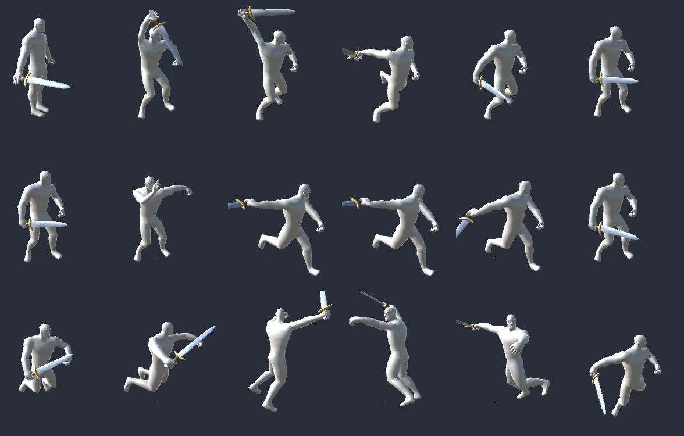
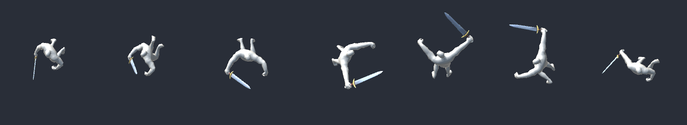
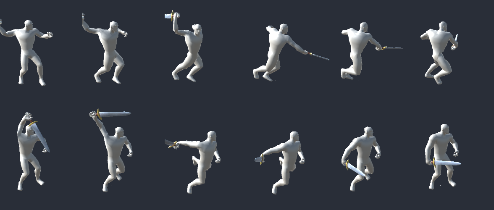

# 🗡️ Attack styles & animations

[← Back to the main page](../README.MD) · [All documentation](README.md)

The White Hilt melee weapons do not swing the same way every time, and the **Rune Sword** has cuts no other weapon in Valheim has. This page tells players what to expect and modders how it is made, with what was learnt about Valheim's player animations on the way.

The Rune Sword's own cuts, rendered by the game's own player animator: the overhead strike, the lunging thrust and the leaping whirl (0.1 s between frames, plain grey stand-in body).

## ⚔️ Attack styles

Each White Hilt melee weapon has a **signature style** and one or two others that suit its grip. Every new combo draws one of them, the signature half the time. A combo you carry on keeps its style, so its rhythm stays the one you started; only the next combo may change. The tooltip lists a weapon's styles. Bows, the crossbow and the staffs are not varied: their animation is the shot or the spell.

| Style | Animation | Hits | Grip |
|---|---|---|---|
| Slash | the sword's three cuts | 3 | one hand |
| Chop | the axe's three chops | 3 | one hand |
| Stab | the knife's quick stabs | 3 | one hand |
| Lunge | the spear's thrust | 1 | one hand |
| Rune whirl | the Rune Sword's own cuts | 3 | one hand |
| Cleave | the battleaxe's swings | 3 | two hands |
| Greatsword | the greatsword's cuts | 3 | two hands |
| Slam | the sledge's overhead slam | 1 | two hands |
| Hew | the pickaxe's overhead blow | 1 | two hands |
| Polearm | the atgeir's thrusts and sweeps | 3 | two hands |

| Weapon | Styles (signature first) |
|---|---|
| Sword, Ice Sword | Slash, Chop, Stab |
| Viking Sword | Slash, Chop |
| Falchion | Chop, Slash |
| Gladius | Stab, Lunge, Slash |
| Rune Sword | Rune whirl, Slash, Stab |
| Mace, War Hammer, Morning Star | Chop, Slash |
| Flail | Slash, Chop |
| Bearded Axe, Crystal Axe, Hand Axe, Throwing Axe | Chop, Slash |
| Knife | Stab, Slash |
| Seax | Slash, Stab |
| Spear, Javelin, Pike, Trident | Lunge, Stab |
| Battleaxe | Cleave, Greatsword, Hew |
| Dane Axe | Cleave, Hew, Greatsword |
| War Axe | Hew, Cleave |
| Claymore | Greatsword, Cleave, Slam |
| Sledge | Slam, Cleave, Hew |
| Atgeir, Pike-Axe | Polearm, Cleave |
| Bardiche, Scythe | Cleave, Polearm |
| Halberd | Polearm, Cleave, Hew |
| Bec de Corbin | Hew, Polearm |

A one-handed weapon only gets one-handed styles and a two-handed weapon two-handed ones, so a swing never pulls the shield arm onto the hilt.

### Balance

A weapon is as strong in every style. A faster style deals less damage and costs less stamina per hit, a slower one more, so damage and stamina **per second** stay those of the weapon's own swing. A combo's last hit counts with the weapon's finishing bonus; single-hit styles (Lunge, Slam, Hew) have none, and that is evened out too. The hit area follows the style: a stab is narrow, a cleave wide. The reach stays the weapon's.

Seconds per hit, measured from the game's player animator (until the next click is taken, with the animation's speed changes included):

| Style | Seconds per hit | Hit area |
|---|---|---|
| Stab | 0.37 | 60° |
| Lunge | 0.51 | 40° |
| Slash | 0.66 | 90° |
| Rune whirl | 0.69 | 90° |
| Chop | 0.74 | 90° |
| Greatsword | 0.75 | 90° |
| Polearm | 0.84 | 20° |
| Cleave | 1.09 | 90° |
| Hew | 1.23 | 60° |
| Slam | 1.69 | 90° |

So a Gladius stabbing hits nearly twice as often as a sword slashing, and each stab deals a little over half as much.

## 🌀 The Rune Sword's own cuts

The Rune Sword's signature is a combo made for this mod alone:

1. **Overhead strike.** The sword goes up over the head, the body leans back, and the blade comes straight down in front with a step forward.
2. **Lunging thrust.** The sword is drawn back to the hip and driven forward at chest height with a long step, the blade level.
3. **Leaping whirl.** A crouch, a jump with a full turn in the air and the sword held out, and a low landing. The finishing hit lands half way round.

The whirl seen from above: the body turns a full circle with the sword held out.

The cuts play while the Rune Sword is in your hand, for you and for everyone who sees you. When it draws another style, it slashes and stabs like the other swords.

Above: the vanilla sword's first cut. Below: the Rune Sword's overhead strike over the same time.

| Cut | Length | Hit at | Next click taken at |
|---|---|---|---|
| Overhead strike | 0.68 s | 0.38 s | 0.55 s |
| Lunging thrust | 0.64 s | 0.29 s | 0.47 s |
| Leaping whirl | 1.05 s | 0.56 s | end of the cut |

## ⚙️ Settings

The server decides the mode and the balance for everyone; each player can choose otherwise for their own swings, and the others see those swings as they are made.

| Setting | Default | What it does |
|---|---|---|
| `[Gear.AttackStyles] Mode` | Varied | How melee weapons swing for players who follow the server: Varied (each combo draws a style), Signature (always the weapon's own style) or Vanilla (as the vanilla weapon it is made from) |
| `[Gear.AttackStyles] SignatureShare` | 0.5 | Chance that a combo uses the weapon's own style when styles vary; the rest is shared equally by its other styles |
| `[Gear.AttackStyles] EvenOutTempo` | 1 | How far damage and stamina per hit follow a style's tempo, so damage and stamina per second stay the same (1 = fully, 0 = the same per hit) |
| `[Gear.AttackStyles] MyChoice` | Server | Your own choice, not synced: Server, Varied, Signature or Vanilla. Only your own swings |

## 🧱 For modders: how it is made

The code is in `Items/Weapons/Styles` and `Patches/Gear/AttackVarietyPatches.cs`, the Rune Sword's clips in `AssetSource/Unity/BuildAttackClips.cs`. These are the findings it rests on, all checked against the game's own files.

### How Valheim plays an attack

- **Every attack is an Any State transition on its trigger alone.** The player's animator (`Player_animator` on `Player/Visual`) starts each of its about fifty attack states (`swing_longsword0`, `battleaxe_attack1`, `knife_stab2`...) from any state, with no condition on the weapon held. So any weapon can play any attack animation; only the trigger name matters.
- **The animation is a name on the attack.** `Attack.m_attackAnimation` holds the trigger. With `m_attackChainLevels` above 1 the game appends the combo step (`swing_longsword` + `0`, `1`, `2`). A combo carries on only while the previous attack had the same animation name and the next click comes within 0.2 s; otherwise it starts again at step 0.
- **`m_attackRandomAnimations` is only for single attacks.** The game's own random variants are used only when the attack has no combo, so they cannot vary a sword.
- **Each attack is a fresh copy.** `Humanoid.StartAttack` clones the weapon's `m_attack` before `Attack.Start` sets the trigger, so a prefix on `Attack.Start` can change the animation, combo length, hit angle, damage and stamina of that one swing without touching the item. That is all the attack styles do; the trigger reaches the other players through the game's own animation sync.
- **The hit comes from the clip.** Damage is dealt at the clip's `OnAttackTrigger` (or `Hit`) event. `Chain` opens the window for the next click, `TrailOn` and `TrailOff` draw the weapon's trail. A clip without `Chain` is only followed once it ends.
- **`Speed` events stay.** A clip's `Speed` event sets the animator's speed, and it keeps that speed until the next `Speed` event, also in the next clip. A new clip should start with `Speed(1)`.
- **Vanilla shares more than you would think.** The mace, the club and the torch swing exactly like the sword (`swing_longsword`); the atgeir and battleaxe clips have no `Chain` event at all.

### Making new animations

- **The player's avatar is humanoid** (`player_maleAvatar`, 23 bones mapped). New clips can be humanoid muscle clips, which play on any humanoid rig, rather than bone curves for Valheim's skeleton.
- **The clips are written from code.** `BuildAttackClips.cs` describes each cut as a few key poses (muscle values, a body turn and a body offset at given times), eases between them and bakes 30 frames a second with `AnimationUtility.SetEditorCurve` on `Animator` properties. Finger muscles have other names in a clip than in `HumanTrait.MuscleName` (`RightHand.Index.1 Stretched`, not `Right Index 1 Stretched`). The game's own sword stance is read once, at build time, so the cuts start and end where the game blends from and to; that stance is the only thing taken from the game.
- **Root motion is baked into the pose.** The game does not apply root motion, so the clip settings bake rotation and position into the pose (`loopBlendOrientation`, `loopBlendPositionY`, `loopBlendPositionXZ`). That is what makes the whirl's full turn visible while the character itself stays put. The body turn is baked frame by frame, since keyed quaternions cannot pass a full turn.
- **The new clips play in borrowed states.** An `AnimatorOverrideController` swaps the dual knives' three combo clips for the Rune Sword's, so the dual knives' triggers (`dual_knives0` to `2`) play them. Those states are free while a one-handed sword is held, since the dual knives need both hands. Their state speed is 1.1, which the timings above include.
- **The override is per player and only while the sword is held.** `RuneSwordMotion` sits on every player, on every client, and watches the right-hand item the game already syncs. Swapping a controller restarts the animator, so the parameters and each layer's state are carried over, or the stance and an equip animation half way would be lost.

### Previews without starting the game

- **Unity can load Valheim's own bundles.** The mod's Unity project is the game's version (6000.0.75), so `AssetBundle.LoadFromFile` on the game's `SoftRef/Bundles` works in the editor. The `Player` prefab is found with `LoadAllAssets<GameObject>()` on bundle `c4210710`, not by name. Nothing from those bundles is written into the mod.
- **The previews use the game's own controller.** They put the new clips into an override of the real `Player_animator`, fire the real triggers and step the animator, so they show what the game will do, combo transitions included.
- **Skinned meshes need help in batch mode.** The body is drawn with `forceMatrixRecalculationPerRender` and `updateWhenOffscreen` on the skinned mesh renderer, with the player at the origin.
- **After `Rebind` the animator sits.** Its default state is the wake-up pose, so the preview plays `Movement` first.
- **Hold the weapon the way the game does.** `VisEquipment.AttachItem` puts the item's `attach` object on the hand joint at zero position and rotation, ignoring the offset it has in the prefab. A preview that keeps the prefab offset shows the hand half way up the blade, as ours did at first.

### Rebuilding

`AssetSource/build_foraging_bundle.ps1` runs `BuildAttackClips.Build` before it builds the bundle (the game must be installed; set `VALHEIM_INSTALL` if it is not in Steam's default folder) and puts `runesword_cut0`, `runesword_cut1` and `runesword_whirl` in it. The preview strips land in `BrudvikWhiteHiltUnity/Preview/attacks`, and `python AssetSource/Preview/attack_doc_images.py` turns them into the pictures on this page. If you change a cut's `Chain` event or length, change `AttackStyles.RuneSecondsPerHit` too: the balance is worked out from it.
