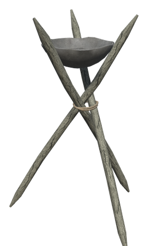
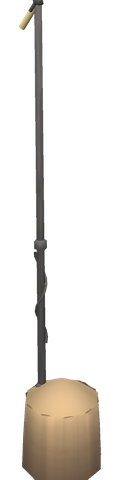
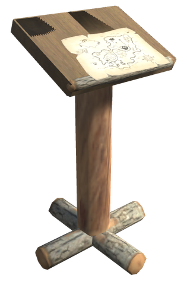
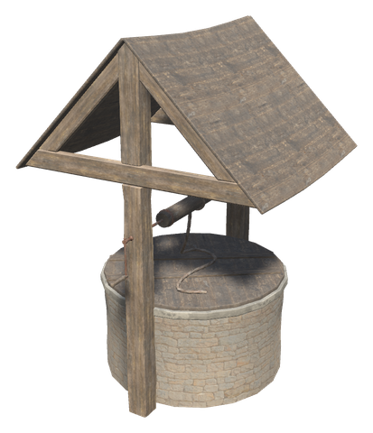
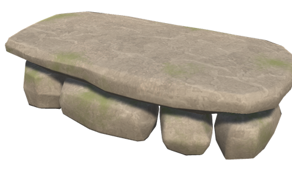

# 🔥 Around the base

[← Back to the README](../README.MD)

## 🔥 ETERNAL FIRE

**Surt's Brazier** is a workbench extension: an iron brazier holding an ember of Surt. While one burns anywhere in the world, every campfire, hearth, torch, sconce, brazier, jack-o-turnip, hot tub and stone oven burns without fuel and stays lit in rain and wind. Hovering over them shows *Eternal fire*. When the last brazier is torn down, the fires are full and burn down as usual.

The config (`EternalFire` section) decides when it applies: `Progression` (default) needs the brazier in linear progression and is always on in full progression, `Always` needs no brazier, and `Off` switches it off. Fires, ovens and smelters can each be switched on or off, and single prefabs excluded. Smelters and blast furnaces are **off** by default, so coal stays part of smelting; they take coal from nearby chests instead (see below).

| Item | Description | Crafting Station | Requirements |
|------|-------------|------------------|--------------|
| **Surt's Brazier** | Workbench extension; eternal fire across the world | Hammer (next to a Workbench) | Stone ×10, Bronze ×4, Surtling Core ×3, Resin ×5 |

---

## 🕯️ RUSHLIGHT

The old light of the poor: a cattail rush dipped in fat and held slanted in an iron rush nip. It gives less light than a standing torch, and burns [Cattails](foraging.md) instead of Resin, each twice as long. Surt's Brazier keeps it lit like any other torch.

| Piece | Description | Crafting Station | Requirements |
|------|-------------|------------------|--------------|
| **Rushlight** | A small light that burns Cattails | Workbench | Wood ×2, Iron ×1, Cattail ×2 |

---

## 📦 CRAFTING FROM CHESTS

What lies in the chests, carts and ship holds within 30 m counts as your own when you **craft**, **build**, **fuel** or **smelt**, and **cook**. Requirements that are partly in chests show their amount in amber, with a small chest on the icon; the tooltip shows how many are in your inventory and how many in chests. A chest that something is taken from opens its lid and glows briefly.

- Adding fuel or ore to a smelter, kiln, fire or oven takes one from the chests when your inventory has none. Hold **Shift** to fill it up in one go, first from your inventory, then from the chests.
- Using a cooking station without raw food in your inventory puts raw food from the chests on it; with Shift, on every free slot.
- Only chests you may open are used: private chests of others and chests inside someone else's ward are skipped, and so are chests another player has open.
- **Left Alt + O** switches it off and on for you.

The `ChestCrafting` config section sets the range (`Range` for crafting, fuel and cooking, `BuildRange` for building, both 30 m), whether to leave one of each item in a chest, which of the four uses are on, and comma-separated lists of containers and items never to take from.

---

## 🔎 SEARCHING THE CHESTS

Press **F9** and type part of an item's name. Every chest, cart and ship hold within 100 m that you may open and that holds a match glows and gets a pin on the map, and the list shows each match with how many there are and in how many chests. The chests keep glowing and their pins stay for 60 seconds after you close the search, so you can walk to them. Only chests in the loaded world are found.

Section `[Storage]`: `SearchRange` (100 m, admin), `MarkSeconds` (60, your own); `[Storage.Keys] Search` (F9).

---

## 📖 GUESTBOOK

An open book on a lectern that keeps the history of the place around it. Anyone can read it with **E**; it does not need a ward and cannot be locked. Each line has the in-game day and time.

- **Visits**: a player who comes within range is written down, again only after being away for a while. Whoever is already there when the book is loaded is not counted.
- **Built / torn down**: placing or removing a piece in range is written down with the player's name. Several of the same piece by the same player within a short time become one line with a count (*Kari built Wood wall x12*).
- **Raids**: hostile creatures that are alerted or hunting within range start a raid line naming them (*Raid: Greydwarf x3, Troll*), and a second line when it has been quiet for a minute (*The raid was beaten off after 4 min*).

The oldest lines go first once the book is full. Only the book's owner (whoever has the area loaded) writes, so nothing is counted twice.

| Piece | Description | Crafting Station | Requirements |
|------|-------------|------------------|--------------|
| **Guestbook** | Records visits, building and raids nearby | Workbench | Wood ×6, Leather Scraps ×3, Feathers ×1 |

| Setting (`[Guestbook]`) | Default | Description |
|---|---|---|
| `Radius` | 40 | Range the book watches, in metres |
| `VisitGapMinutes` | 720 | Game minutes a visitor must have been away to be written down again (a game day is 1440 game minutes) |
| `MergeMinutes` | 240 | Game minutes within which the same piece by the same player becomes one line |
| `RaidQuietSeconds` | 60 | Seconds without enemies before a raid counts as over |
| `MaxEntries` | 100 | Lines a book keeps |

---

## 🧾 CRAFTING PANEL

The crafting panel and the build menu show what you have, not only what a recipe costs.

- **What you have**: a small dark box on the left of each requirement's icon shows how many you have, in your inventory and in the chests you may use around you (white when it is enough, red when it is not). Large amounts are shortened, e.g. `1.2k`.
- **∞**: shown in gold when a restocking chest, cart or ship hold within reach keeps the item unlimited, so it never runs out here.
- **On the way to unlimited**: in Linear chest mode, a thin gold bar along the bottom of the icon fills up as the best chest in the world gets closer to unlocking the item.
- **Tooltip**: shows the split (*You have 14: 6 in your inventory + 8 in chests*) and either *Unlimited from a chest nearby*, *Unlimited in the Wood Chest, but none is nearby*, or *Unlimited after 12 more (38/50 in the best chest)*.
- **Craft several at once**: arrows on the left of the Craft button choose how many to make, e.g. 4 axes. The mouse wheel over the number works too. The requirements show the cost for all of them, and the button reads *Craft x 4*. It starts at 1 for every recipe and is not used for upgrades. With 1 chosen, Shift + Craft still makes five like in vanilla.

| Setting (`CraftingPanel`) | Default | Description |
|---|---|---|
| `ShowAvailable` | on | The box with what you have (each player) |
| `ShowInBuildMenu` | on | The same in the build menu (each player) |
| `ShowUnlockProgress` | on | The gold bar towards unlimited (each player) |
| `AmountSelector` | on | The arrows next to the Craft button (each player) |
| `MaxCraftAmount` | 20 | The most that can be crafted at once (server) |

---

## 🗑️ WASTE WELL

| **Piece** | Description | Crafting Station | Requirements |
|---|---|---|---|
| **Waste Well** | A stone well for rubbish. Open it (E) and throw things in: 5 seconds after it is closed they are gone, so opening it again before then gets them back. Shift + Use makes the well collect items that have lain on the ground within 8 m for 30 seconds or more; it never takes hatching eggs or items placed as decorations. Chest crafting never takes from it | Workbench | Stone ×20, Wood ×6 |

The server sets it in the `WasteWell` section: `DisposeDelaySeconds` (5), `CollectRadius` (8), `MinItemAgeSeconds` (30) and `KeepItems`, prefab names never collected from the ground.

---

## 🏆 TROPHY ALTAR

A small stone altar, about 1.2 × 0.6 m, with a miniature Eikthyr standing on it. Open it like a workbench: offer one boss trophy and one **Swamp Key** and get a full stack (20) of that trophy back. The Elder drops one key per kill, so every extra stack costs another fight with him. Keep one key for the crypts.

Ordinary trophies work the same way with a **Hard Antler** from Eikthyr instead of the key: one trophy and one antler give a full stack.

- It copies the trophies of the seven bosses: Eikthyr, The Elder, Bonemass, Moder, Yagluth, The Queen and Fader, with a Swamp Key.
- With a Hard Antler it copies every other trophy of the game itself. Deer trophies are left out by default (`ExcludedTrophies`), since they summon Eikthyr, who drops the antlers. The White Hilt monsters' trophies, the black beast trophies and trophies from other mods have to be collected in the normal way.
- A trophy only shows up at the altar once you have picked up both the trophy and the key or antler, so it never skips a boss.
- It needs no roof and no fire. The craft amount arrows on the Craft button make several stacks at once if you have the keys.

| **Piece** | Description | Crafting Station | Requirements |
|---|---|---|---|
| **Trophy Altar** | Boss trophy + Swamp Key, or another trophy + Hard Antler, gives a full stack of that trophy | Workbench | Stone ×10, Fine Wood ×4, Iron ×2, Ancient Bark ×2 |

| Setting (`TrophyAltar`) | Default | Description |
|---|---|---|
| `Trophies` | the 7 boss trophies | Trophy prefab names the altar can copy, comma separated. A name added here needs a restart |
| `TrophiesPerCraft` | 1 | Trophies one copy takes |
| `KeysPerCraft` | 1 | Swamp Keys one copy takes |
| `TrophiesMade` | 0 | Trophies one copy gives. 0: a full stack |
| `OrdinaryTrophies` | true | Copy the game's ordinary trophies too, with Hard Antlers |
| `AntlersPerCraft` | 1 | Hard Antlers one copy of an ordinary trophy takes |
| `OrdinaryTrophiesMade` | 0 | Ordinary trophies one copy gives. 0: a full stack |
| `ExcludedTrophies` | TrophyDeer | Ordinary trophies the altar never copies, comma separated |

---

## 🚪 SELF-CLOSING DOORS

Doors, gates and windows built by players close on their own a few seconds after the last one went through. Nothing closes while a player (or a tamed animal) is within 3 m of the opening, so no door shuts in anyone's face. Doors with a key, doors that cannot be closed and doors in dungeons and villages are left alone.

When the door's owner leaves the active area, for example through a distant portal, unattended timer-managed doors close before the area unloads, even if their delay has not expired yet. Hold-open, disabled automatic closing and the opening's player/animal safety checks still apply. Travel within the active area keeps the normal delay.

- **Hold open**: Shift + E opens a door and holds it open until someone closes it with E; Shift + E on an open door holds it or lets it close on its own again. The hover text shows when a door is held open.
- **Windows** close when rain or a storm begins and when night falls. They can be opened again while it lasts, and a window held open stays open.
- **Raids**: when enemies on the hunt come within 20 m, doors, gates and windows close at once, also those held open.

Whether a door is a gate or a window is told by its prefab name (`GateNames`, `WindowNames`), so doors from other mods work too.

Vanilla and White Hilt drawbridges use the gate closing settings; closing raises the bridge. Automatic closing runs on the owner, including dedicated servers, without requiring the owner to animate the door. Player and tamed-animal clearance still applies.

| Setting | Default | What it does |
|---|---|---|
| `Enabled` | true | Main switch |
| `CloseDoors` / `DoorDelaySeconds` | true / 5 | Doors |
| `CloseGates` / `GateDelaySeconds` | true / 10 | Gates and grates |
| `CloseWindows` / `WindowDelaySeconds` | false / 30 | Windows on a timer (rain, night and raids still close them) |
| `ClearRadius` | 3 | Metres from the opening that keep it open while a player is there |
| `TamesBlockClosing` | true | Tamed animals in the opening keep it open too |
| `OnlyPlayerBuilt` | true | Leave doors in dungeons and villages alone |
| `AllowHoldOpen` | true | Shift + E holds a door open |
| `ExcludedPieces` | | Prefab names that never close on their own, comma separated |
| `GateNames` | gate,grate,skanseport | Name parts that make a door a gate |
| `WindowNames` | window | Name parts that make a door a window |
| `WindowsCloseInRain` / `WindowsCloseAtNight` | true / true | Windows close when rain or night begins |
| `RaidClose` / `RaidRadius` | true / 20 | Everything closes when enemies come this near |
| `RaidIgnoresHoldOpen` | true | Enemies also close doors held open |

All settings are in the server's `Doors` section.
