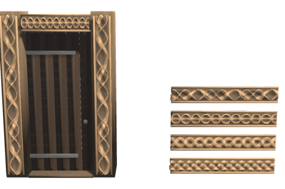
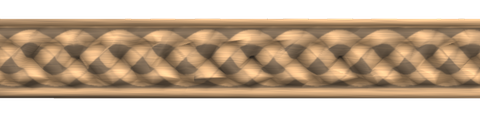
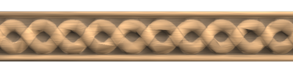
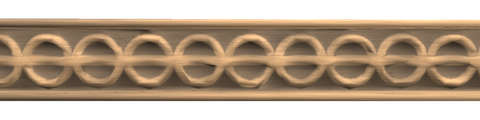
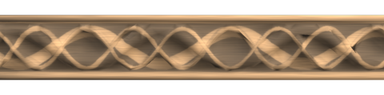
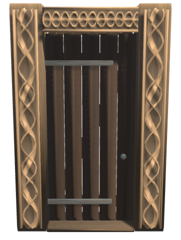
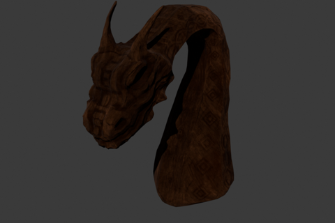
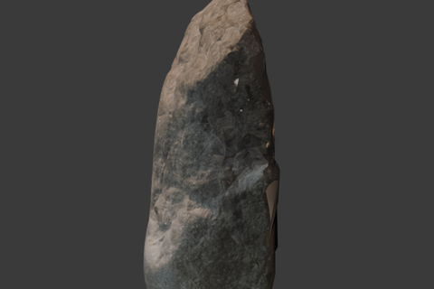

# 🐉 Carvings

Carved interlace for the house, after the patterns the Norse cut in wood and stone: friezes for the face of a wall, boards for posts and door frames, and a carved portal. And for the Decor Hammer, a carved dragon head, the spiral stems of a Viking ship and a scanned runestone.

## 🪢 FRIEZES AND POST BOARDS

   

Four patterns, each as a **Carved Frieze** 2 m long and 0.3 m high for the face of a wall (over a door, along a gallery, under the eaves) and as a **Carved Post Board** 2 m high and 0.3 m wide for a post or the sides of a doorway:

- **Plait**: three strands plaited over and under each other, the commonest border of the Viking age.
- **Cable**: two strands twisted round each other, as round the arches of the stave church portals.
- **Ring Chain**: rings linked by a band that weaves through them, after the Borre style of the 10th century.
- **Urnes Loops**: a broad band in long loops with thin ones winding through it, after the Urnes style of the 11th century.

The strands pass over and under where they cross, and stand out between two raised rims. The carving is a relief model with a normal map for its finer detail, so it keeps its edges up close. Friezes snap end to end; a frieze's back goes against the wall.

| Piece | Description | Crafting Station | Requirements |
|-------|-------------|------------------|--------------|
| **Carved Frieze** (`piece_whitehilt_frise_<pattern>`) | 2 m long, 0.3 m high, for a wall | Hammer (Furniture, Workbench) | Fine Wood ×2 |
| **Carved Post Board** (`piece_whitehilt_stolpebord_<pattern>`) | 2 m high, 0.3 m wide, for a post | Hammer (Furniture, Workbench) | Fine Wood ×2 |

`<pattern>` is `flette`, `tau`, `ringkjede` or `slyng`.

## 🚪 CARVED PORTAL

A doorway 2 m wide and 3 m high between broad posts carved with Urnes loops up both faces, a ring chain over the door and a tarred door 1.2 m wide and 2.6 m high, after the carved portals of the stave churches. It snaps in place of a 2 m wall and the metre over it, like the other [doors 3 m high](log-house.md#-doors), and closes by itself like every door.

| Piece | Description | Crafting Station | Requirements |
|-------|-------------|------------------|--------------|
| **Carved Portal** (`piece_whitehilt_utskaret_portal`) | A carved doorway 2 × 3 m with a door | Hammer (Workbench) | Fine Wood ×12, Wood ×4, Resin ×2 |

## 🛶 FOR THE DECOR HAMMER

 

Under **Norse** in the [Decor Hammer](decor.md): a **Carved Dragon Head** on a curving neck, the **Ship's Bow** and **Ship's Stern** of a Viking ship rising into spiral stems as on the Oseberg ship, and the **Asferg Runestone**, a scan of the runestone from Jutland. The models are by other artists under CC BY 4.0; see the credits in the [README](../README.MD).

## How they are made

The friezes are generated, not traced: `AssetSource/Carvings/make_knotwork.py` draws each strand as a centre line with a depth along it, so the strand in front at a crossing passes over, and writes a height map, a normal map and the wood's colour. `blender_relief.py` turns the height map into the relief model, and `build_friezes.py` runs both for every pattern. `make_heightmap.py` turns an engraving of a carving into a height map in the same way; it is there for the stave church portals drawn in Dietrichson's *De norske stavkirker* (1892), which need a sharper scan than the one at hand to come out well.

## Config

The carvings are switched on and off and priced in `[Content]` and `[Recipes]` like the other White Hilt pieces. With linear progression they come with the Black Forest, where fine wood is first to hand.
