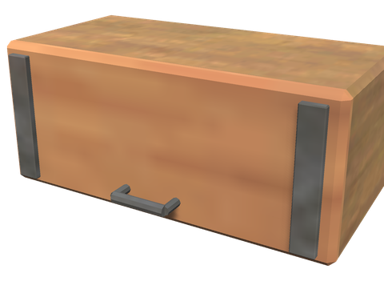
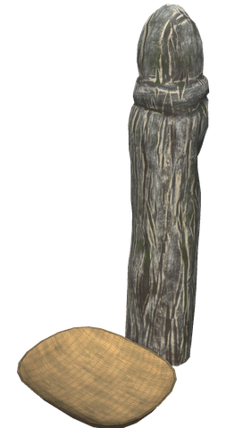

# 📦 Restocking chests

[← Back to the README](../README.MD)

The chests from the former **BrudvikStackedChest** mod are now part of White Hilt. Chests placed with the old mod keep their place and their contents, see [Moving over from BrudvikStackedChest](#moving-over-from-brudvikstackedchest).

## 📦 CHESTS

Fourteen chests that fill themselves with their kind of items and refill them to a full stack as soon as you take some out, use them from the chest, or build or craft from them with [nearby chests](base.md). Each chest has its own colour, icon and glow.

### Building a chest

All chests are built with the **Hammer**, in the **Chests** category.

| Resource | Amount | Recoverable |
|----------|--------|-------------|
| Wood     | 10     | Yes         |

### Available chests

The contents of every chest are worked out when a world loads. Every item in the game is sorted by its type and by where it comes from, including White Hilt items and items from other mods.

| Chest | Colour | Contents |
|-------|--------|----------|
| Wood Chest | Black | Everything that drops from trees and logs (wood, resin, bark), plus Coal |
| Stone Chest | Grey | Everything mined from rocks and deposits (stone, flint, obsidian, crystal, sulfur), plus what is crafted from stone only |
| Metal Chest | Dark red | Ores, scrap and bars, plus what is crafted from metal only (nails) and Chain |
| Food Chest | Brown | All food, fish, raw and uncooked ingredients, and anything used in a food recipe (10 rows) |
| Material Chest | Dark blue | All remaining crafting materials, including Surtling Core, Ectoplasm, Flax, casts and moulds |
| Animal Chest | Yellow | Materials dropped by creatures (hides, bones, scales, feathers, leather scraps…) |
| Seed Chest | Green | Seeds, cones and nuts that are planted but not used as ingredients |
| Trophy Chest | Teal | All trophies |
| Treasure Chest | Gold | Items with a trade value (Coins, Amber, Ruby…), gemstones, keys, eggs and boss rewards |
| Tools Chest | Purple | Pickaxes, building and farming tools, fishing rods and bait, torches, lanterns, saddles and other gear |
| Armor Chest | Brown | All helmets, chest pieces, legs, capes and trinkets |
| Weapon Chest | Red | All weapons, shields, arrows, bolts and bombs (10 rows) |
| Potion Chest | Pink | All meads and mead bases |
| Everlasting Chest | Dark grey | Empty: put in your own items and they are restocked |

Items that cannot be obtained in normal play (creature attacks, test items, unused variants) are left out. `DumpItemLists` writes every chest's list to the BepInEx log.

### Wall Drawers

Every one of the fourteen chests above also has a **Wall drawer** variant in the ordinary Hammer's **Chests** menu. Its build icon shows the chest's category icon with a drawer in front, so drawers and chests are easy to tell apart. Each costs Wood ×10 (recoverable) and occupies about **0.7 × 0.3 × 0.22 m**, including its grip. The category icon, restocking, hover information, contents panel, progress indicators, learning and collection behavior are the same as its chest. Food and Weapon drawers retain 10 rows; every other drawer retains 8 rows. All retain 8 columns.

Place the back against a vertical **player-built wooden or stone wall**, facing away from it. While placing, the drawer turns square to the wall and sits flat against it. Drawers work in ordinary bases as well as on Skidbladnir's hull walls and player-built walls aboard it. Terrain, natural rocks, ruined unbuilt walls, floors, roofs and another drawer are not valid supports. Existing chest inventories are unchanged; drawers have independent saved inventories and use the same per-category Include/Exclude and mode settings.

| Category | Drawer prefab |
|---|---|
| Wood | `BSWoodChestDrawer` |
| Stone | `BSStoneChestDrawer` |
| Metal | `BSMetalChestDrawer` |
| Food | `BSFoodChestDrawer` |
| Material | `BSMaterialChestDrawer` |
| Animal | `BSAnimalChestDrawer` |
| Seed | `BSSeedChestDrawer` |
| Trophy | `BSTrophyChestDrawer` |
| Treasure | `BSTreasureChestDrawer` |
| Tools | `BSToolsChestDrawer` |
| Armor | `BSArmorChestDrawer` |
| Weapon | `BSWeaponChestDrawer` |
| Potion | `BSPotionChestDrawer` |
| Everlasting | `BSEmptyChestDrawer` |

Test placement, opening, hover indicators, restocking and saved contents in a backup world before using drawers in an existing base; ship attachments also need sailing/reload and multiplayer checks.

### Collection Post

A carved post with a wicker basket, built with the **Hammer** in **Chests** near a workbench. It works on its own, without a workbench. **Use (E)** opens the basket, **Shift + Use** pauses or resumes the post, and the collection radius is shown while placing it. An active post casts a soft golden light.

- **Seeing it work:** each time the post moves something, its light flares and a sparkle rises over the basket and over every chest that received items, for every player nearby. The hover text shows how many chests the post can use, how much it sorted last and how long ago. While stacks in the basket fit in no chest, the light turns red and breathes slowly, and the hover text says how many stacks are left.

| Piece | Station | Requirements |
|-------|---------|--------------|
| Collection Post | Workbench | Fine Wood ×10, Bronze ×5, Surtling Core ×2 (recoverable) |

- Collects loose drops from trees, mining, creatures and production, not plants still growing, grave contents or items inside other containers or machines. Living fish and items stuck in tar are left alone.
- **The basket** holds 8 × 4 slots. Put items in and close it: the post sorts them into the receiving chests by the same rules as loose drops, usually within a few seconds; the first delivery to a chest another player last used takes a round longer. Up to **StacksPerRound** basket stacks are tried each round, in turn, so stacks that fit nowhere never hold up the rest. Items a chest already holds without limit are absorbed. What fits nowhere stays in the basket for you to take back. Nothing moves while someone has the basket open, and removing the post drops what is left in it.
- Both the collection radius and the receiving-chest radius default to **80 metres**, measured from the post; each is independently configurable from 10 to 200 metres.
- Every matching chest is a candidate: an item may belong to several categories, and a category may have several chests and wall drawers. Matching category chests are tried first, and among them chests that already hold the item without limit (and so absorb it), then chests that already hold it, then the nearest. When one chest is full the rest goes to the next. The **Everlasting Chest** is the fallback, and is never used while a matching category chest is still being handed over from another player. Include/Exclude category settings apply. Ordinary chests, carts and ship holds are not receivers.
- When only some of a stack fits, only that amount moves. Full chests leave the remainder on the ground. Items already unlimited are absorbed under the existing chest rules, including when no slots are free.
- Quality, fish level, variant, durability, crafter and custom data are kept. Starred and custom-data items are stored separately and never absorbed.
- Player-dropped items are left alone by default. New player drops are marked in world data, so that protection survives reloading; drops made before this feature cannot be identified after a reload.
- Only accessible, closed chests are used, and wards are respected. Overlapping posts assign each drop to the nearest active post. The nearest loaded player processes the post's loose drops, and the player who last opened the basket sorts it; both request chest ownership before transferring items.
- Collection only works in **loaded areas while a player is nearby**, including on a dedicated server with clients connected. Increasing the radius does not load distant parts of a base or keep collecting while everyone is away.
- Collection does not discover materials or recipes for players; use **Learn all** in the chest as before. Linear, Discovered and Full mode retain their existing unlock/restocking rules.

Server settings are in **Chests.Collection**. The build recipe and progression tier use the usual **Recipes** and **Tiers** entry `piece_whitehilt_collectionpost` (Black Forest by default).

| Setting | Default | Description |
|---------|---------|-------------|
| Enabled | On | Enable collection by placed posts |
| Radius | 80 m | Collection radius (10–200 m) |
| ChestRadius | 80 m | Receiving-chest radius (10–200 m) |
| IntervalSeconds | 2 | Seconds between collection rounds (0.5–60) |
| StacksPerRound | 20 | Maximum loose stacks, and basket stacks, processed per post per round (1–200) |
| ScanLimit | 200 | Maximum loaded drops examined per round (20–2000); larger lists are scanned over successive rounds |
| CollectPlayerDrops | Off | Also gather deliberately dropped items |
| OwnershipRetrySeconds | 5 | Retry interval for unanswered chest ownership requests (1–60 seconds) |

### Restocking

- Every unlimited item takes one full stack. When one recipe or build piece needs more than a stack (more than 50 wood, say), the chest keeps enough full stacks for it.
- Putting an item into a chest that already holds it without limit (ctrl-click, drag and drop or **Place stacks**) takes it out of your inventory instead of making another stack. **Place stacks** is a quick way to empty your pockets.
- **Take all** only takes what you stored yourself and leaves the unlimited stacks.
- Chests keep their contents sorted from the top left: unlimited items first, then what you stored yourself, each by type and name (`SortContents`).
- Items with skill stars (see [Skills & milestones](skills.md)) or their own data, such as a dog's remains with its name, are always yours: they are never refilled, merged, swallowed or deleted.

### Removing a chest

- The unlimited stacks are deleted, not dropped, so a chest can be moved without duplicating anything.
- Items you stored yourself are dropped like from any other chest. In Full mode ordinary stackable items always count as unlimited and are deleted too; gear that a player crafted or upgraded and items with stars or their own data are dropped.

> **Warning**: in Full mode, ordinary stackable items stored in the Everlasting Chest are lost when the chest is removed.

### Carts and ships

Carts and ship holds keep unlimited items full like the Everlasting Chest, so what you bring along never runs out. Put Wood in the Longship when Wood is unlimited, and the stack stays full while you build from the hold at an outpost with [nearby chests](base.md). This covers every cart and ship, including the White Hilt Ship's sea chest (`UnlimitedCargo`).

- Any amount of an unlimited item is filled up to a full stack. Extra stacks of it are removed, which frees the slots.
- Only items that stack are refilled. Which items are unlimited follows `Mode`, as in the Everlasting Chest. In Full mode, that is every ordinary stackable item.
- Cargo never unlocks items in Linear mode and never adds items you did not bring. It is not sorted and does not grow.
- Putting in more of an unlimited item, **Take all** and destroying the cart or ship work as in the chests: the item is swallowed, the unlimited stacks stay behind, and they are deleted instead of dropped.
- Items with skill stars or their own data are never refilled or deleted.

### Chest modes

`Mode` decides how generous the chests are:

| Mode | Behaviour |
|------|-----------|
| Full | Every item is always available |
| Linear | A chest works like a normal chest until it holds a full stack of an item (`UnlockStacks`). From then on the item is unlimited in every chest of that type in the world |
| Discovered | An item is unlimited as soon as any player in the world has discovered it |

In Linear and Discovered:

- Unlocked and discovered items are shared by everyone in the world and saved by the server in `BepInEx/config/BrudvikStackedChest/`.
- Items that do not stack, like weapons and armor, are never duplicated; those chests work as normal chests.
- Items that come in levels, like fish, count each level on its own in Linear mode: a full stack of level 2 Perch unlocks level 2 Perch, and from then on every chest of that type also keeps a stack of it. In Full and Discovered mode every level of such an item is unlimited once it is stored.
- The Everlasting Chest makes any stackable item unlimited once it holds a full stack (Linear) or once it is discovered (Discovered).

Switching to a less generous mode removes the unlimited items the new mode no longer supplies, for example everything that is not unlocked when going from Full to Linear.

### Seeing your progress

- Unlimited stacks show a gold **∞** instead of their amount.
- In Linear mode, items that can still be unlocked get a blue bar under the slot that fills up as you store more.
- The item tooltip says whether the item is unlimited, how many more you need to store, or why it is stored normally.
- The chest title and hover text show how many of the chest's items are unlimited, and the hover text lists the three items closest to being unlocked.
- Everyone on the server is told when a player makes an item unlimited.
- A chest glows brighter the more of its items are unlimited, turns gold when all of them are, and sparkles when it refills or unlocks something.
- **On the front of a chest** the icon turns grey when it is empty, with a bar for the used slots and, in Linear and Discovered, a gold bar for the unlimited items (`ShowIndicators`).
- **Looking at a chest** shows its contents as item icons below the crosshair (`ShowHoverPanel`).
- **Pointing at an item in your inventory** lights up the chests and wall drawers it belongs in within 30 m (`FindRange`), and its tooltip names the chest.

### Learning items

- Items in an open chest that you have not learned yet are marked with a yellow **!**.
- **Learn all** next to Place stacks teaches you every item in the chest at once, as if you had picked them up, so their recipes and build pieces unlock (`LearnAll`, `LearnTrophies`).

### Gathering progress

The player screen (Tab) has an extra button next to Skills, Compendium, Trophies and Achievements. It lists what can be gathered in the biome you are in: what trees, rocks, plants and creatures drop and what is found in its dungeons. In Linear mode a bar shows how much the closest chest in the world holds and how much is missing; in Discovered mode whether the item is discovered. The arrows browse the other biomes you have visited, known by the biome itself whatever the world or language calls the place; a biome entered before this was recorded shows once you are in it again.

Under each item's name stands the chest it belongs in, with that chest's sign and in the colour it glows (several chests when the item belongs in more than one). **Click an item** to make those chests and wall drawers within 100 m light up and sparkle for 20 seconds, so you can see where to put it; a message says how many light up, or that none are near. Only you see it.

## ⚙️ Settings

All in the `Chests` section of the White Hilt settings. `Display` settings are each player's own; the rest is the server's.

| Section | Setting | Description |
|---------|---------|-------------|
| Chests | Mode | Full, Linear or Discovered (default Full) |
| Chests | UnlockStacks | Linear: full stacks a chest must hold to unlock an item (1–10, default 1) |
| Chests | SortContents | Keep the contents sorted from the top left (default on) |
| Chests | LearnAll | Show the Learn all button (default on) |
| Chests | LearnTrophies | Let Learn all learn trophies too (default on) |
| Chests | UnlimitedCargo | Carts and ship holds keep unlimited items full (default on) |
| Chests | ShowIndicators | Icon and bars on the front of chests (default on, per player) |
| Chests | ShowHoverPanel | Contents as icons when looking at a chest (default on, per player) |
| Chests | FindRange | Metres within which the chests for an item pointed at in the inventory light up; 0 for none (default 30, per player) |
| Chests | DumpItemLists | Write every chest's item list to the log (per player) |
| Chests.&lt;Chest&gt; | Include | Comma-separated prefab names always placed in this chest |
| Chests.&lt;Chest&gt; | Exclude | Comma-separated prefab names never placed in this chest |

## 💬 Console commands

| Command | Description |
|---------|-------------|
| `whitehilt_chest_progress` | Lists how many items of each chest are unlimited (was `bsc_progress`) |
| `whitehilt_chest_census` | Counts the contents of every chest and compares them with the previous count (server or host) |

## 🔁 Moving over from BrudvikStackedChest

The chests keep their old prefab names, size and saved data, and the server keeps its progress files in `BepInEx/config/BrudvikStackedChest/`, so placed chests and their contents carry over.

1. Back up the world (`worlds_local/<world>.db` and `.fwl`, on the server too).
2. Install this version of White Hilt on the server and every client **while BrudvikStackedChest is still installed**. As long as the old mod is loaded, White Hilt leaves the chests to it and only counts them: at every world start the server writes a census to `BepInEx/config/BrudvikStackedChest/census/`.
3. Remove BrudvikStackedChest everywhere, but **keep** `BepInEx/config/com.jotunn.BrudvikStackedChest.cfg` and the `BepInEx/config/BrudvikStackedChest/` folder. On the first start White Hilt takes over the old settings, above all `Mode`, and logs each value it took over. A wrong mode would make the chests remove the stacks they no longer supply.
4. Start the server. The census at the start compares the chests with the previous count and logs any chest that is gone or any item that decreased. Visit some chests and restart once more to check again; taking items out also counts as a decrease.
