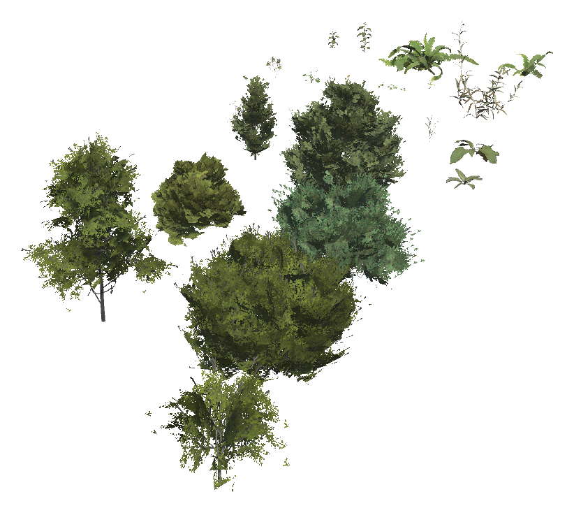
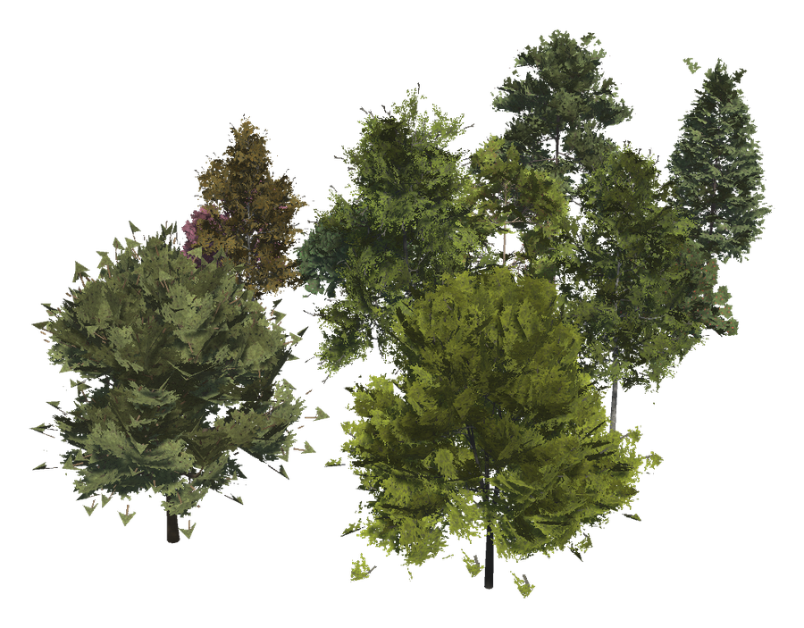
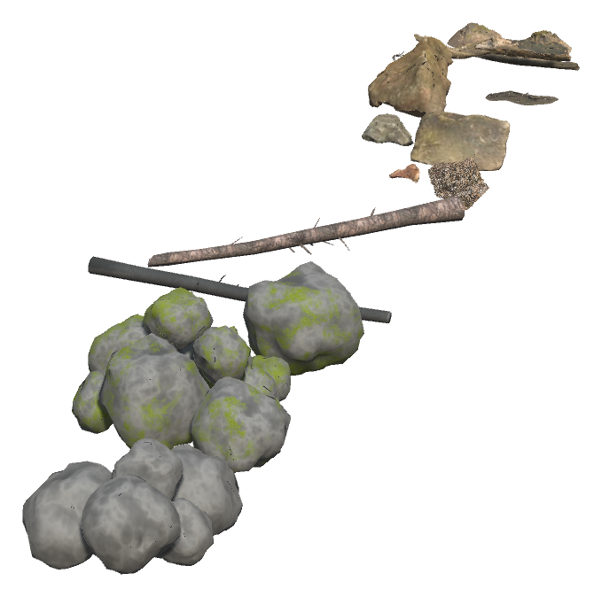
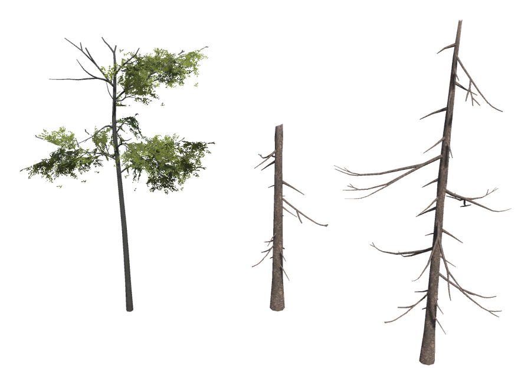
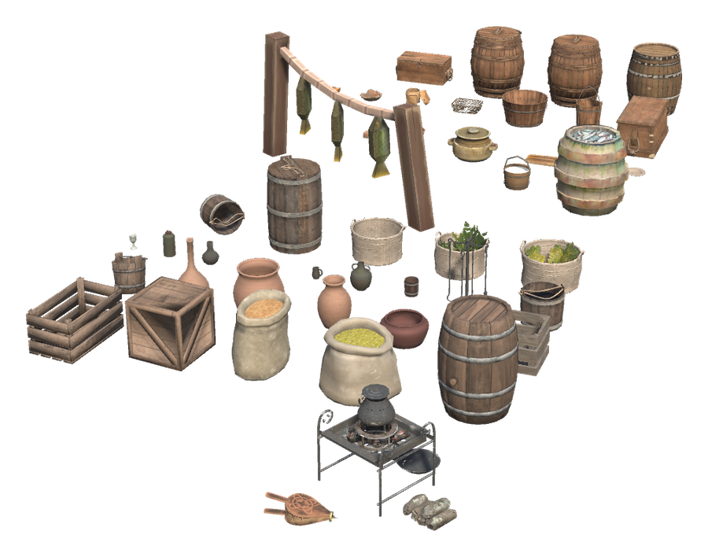
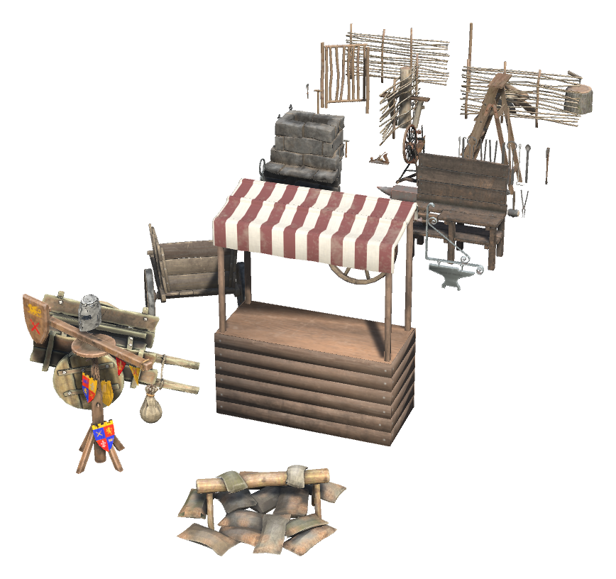
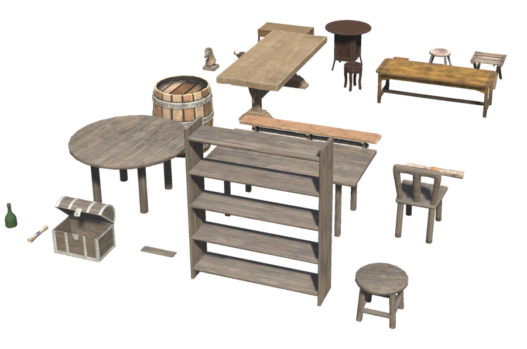
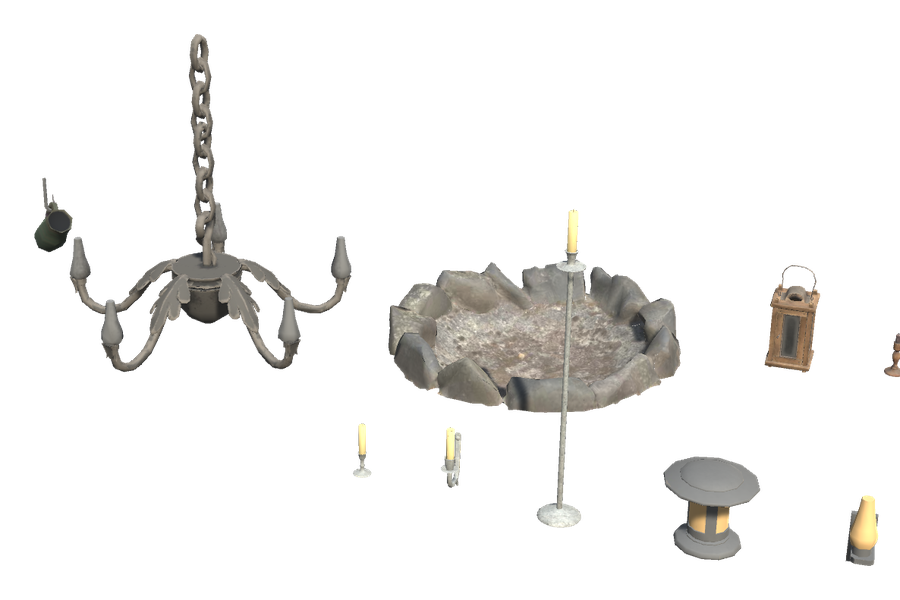
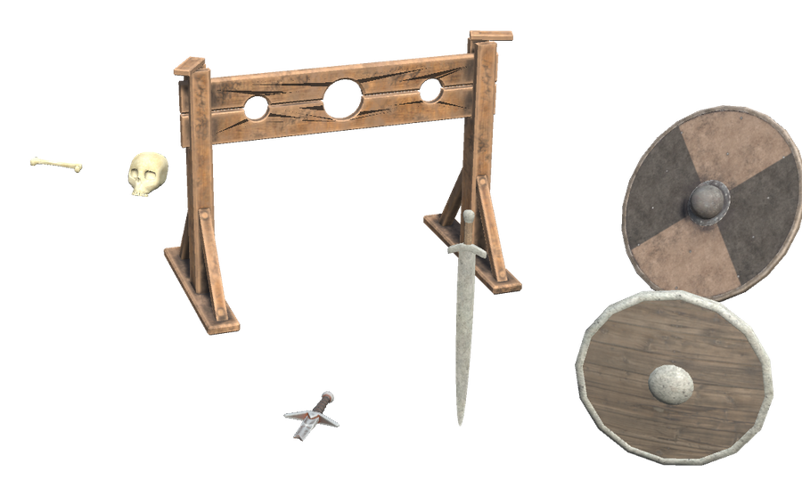

# 🪴 Decor Hammer

[← Back to the README](../README.MD)

The White Hilt Decor Hammer builds decorations only: plants that sway in the wind, stones and stumps, kitchen and workshop things, furniture, cloth, lights and Norse pieces. There are 261 of them under eight tabs.

| Item | Description | Crafting Station | Requirements |
|------|-------------|------------------|--------------|
| **White Hilt Decor Hammer** | Everlasting build tool for decorations. Its pieces show up once you know their materials | Workbench | Wood ×4, Stone ×2, Resin ×2 |

- A decoration shows up in the menu once you know all its materials, as vanilla pieces do, so new ones appear as you reach new biomes.
- Plants and things from the wild (Garden and Wilds) can be placed anywhere. Everything else needs a workbench nearby, as vanilla furniture does.
- Removing a decoration gives its materials back, so rearranging a room costs nothing.
- Plants, cloth and small things on tables let you walk through them; the hammer still removes them.
- Decorations need no support: a lantern can hang from a beam and a pot can stand on a shelf.
- Stools, chairs and benches can be sat on.
- Bushes, trees and other pieces with Valheim's own look are copies of their looks only: they cannot be chopped, picked, mined or looted.

## 🌿 Garden

Trees, bushes, young trees, ferns, flowers, mushrooms and berry bushes. All of them sway in the wind and bend when you walk through them, as Valheim's own plants do, and none of them can be picked or chopped.

| Decoration | Description | Requirements | Notes |
|------------|-------------|--------------|-------|
| **Leafy Bush** | A round green bush from the meadows. | Wood ×2 | Valheim's own look |
| **Heath Bush** | A low bush of the open heath. | Wood ×2 | Valheim's own look |
| **Dense Bush** | A thick bush of small leaves. | Wood ×2 | Valheim's own look |
| **Shrub** | A small shrub for borders and corners. | Wood ×1 | Valheim's own look |
| **Heath Shrub** | A small, dry shrub of the heath. | Wood ×1 | Valheim's own look |
| **Young Beech** | A young beech tree that never grows old. | Beech Seeds ×1, Wood ×2 | Valheim's own look |
| **Young Beech, Bushy** | A young, bushy beech tree. | Beech Seeds ×1, Wood ×2 | Valheim's own look |
| **Young Fir** | A small fir tree from the Black Forest. | Fir Cone ×1, Wood ×2 | Valheim's own look |
| **Yggdrasil Shoot** | A young shoot of the world tree, from the Mistlands. | Yggdrasil Wood ×2 | Valheim's own look |
| **Ashlands Bush** | A thorny, ember-red bush from the Ashlands. | Ashwood ×2 | Valheim's own look |
| **Ashlands Fern** | A fern that grows in the warm ash. | Fiddlehead ×1 | Valheim's own look |
| **Thistle** | A blue-flowered thistle that is never picked. | Thistle ×1 | Valheim's own look |
| **Dandelion** | A single yellow dandelion. | Dandelion ×1 | Valheim's own look |
| **Red Mushroom** | A red-capped mushroom for the shade. | Mushroom ×1 | Valheim's own look |
| **Yellow Mushroom** | A yellow mushroom from the deep woods. | Yellow Mushroom ×1 | Valheim's own look |
| **Blue Mushroom** | A blue mushroom that seems to glow in the dark. | Blue Mushroom ×1 | Valheim's own look |
| **Magecap** | A tall Mistlands mushroom. | Magecap ×1 | Valheim's own look |
| **Jotun Puffs** | Puffy Mistlands mushrooms. | Jotun Puffs ×1 | Valheim's own look |
| **Blueberry Bush** | A blueberry bush full of berries that are only for looking at. | Blueberries ×3, Wood ×1 | Valheim's own look |
| **Raspberry Bush** | A raspberry bush heavy with fruit. | Raspberries ×3, Wood ×1 | Valheim's own look |
| **Cloudberry Patch** | Low cloudberry plants from the plains. | Cloudberries ×3 | Valheim's own look |
| **Wild Flax** | Blue-flowered flax swaying in the wind. | Flax ×2 | Valheim's own look |
| **Wild Barley** | A tuft of golden wild barley. | Barley ×2 | Valheim's own look |
| **Fern** | A broad green fern for shady corners. | Wood ×1 |  |
| **Tall Fern** | A taller fern with arching fronds. | Wood ×1 |  |
| **Stinging Nettle** | A tall clump of nettles. Best admired from a distance. | Wood ×1 |  |
| **Nettles** | A small clump of nettles. | Wood ×1 |  |
| **Round Shrub** | A full, round shrub. | Wood ×2 |  |
| **Low Shrub** | A low, spreading shrub. | Wood ×1 |  |
| **Wood Sorrel** | A patch of clover-leaved sorrel. | Wood ×1 |  |
| **Dandelion Patch** | A patch of dandelions, some already gone to seed. | Dandelion ×2 |  |
| **Celandine** | Bright yellow spring flowers. | Dandelion ×1 |  |
| **Periwinkle** | Ground cover with small blue-violet flowers. | Dandelion ×1 |  |
| **Weeds** | Common weeds that grow along every path. | Wood ×1 |  |
| **Tall Grass** | A tuft of tall grass. | Wood ×1 |  |
| **Grass Tuft** | A small tuft of meadow grass. | Wood ×1 |  |
| **Orange Daisies** | Bright orange daisies. | Dandelion ×1 |  |
| **Yellow Stars** | Small star-shaped yellow flowers. | Dandelion ×1 |  |
| **Blue Flowers** | A spray of small sky-blue flowers. | Dandelion ×1 |  |
| **Red Flowers** | Red and orange flowers that open in the sun. | Dandelion ×1 |  |
| **Fir Tree** | A tall fir tree that never needs felling. | Wood ×10, Fir Cone ×1 |  |
| **Pine Tree** | A tall pine with a broad crown. | Wood ×10, Pine Cone ×1 |  |
| **Young Noble Fir** | A dense young fir. | Wood ×6, Fir Cone ×1 |  |
| **Juniper Shrub** | A low evergreen shrub. | Wood ×2, Fir Cone ×1 |  |
| **Fir Sapling** | A small fir sapling. | Wood ×1, Fir Cone ×1 |  |
| **Apple Tree** | An apple tree for the farmyard. | Wood ×8, Beech Seeds ×1 |  |
| **Ash Tree** | A tall ash tree. | Wood ×10, Beech Seeds ×1 |  |
| **Cherry Tree** | A cherry tree in blossom. | Wood ×8, Beech Seeds ×1 |  |
| **Plum Tree** | A plum tree for the garden. | Wood ×8, Beech Seeds ×1 |  |
| **Holly** | A dark green holly bush. | Wood ×2 |  |
| **Raspberry Canes** | A thicket of raspberry canes. | Raspberries ×3, Wood ×1 |  |
| **Birch Tree** | A white-barked birch. | Wood ×10, Birch Seeds ×1 |  |
| **Tall Birch** | A tall, slender birch. | Wood ×10, Birch Seeds ×1 |  |
| **Autumn Birch** | A birch in its autumn colours. | Wood ×10, Birch Seeds ×1 |  |
| **Maple Tree** | A broad maple tree. | Wood ×10, Beech Seeds ×1 |  |
| **Oak Tree** | A spreading oak. | Wood ×10, Acorn ×1 |  |
| **Hazel Shrub** | A leafy shrub for hedges. | Wood ×2 |  |
| **Tall Shrub** | A tall, open shrub. | Wood ×2 |  |
| **Leafy Sapling** | A small leafy sapling. | Wood ×1, Beech Seeds ×1 |  |

## 🪨 Wilds

Stones, outcrops, stumps, logs, dead trees and moss to make a garden or a path look as if it has always been there.

| Decoration | Description | Requirements | Notes |
|------------|-------------|--------------|-------|
| **Dead Fir** | A small fir that dried out long ago. | Wood ×3 | Valheim's own look |
| **Moss** | Patches of soft moss for stones and roofs. | Stone ×1 |  |
| **Old Stump** | The stump of a long-felled tree. | Wood ×4 |  |
| **Split Stump** | A broken stump with splintered wood. | Wood ×4 |  |
| **Fallen Trunk** | A dead trunk lying in the moss. | Wood ×6 |  |
| **Weathered Trunk** | A grey, weathered trunk. | Wood ×6 |  |
| **Dry Branches** | A few dry branches on the ground. | Wood ×1 |  |
| **Pine Roots** | Roots reaching out of the ground. | Wood ×3 |  |
| **Mossy Standing Stone** | A tall stone with moss on its back. | Stone ×10 |  |
| **Mossy Boulder** | A boulder grown over with moss. | Stone ×8 |  |
| **Mossy Stone** | A stone with a cap of moss. | Stone ×4 |  |
| **Boulder** | A large, rounded boulder. | Stone ×12 |  |
| **Field Stone** | A stone cleared from a field. | Stone ×4 |  |
| **Meadow Rock** | A grey rock of the meadows. | Stone ×10 | Valheim's own look |
| **Forest Rock** | A mossy rock of the Black Forest. | Stone ×10 | Valheim's own look |
| **Heath Rock** | A weathered rock of the heath. | Stone ×10 | Valheim's own look |
| **Mountain Rock** | A rock from the mountains. | Stone ×10 | Valheim's own look |
| **Mistlands Rock** | A rock from the Mistlands. | Stone ×10 | Valheim's own look |
| **Rotten Stump** | An old stump from the meadows. | Wood ×4 | Valheim's own look |
| **Mossy Log** | An old fir log covered in moss. | Wood ×6 | Valheim's own look |
| **Beech Stump** | What is left of a beech. | Wood ×3 | Valheim's own look |
| **Oak Stump** | The broad stump of an oak. | Wood ×4 | Valheim's own look |
| **Swamp Stump** | A dark stump from the swamp. | Ancient Bark ×2 | Valheim's own look |
| **Dead Pine** | A tall pine, long dead. | Wood ×8 |  |
| **Snag** | A broken, dead trunk still standing. | Wood ×6 |  |
| **Dead Tree** | A bare, dead tree. | Wood ×8 |  |
| **Fallen Log** | A long log on the forest floor. | Wood ×6 |  |
| **Birch Log** | A fallen birch log. | Wood ×6 |  |
| **Mossy Boulder, Round** | A round boulder with moss on top. | Stone ×12 |  |
| **Mossy Outcrop** | A mossy outcrop of rock. | Stone ×20 |  |
| **Rock Outcrop** | A grey outcrop of rock. | Stone ×16 |  |

## 🍲 Hearth

Barrels, crates, sacks, baskets, bowls, pots, tankards and food for the kitchen and the storehouse.

| Decoration | Description | Requirements | Notes |
|------------|-------------|--------------|-------|
| **Mead Barrel** | A barrel on its stand, with a bung for tapping. | Wood ×4, Resin ×1 |  |
| **Old Barrel** | A sturdy old barrel. | Wood ×4 |  |
| **Worn Barrel** | A barrel worn by years of use. | Wood ×4 |  |
| **Wooden Crate** | A crate with a latched lid. | Wood ×3 |  |
| **Plank Crate** | A crate of rough planks. | Wood ×3 |  |
| **Wooden Bucket** | A bucket with a rope handle. | Wood ×2 |  |
| **Pail** | A pail with two handles. | Wood ×2 |  |
| **Flat Basket** | A shallow woven basket. | Wood ×2 |  |
| **Lidded Basket** | A woven basket with a lid. | Wood ×2 |  |
| **Wooden Bowl** | A deep bowl turned from one piece of wood. | Wood ×1 |  |
| **Small Bowl** | A small wooden bowl. | Wood ×1 |  |
| **Carved Plate** | A wooden plate with a carved rim. | Wood ×1 |  |
| **Wooden Spoon** | A large wooden spoon. | Wood ×1 |  |
| **Cutting Board** | A worn board for chopping. | Wood ×1 |  |
| **Clay Pot** | A plain clay pot. | Stone ×2, Resin ×1 |  |
| **Clay Planter** | A clay pot for growing herbs. | Stone ×2 |  |
| **Cheese Box** | A round box of thin wood. | Wood ×1 |  |
| **Onion** | An onion that keeps forever. | Onion ×1 |  |
| **Apple** | A red apple, just for show. | Raspberries ×1 |  |
| **Fish Barrel** | A barrel of salted fish. | Wood ×4, Raw Fish ×1 |  |
| **Milk Pail** | A pail for the morning milking. | Wood ×2 |  |
| **Fish Drying Rack** | Fish hung on a rack to dry in the wind. | Wood ×4, Raw Fish ×2 |  |
| **Basket of Turnips** | A basket brimming with turnips. | Wood ×2, Turnip ×3 |  |
| **Basket of Carrots** | A basket of fresh carrots. | Wood ×2, Carrot ×3 |  |
| **Farm Basket** | An empty basket for the harvest. | Wood ×2 |  |
| **Farm Barrel** | A barrel bound with iron hoops. | Wood ×4 |  |
| **Tipped Bucket** | A bucket left lying on its side. | Wood ×2 |  |
| **Bucket of Water** | A bucket of water from the well. | Wood ×2 |  |
| **Fireplace Tools** | A poker, shovel and brush on their stand. | Iron ×1 |  |
| **Tankard** | A wooden tankard for mead. | Wood ×1 |  |
| **Two-Handled Jug** | A jug with two handles. | Stone ×1, Resin ×1 |  |
| **Mug** | A mug with a handle. | Wood ×1 |  |
| **Trencher** | A round wooden plate. | Wood ×1 |  |
| **Flask** | A flask with a narrow neck. | Stone ×1, Resin ×1 |  |
| **Stoneware Jar** | A tall jar with a stopper. | Stone ×1, Resin ×1 |  |
| **Goblet** | An iron goblet. | Iron ×1 |  |
| **Slatted Crate** | An open crate of slats. | Wood ×2 |  |
| **Clay Bowl** | A wide clay bowl. | Stone ×2 |  |
| **Clay Vase** | A clay vase. | Stone ×2, Resin ×1 |  |
| **Large Clay Pot** | A large clay pot for storing grain. | Stone ×3 |  |
| **Clay Bottle** | A tall clay bottle. | Stone ×3 |  |
| **Well Bucket** | A bucket with a tall handle. | Wood ×2 |  |
| **Market Barrel** | A tall barrel with iron hoops. | Wood ×4 |  |
| **Sack of Grain** | An open sack of grain. | Barley ×3 |  |
| **Sack of Seed** | An open sack of seed. | Barley ×3 |  |
| **Wooden Box** | A sturdy wooden box. | Wood ×3 |  |
| **Market Crate** | An open crate for vegetables. | Wood ×2 |  |
| **Cooking Grate** | A grate over a fire, with a pot and bellows. It cooks nothing. | Iron ×2, Stone ×4, Coal ×2 | light |

## 🔨 Workshop

A smithy (anvil, forge, bench, tongs, bellows), a market stall, carts, tools, firewood, fences and a quintain for the yard and the workshop.

| Decoration | Description | Requirements | Notes |
|------------|-------------|--------------|-------|
| **Chopping Block** | A chopping log with an axe in it. | Wood ×3, Flint ×1 |  |
| **Split Firewood** | A few pieces of split firewood. | Wood ×3 |  |
| **Fence Post** | A rough fence post. | Wood ×1 |  |
| **Rail Fence** | A length of split-rail fence. | Wood ×3 |  |
| **Log Fence** | A low fence of crossed logs. | Wood ×3 |  |
| **Plank Fence** | A fence of posts and planks. | Wood ×3 |  |
| **Field Gate** | A small gate for a field fence. It stays shut; walk round it. | Wood ×4 |  |
| **Hatchet** | A small axe, left where it was last used. | Wood ×1, Flint ×1 |  |
| **Old Axe** | A worn wood axe. | Wood ×1, Flint ×1 |  |
| **Stepladder** | A wooden stepladder. It is not for climbing. | Wood ×4 |  |
| **Old Spinning Wheel** | A spinning wheel that has seen many winters. | Fine Wood ×4 |  |
| **Hand Plane** | A carpenter's plane. | Wood ×1, Bronze ×1 |  |
| **Smith's Hammer** | A small smithing hammer. | Wood ×1, Bronze ×1 |  |
| **Rusty Spade** | A spade gone brown with rust. | Wood ×1, Iron ×1 |  |
| **Hanging Chains** | Chains for the smithy wall. | Chain ×1 |  |
| **Dvergr Pickaxe** | A dvergr miner's pickaxe. | Wood ×1, Copper ×2 | Valheim's own look |
| **Hook and Chain** | A hoisting hook on a chain, to hang from the rafters. | Chain ×1, Copper ×1 | Valheim's own look |
| **Trader's Wagon** | A wagon like the one Haldor travels with. | Wood ×20, Fine Wood ×8, Leather Scraps ×6 | Valheim's own look |
| **Smith's Tool Wall** | Tongs, hammers and punches hung in a row. | Iron ×4, Wood ×2 |  |
| **Anvil** | A heavy anvil. | Iron ×6 |  |
| **Stone Forge** | A stone hearth with a fire that never goes out. It smelts nothing. | Stone ×20, Coal ×4 | light |
| **Smith's Bench** | A bench with a back board for tools. | Wood ×8, Iron ×1 |  |
| **Quench Tub** | A tub of water to cool hot iron. | Wood ×4 |  |
| **Bellows** | Leather bellows for the forge. | Leather Scraps ×2, Wood ×1 |  |
| **Tongs** | Long smith's tongs. | Iron ×1 |  |
| **Crucible** | A crucible for melting metal. | Stone ×2 |  |
| **Smithy Sign** | A hanging sign with an anvil on it. | Iron ×2 |  |
| **Cart Wheel** | A spoked wheel to lean against a wall. | Wood ×4 |  |
| **Handcart** | A two-wheeled handcart. | Wood ×10 |  |
| **Market Stall** | A stall with a striped awning. | Wood ×12, Linen Thread ×4 |  |
| **Barrow** | A small wooden cart. | Wood ×8 |  |
| **Logs and Sacks** | Logs stacked with a few sacks. | Wood ×6, Linen Thread ×1 |  |
| **Quintain** | A swinging target for spear practice. | Wood ×6, Leather Scraps ×2 |  |

## 🪑 Home

Tables, stools and chairs you can sit on, shelves, boxes and pots, from the meadows to the Ashlands.

| Decoration | Description | Requirements | Notes |
|------------|-------------|--------------|-------|
| **Folding Stool** | A folding stool with a leather seat. | Wood ×2 | seat |
| **Wooden Stool** | A round wooden stool. | Wood ×2 | seat |
| **Low Stool** | A low stool for the hearth. | Wood ×2 | seat |
| **Round Table** | A small round table. | Wood ×5 |  |
| **Side Table** | A small table for the bedside. | Wood ×4 |  |
| **Rough Table** | A heavy table of rough planks. | Wood ×6 |  |
| **Low Table** | A low, broad table for sitting round on the floor. | Wood ×8 |  |
| **Trestle Table** | A sturdy trestle table. | Wood ×6, Fine Wood ×2 |  |
| **Carved Bull Head** | A carved bull's head for the wall. | Wood ×4, Leather Scraps ×2 |  |
| **Carved Horse Head** | A carved horse's head for the wall. | Wood ×4, Leather Scraps ×2 |  |
| **Rolled Map** | A map rolled up and tied. | Leather Scraps ×1 |  |
| **Dvergr Table** | A table from a dvergr outpost. | Yggdrasil Wood ×4 | Valheim's own look |
| **Dvergr Chair** | A dvergr chair. | Yggdrasil Wood ×2 | seat, Valheim's own look |
| **Dvergr Stool** | A dvergr stool. | Yggdrasil Wood ×1 | seat, Valheim's own look |
| **Dvergr Shelf** | A dvergr storage shelf. | Yggdrasil Wood ×3 | Valheim's own look |
| **Dvergr Barrel** | A barrel from the dvergr stores. | Yggdrasil Wood ×3, Copper ×1 | Valheim's own look |
| **Dvergr Crate** | A dvergr supply crate. | Yggdrasil Wood ×2 | Valheim's own look |
| **Long Dvergr Crate** | A long dvergr crate. | Yggdrasil Wood ×3 | Valheim's own look |
| **Mountain Chair** | A chair from a mountain hall. | Wood ×3, Wolf Pelt ×1 | seat, Valheim's own look |
| **Mountain Table** | A table from a mountain hall. | Wood ×6, Wolf Pelt ×1 | Valheim's own look |
| **Charred Bench** | A bench from the halls of the Ashlands. | Ashwood ×4 | seat, Valheim's own look |
| **Charred Stool** | A stool from the halls of the Ashlands. | Ashwood ×2 | seat, Valheim's own look |
| **Charred Table** | A table from the halls of the Ashlands. | Ashwood ×6 | Valheim's own look |
| **Braided Box** | A box with braided leather bands. | Wood ×2, Leather Scraps ×1 | Valheim's own look |
| **Castle Urn** | An urn from an old stronghold. | Stone ×2 | Valheim's own look |
| **Red Ashlands Pot** | A red-glazed pot from the Ashlands. | Stone ×2, Ashwood ×1 | Valheim's own look |
| **Green Ashlands Pot** | A green-glazed pot from the Ashlands. | Stone ×2, Ashwood ×1 | Valheim's own look |
| **Ashlands Urn** | A tall Ashlands urn. | Stone ×3, Ashwood ×1 | Valheim's own look |
| **Barrel** | A plain barrel like the ones in abandoned houses. | Wood ×4 | Valheim's own look |
| **Cargo Crate** | A crate washed up from a lost ship. | Wood ×4 | Valheim's own look |
| **Long Bench** | A long, plain bench. | Wood ×4 | seat |
| **Hooped Barrel** | A barrel with three iron hoops. | Wood ×4 |  |
| **Wooden Chair** | A plain wooden chair. | Wood ×3 | seat |
| **Plain Table** | A plain rectangular table. | Wood ×6 |  |
| **Dark Round Table** | A round table of dark wood. | Wood ×5 |  |
| **Dark Stool** | A stool of dark wood. | Wood ×2 | seat |
| **Dark Shelves** | Open shelves of dark wood. | Wood ×6 |  |
| **Wall Plank** | A single plank shelf for the wall. | Wood ×2 |  |
| **Banded Chest** | An open chest bound with iron. It is only for show. | Wood ×4, Iron ×1 |  |
| **Scroll** | A rolled scroll tied with a band. | Leather Scraps ×1 |  |
| **Green Bottle** | A green glass bottle with a cork. | Resin ×2 |  |

## 🧵 Textiles

Hanging cloth, hides, curtains, banners and runner rugs.

| Decoration | Description | Requirements | Notes |
|------------|-------------|--------------|-------|
| **Hanging Cloth** | A long cloth hung from the rafters. | Linen Thread ×2 | Valheim's own look |
| **Hanging Hide** | A shaggy hide hung to dry. | Wolf Pelt ×2 | Valheim's own look |
| **Dvergr Curtain** | A heavy dvergr curtain. | Linen Thread ×2 | Valheim's own look |
| **Dvergr Banner** | A dvergr banner. | Linen Thread ×2 | Valheim's own look |
| **Fuling Banner** | A banner from a fuling village. | Wood ×2, Linen Thread ×1 | Valheim's own look |
| **Charred Banner** | A banner of the charred warriors. | Ashwood ×1, Linen Thread ×2 | Valheim's own look |
| **Tattered Charred Banner** | A tattered banner of the charred warriors. | Ashwood ×1, Linen Thread ×2 | Valheim's own look |
| **Hall Banner** | A tall banner from the halls of the Ashlands. | Ashwood ×1, Linen Thread ×2 | Valheim's own look |
| **Hall Runner** | A long runner rug. | Linen Thread ×3 | Valheim's own look |
| **Hall Runner End** | The end of a runner rug. | Linen Thread ×2 | Valheim's own look |
| **Blue Tapestry** | A blue hanging on a rod. | Linen Thread ×3 |  |

## 🕯️ Lights

Candles, lanterns, lamps, a chandelier and fires that burn without fuel. They give light, not heat or comfort.

| Decoration | Description | Requirements | Notes |
|------------|-------------|--------------|-------|
| **Candlestick** | A wooden candlestick with an ever-burning candle. | Wood ×1, Resin ×2 | light |
| **Wooden Lantern** | A wooden lantern with a warm light. | Wood ×2, Resin ×2 | light |
| **Ring of Stones** | A ring of stones with a fire that never needs wood. It gives light, not heat. | Stone ×8, Wood ×4, Coal ×2 | light |
| **Dvergr Lamp Post** | A standing dvergr lantern. | Copper ×2, Resin ×2 | Valheim's own look |
| **Dvergr Hanging Lamp** | A dvergr lantern to hang from a beam. | Copper ×1, Resin ×2 | Valheim's own look |
| **Fuling Torch** | A crude fuling torch that burns forever. | Wood ×2, Resin ×2 | Valheim's own look |
| **Old Brazier** | An iron brazier from an old stronghold. | Iron ×2, Coal ×4 | Valheim's own look |
| **Chandelier** | An iron chandelier with candles that never burn down. | Iron ×3, Resin ×4 | light |
| **Hanging Oil Lamp** | An oil lamp to hang from a beam. | Iron ×1, Resin ×2 | light |
| **Wall Lamp** | A lamp for the wall. | Iron ×1, Resin ×2 | light |
| **Tavern Lantern** | A lantern with a wide roof. | Iron ×1, Resin ×2 | light |
| **Candle Stand** | A tall iron candle stand. | Iron ×2, Resin ×2 | light |
| **Wall Candle** | A candle holder for the wall. | Iron ×1, Resin ×2 | light |
| **Table Candle** | A candle in an iron holder. | Iron ×1, Resin ×2 | light |

## ᚱ Norse

Runestones, graves, a dolmen, stocks, skulls, swords and shields, fuling totems, wrecked ships and other pieces of the old world.

| Decoration | Description | Requirements | Notes |
|------------|-------------|--------------|-------|
| **Runestone** | A standing stone carved with runes. | Stone ×10 | Valheim's own look |
| **Old Runestone** | A weathered runestone. | Stone ×10 | Valheim's own look |
| **Dolmen** | Great stones raised by people long forgotten. | Stone ×30 | Valheim's own look |
| **Grave** | An old grave with a stone at its head. | Stone ×6, Bone Fragments ×2 | Valheim's own look |
| **Mountain Gravestone** | A gravestone from the mountains. | Stone ×6 | Valheim's own look |
| **Pile of Skulls** | A grim reminder for unwelcome guests. | Bone Fragments ×6 | Valheim's own look |
| **Fuling Totem Pole** | A totem pole from a fuling village. | Wood ×6, Bone Fragments ×2 | Valheim's own look |
| **Fuling Fence** | A spiked fuling fence. | Wood ×4 | Valheim's own look |
| **Straw Pile** | A pile of straw. | Barley ×2 | Valheim's own look |
| **Wall Shield** | A painted round shield for the wall. | Wood ×4, Leather Scraps ×1 |  |
| **Wrecked Dragon Head** | The carved dragon head of a sunken karve. | Fine Wood ×6, Resin ×2 | Valheim's own look |
| **Wrecked Bow** | The bow of a wrecked karve. | Fine Wood ×8 | Valheim's own look |
| **Wrecked Stern** | The stern of a wrecked karve. | Fine Wood ×8 | Valheim's own look |
| **Wrecked Sternpost** | A sternpost washed ashore. | Fine Wood ×4 | Valheim's own look |
| **Longship Wreck, Fore** | The fore part of a wrecked longship. | Fine Wood ×10, Ancient Bark ×4 | Valheim's own look |
| **Longship Wreck, Aft** | The aft part of a wrecked longship. | Fine Wood ×10, Ancient Bark ×4 | Valheim's own look |
| **Broken Mast** | A broken mast, half buried in sand. | Fine Wood ×6 | Valheim's own look |
| **Fallen Swords** | Swords left where a battle ended. | Iron ×4 | Valheim's own look |
| **Stocks** | Stocks for the village's troublemakers. | Wood ×6, Iron ×1 |  |
| **Skull** | A human skull. | Bone Fragments ×2 |  |
| **Bone** | An old bone. | Bone Fragments ×1 |  |
| **Iron-Rimmed Shield** | A round shield with an iron rim, for the wall. | Wood ×4, Iron ×1 |  |
| **Old Sword** | An old sword to hang on the wall. | Iron ×2 |  |
| **Broken Sword** | A sword snapped in battle. | Iron ×1 |  |

## ⚙️ Settings

The hammer has the usual `[Content]`, `[Recipes]` and `[Tiers]` entries under `WhiteHiltDecorHammer` (see [Settings & progression](progression.md)). Turning it off removes the hammer; decorations already built stay.

## 🧱 For modders

Every decoration is one line in [`AssetSource/Decor/decor.json`](../AssetSource/Decor/decor.json), which the mod embeds. A new one with a vanilla look needs nothing else. One with a model from [Poly Haven](https://polyhaven.com) or a downloaded `.glb` is prepared by `AssetSource/Decor/prepare_decor.py` and built into the decor bundle by `AssetSource/build_foraging_bundle.ps1 -DecorOnly`. See [`AssetSource/Decor/README.md`](../AssetSource/Decor/README.md) for the fields, and [How the mod is built](architecture.md) for how the pieces are made.
