# 🏰 Defences

[← Back to the README](../README.MD)

## 🏰 DEFENCES

A palisade fort for the early game, and the same fort in [stone](#-stone-defences) for later, built from Valheim's own stakes, logs and planks. Every walkway is 2 m up, so the rampart, its corners and bends, the gatehouse and the first floor of every watchtower join into one walk all the way round. Each piece is one building piece with one health bar, and its meshes are merged when the game starts, so a whole fort stays light.

         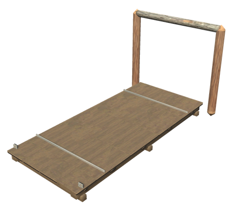 

| Item | Description | Crafting Station | Requirements |
|------|-------------|------------------|--------------|
| **Palisade Rampart** | 4 m of sharpened stakes with lashing bands, base spikes and an earth bank, and a walkway behind | Hammer (Workbench) | Core Wood ×8, Wood ×10, Stone ×4 |
| **Rampart Corner** | A square corner with a thick corner stake; the walkway goes round it | Hammer (Workbench) | Core Wood ×6, Wood ×6, Stone ×4 |
| **Rampart Bend** | Turns the rampart by 45 degrees, either way | Hammer (Workbench) | Core Wood ×6, Wood ×6, Stone ×4 |
| **Rampart Stairs** | Stairs from the ground up to the walkway | Hammer (Workbench) | Wood ×12 |
| **Gatehouse** | A double gate of iron-banded stakes that opens and closes, between two roofed towers with stairs up to a walk over the gate. Torches, shields and a crown of stakes with a deer trophy | Hammer (Workbench) | Core Wood ×30, Wood ×30, Bronze ×4, Stone ×10, Resin ×6 |
| **Small Watchtower** | 2 × 2 m, two floors, overhanging parapet and roof | Hammer (Workbench) | Core Wood ×12, Wood ×20, Stone ×4, Resin ×4 |
| **Watchtower** | 3 × 3 m, two floors, overhanging parapet and roof | Hammer (Workbench) | Core Wood ×20, Wood ×30, Stone ×6, Resin ×6 |
| **Large Watchtower** | 4 × 4 m, three floors with parapets on the two upper ones, and a roof | Hammer (Workbench) | Core Wood ×32, Wood ×50, Stone ×10, Resin ×10 |
| **Cheval de Frise** | A log with crossed sharpened stakes that hurts creatures running into it | Hammer (Workbench) | Core Wood ×4, Wood ×4 |
| **Drawbridge** | A 4 × 9 m deck over a moat, hinged at one end between two posts. Open it to lower it, close it to raise it | Hammer (Workbench) | Core Wood ×10, Wood ×20, Iron ×4, Chain ×2 |

In the towers, use the ladder to climb to the next floor up, or hold the alternate key (Shift) to climb down.

### Moats and the drawbridge

The White Hilt hoe digs moats round the fort: a dry V-ditch, a wet moat with water or a ditch with sharp stakes, with causeways left in front of the gates. See [Moats](build-tools.md#moats).

Place the drawbridge with its posts at the inner edge of the moat and the deck reaching across. It follows the nearest gate within 12 m: when the gate opens the bridge is lowered, and when the gate closes, by hand, on its own or when enemies come near (see [self-closing doors](base.md)), the bridge is raised. It can also be opened and closed by hand.

The raised and lowered positions stay the same after loading, and following a gate works on dedicated servers without an active door animation.

## 🪨 STONE DEFENCES

The same fort in stone, for when trolls come knocking. Every palisade module has a stone counterpart with the same footprint and snap points, built near a **Stonecutter**. Stone stands taller: the wall walk is on top of the wall, **3 m** up, a metre above the palisade's, so the stone pieces join each other into one walk, and stone and wood can stand side by side without their walks meeting.

The fronts are not flat: a stepped plinth with rubble at the foot, string courses, a parapet that overhangs on corbels, merlons with arrow slits, buttresses, dressed corner stones, a round corner bastion and round-fronted gate towers. Moss grows on the ledges and the lowest courses are dark with damp, so a new wall already looks as if it has stood a few winters.

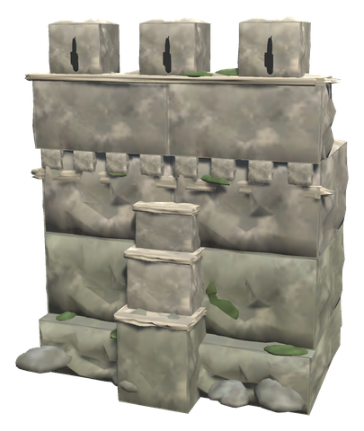 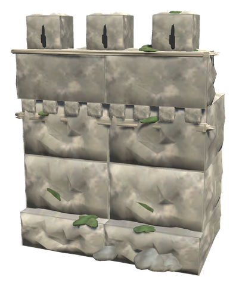 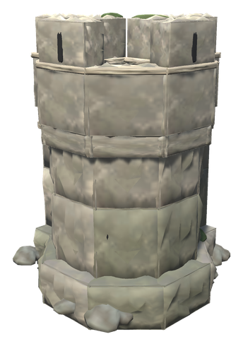 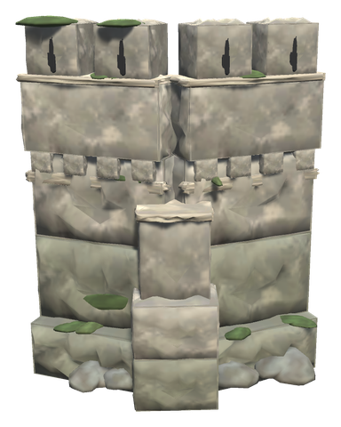 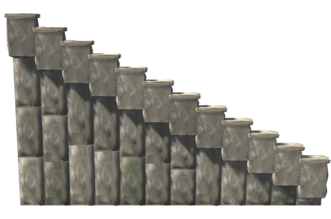 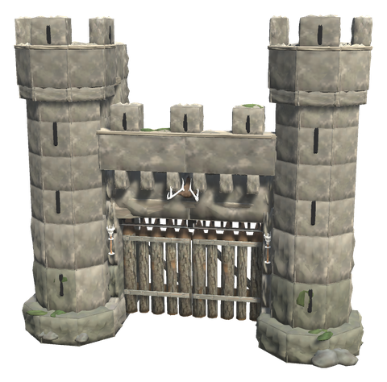 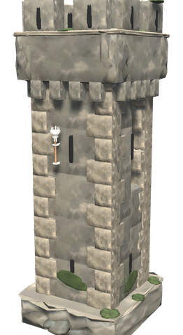 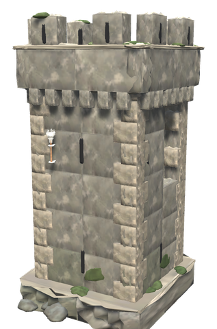 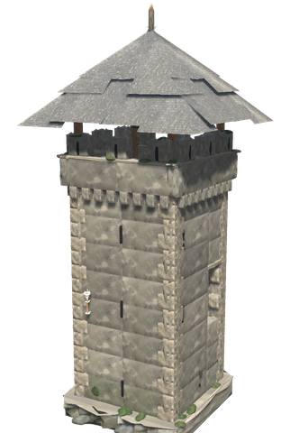 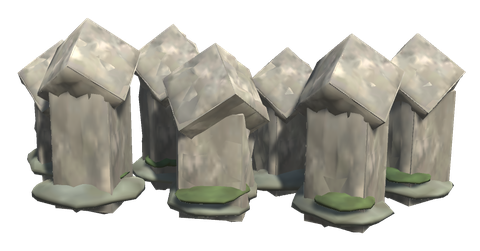 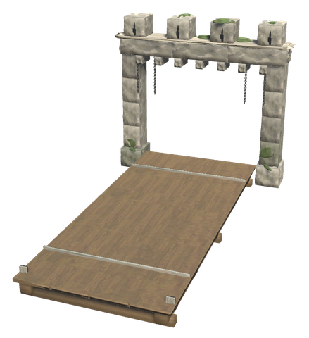 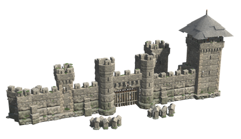

| Item | Description | Crafting Station | Requirements | Health |
|------|-------------|------------------|--------------|--------|
| **Stone Rampart** | 4 m of thick stone wall with a buttress in front; the walk runs along the top behind merlons with arrow slits | Hammer (Stonecutter) | Stone ×40 | 4000 |
| **Plain Stone Rampart** | The same wall without the buttress, to alternate with it | Hammer (Stonecutter) | Stone ×36 | 4000 |
| **Stone Corner Bastion** | A square corner with a round bastion over it; its top joins both wall walks | Hammer (Stonecutter) | Stone ×50 | 3500 |
| **Stone Corner 45** | Turns the wall by 45 degrees, with a buttress over the joint | Hammer (Stonecutter) | Stone ×40 | 3500 |
| **Stone Rampart Stairs** | Twelve solid steps with a cheek wall, 6 m long, up to the walk | Hammer (Stonecutter) | Stone ×30 | 2000 |
| **Stone Gatehouse** | The palisade's double gate under a stone arch, with a portcullis ([worked from inside](#-working-the-gate)) and machicolations, between two round-fronted towers. Enter a tower from the wall walk and climb its ladder to the walk over the gate and on to the top | Hammer (Stonecutter) | Stone ×120, Core Wood ×20, Wood ×20, Iron ×10 | 10000 |
| **Small Stone Tower** | 2 × 2 m, floors at 3 m and 5.6 m, open crenellated top | Hammer (Stonecutter) | Stone ×60, Wood ×10 | 5000 |
| **Stone Tower** | 3 × 3 m, floors at 3 m and 5.6 m, open crenellated top | Hammer (Stonecutter) | Stone ×90, Wood ×16 | 7500 |
| **Large Stone Tower** | 4 × 4 m, floors at 3 m, 5.6 m and 8.2 m, under a slate roof | Hammer (Stonecutter) | Stone ×130, Wood ×30 | 11000 |
| **Dragon's Teeth** | Two staggered rows of stone posts with sharp points that hurt creatures running into them | Hammer (Stonecutter) | Stone ×20 | 1500 |
| **Stone Drawbridge** | The 4 × 9 m deck between two stone piers with chains to a crenellated lintel. Follows the nearest gate like the wooden one | Hammer (Stonecutter) | Stone ×30, Core Wood ×10, Wood ×20, Iron ×4, Chain ×2 | 6000 |

- **Strength**: stone has about 2.5 times the health of the palisade. Blunt blows, which trolls deal, do half damage, and so do slashes, chops and arrows (arrows a quarter). Fire, frost, poison and spirit do nothing, and rain does not wear it. A pickaxe does full damage, so you can still take your own wall down. A troll needs about a hundred blows on a stone rampart, against some twenty-five on the palisade.
- **Towers** have a door at the foot of the back, doorways onto the wall walks on both sides near the back, and a ladder up the front through a hatch in every floor.
- The pieces are on the Black Forest tier, but are built near a Stonecutter, which needs iron, so they come with the Swamp in practice.

### Black marble and grausten

Every stone piece also comes in **black marble** for the Mistlands and **grausten** for the Ashlands: the same shapes, ladders, gates and portcullis, built near a Stonecutter of the later stone. Marble is dark with pale veins and grows blue-green moss; grausten is dark and warm grey, sooty instead of mossy, with iron spikes on its merlons.

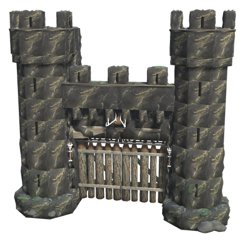 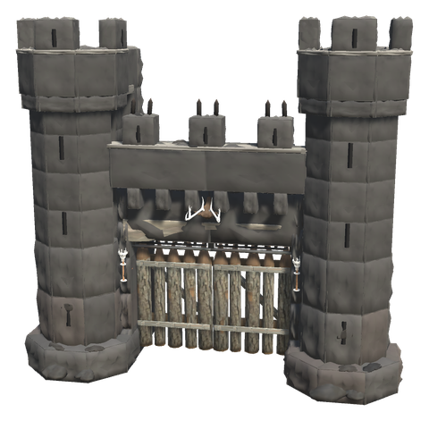

| | Stone | Black marble | Grausten |
|---|---|---|---|
| Tier | Black Forest | Mistlands | Ashlands |
| Cost | Stone as listed | Half as much Black Marble in place of the Stone | Half as much Grausten in place of the Stone |
| Health | as listed | 1.5 times | 2 times |
| Blunt damage (trolls) | half | half | a quarter |

The names follow the stone: *Black Marble Rampart*, *Grausten Gatehouse*, *Small Grausten Tower* and so on.

## 🔥 DEFENDING THE WALLS

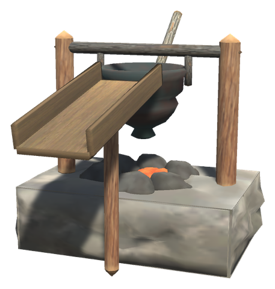 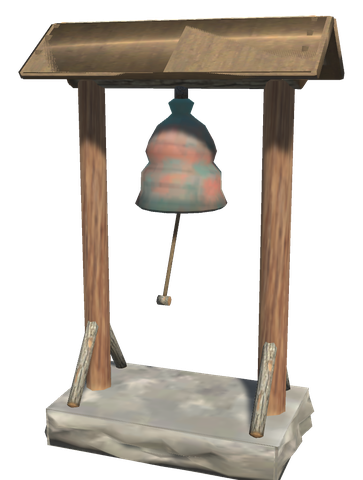

| Item | Description | Crafting Station | Requirements |
|------|-------------|------------------|--------------|
| **Oil Cauldron** | An iron cauldron on a tipping frame over a small hearth, with a chute out over the parapet. Set it on the walk over a gate, chute outwards | Hammer (Workbench) | Stone ×10, Iron ×4, Wood ×6 |
| **Alarm Bell** | A bell under a small roof on two posts, with a rope to ring it | Hammer (Workbench) | Wood ×8, Bronze ×4, Stone ×6 |

- **Filling the cauldron**: use Resin ×5 or Tar ×2 on it for boiling pitch, or Stone ×10 for stones (put the item in your hotbar and press its number while looking at the cauldron). Pitch must heat for 20 seconds; the embers glow while it does.
- **Tipping it** (use) pours everything down in front of the wall, 1 to 3 m out and up to 5 m below: pitch does 60 fire damage and sets them burning, stones 80 blunt damage and knock them back. Players and tamed animals are spared. Then fill it again.
- **Ringing the bell** (use) shuts every gate, drawbridge, portcullis and door within 40 m, where you may, and every player within 150 m hears it, is told and gets a mark on the map for a minute. A guestbook that notes a raid rings the bells within its radius by itself, so the base shuts itself while you are away.

Work the gates, drawbridges and portcullises from inside the walls, or call them open from outside with a horn. Every control follows the same rule as a door in a ward: only players who may open it can work it.

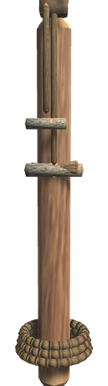 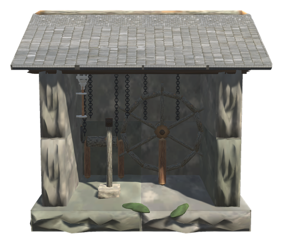

| Item | Description | Crafting Station | Requirements |
|------|-------------|------------------|--------------|
| **Gate Rope** | A rope made fast on a post. Pull it (use) to open or close the gate, drawbridge or portcullis within 15 m. Shift + use sets which of them it works, among those nearby; put up one rope for each | Hammer (no station) | Wood ×4, Leather Scraps ×4 |
| **Windlass House** | A small stone house with the gate's machinery, working everything within 25 m: the great wheel raises and lowers the drawbridge, the crank the portcullis, the lever opens and closes the gate. Shift + use on any of them shuts everything at once, for a raid. The wheel, crank and lever turn to show how things stand | Hammer (Workbench) | Stone ×20, Wood ×20, Bronze ×4 |
| **Gate Horn** | Blow it (attack) within 40 m of a gate: the gate opens, raising its portcullis, or closes if it was open. A drawbridge nearby follows the gate | Workbench | Boar Trophy, Leather Scraps ×2, Copper |

- **The portcullis** of the stone gatehouse comes down in front of the gate leaves and blocks the gateway. It is worked only with a Gate Rope, a Windlass House or the Gate Horn, so it can be lowered while the gate leaves stay open, or kept down behind a closed gate.
- **Teaching the horn**: a new Gate Horn calls the nearest gate. Use it on a Gate Rope or a Windlass House (put it in your hotbar and press its number while looking at the control) and it learns that gate's call: from then on it calls only that gate, wherever you stand within reach. Its tooltip says which it does.
- A drawbridge follows its gate as before; a rope set to the drawbridge or the windlass wheel works the bridge on its own until the gate next moves.

## Config

Section `[Defences]` (admin only, synced from the server; it was `[Defenses]` before 0.49.0, and its value is moved over):

| Setting | Default | What it does |
|---|---|---|
| `HealthMultiplier` | 1 | Multiplier on the health of every palisade and stone defence. Placed pieces keep their damage; a repair brings them to the new full health |
| `DrawbridgeLinkRange` | 12 | A drawbridge follows the nearest gate within this many metres. 0 turns it off |

Section `[Defences.Siege]` (admin only, synced from the server):

| Setting | Default | What it does |
|---|---|---|
| `PitchDamage` | 60 | Fire damage of boiling pitch from the Oil Cauldron; it also sets them burning |
| `StoneDamage` | 80 | Blunt damage of stones from the Oil Cauldron |
| `HeatSeconds` | 20 | Seconds pitch must heat before it can be poured |
| `BellShutRange` | 40 | How far round the Alarm Bell gates, drawbridges, portcullises and doors are shut |
| `BellAlertRange` | 150 | How far away players are told the bell rings and get a mark on the map |
| `BellRingsOnRaid` | on | A bell rings by itself when a guestbook near it notes a raid |
| `CraneShipRange` | 15 | How far from the Harbour Crane a ship may lie for it to load and unload |

Section `[Defences.GateControl]` (admin only, synced from the server):

| Setting | Default | What it does |
|---|---|---|
| `RopeRange` | 15 | How far from a Gate Rope the gate, drawbridge or portcullis it works may be, in metres |
| `WindlassRange` | 25 | How far from a Windlass House the gate, drawbridge and portcullis it works may be, in metres |
| `HornRange` | 40 | How far a Gate Horn is heard by a gate, in metres |
| `HornSeconds` | 2 | Seconds the Gate Horn is blown before the gate answers |
