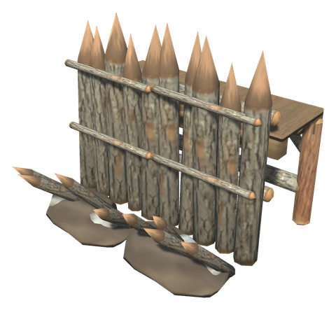
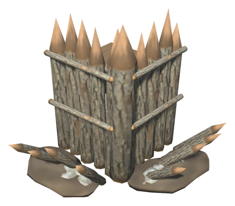
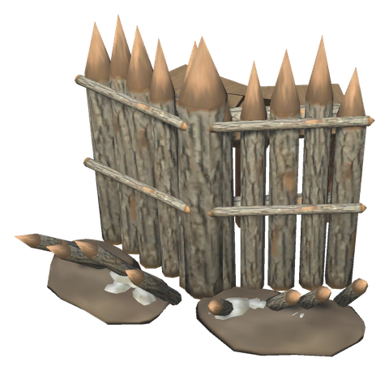
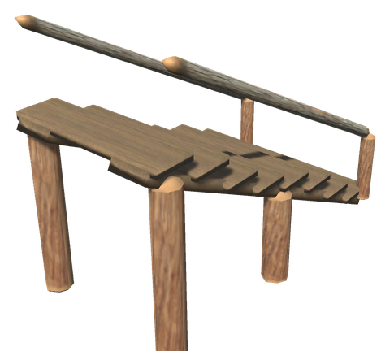
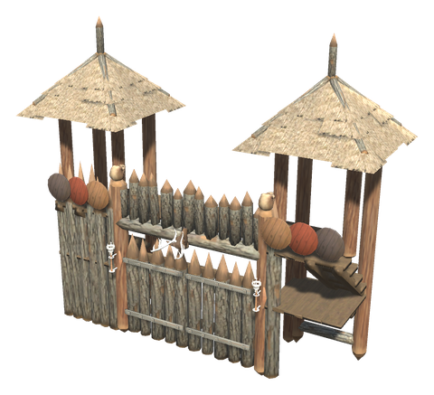
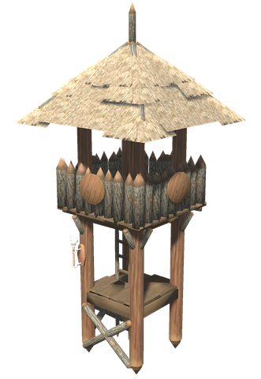
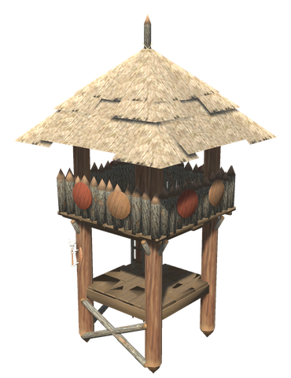
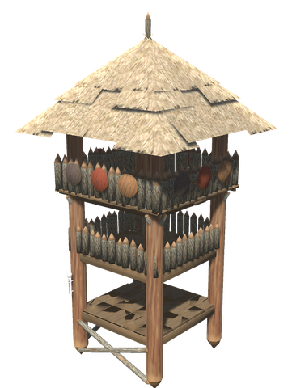
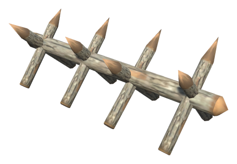
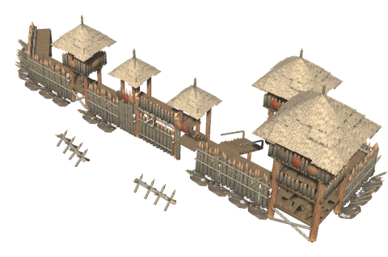

# 🏰 Defences

[← Back to the README](../README.MD)

## 🏰 DEFENCES

A palisade fort for the early game, built from Valheim's own stakes, logs and planks. Every walkway is 2 m up, so the rampart, its corners and bends, the gatehouse and the first floor of every watchtower join into one walk all the way round. Each piece is one building piece with one health bar, and its meshes are merged when the game starts, so a whole fort stays light.

         

| Item | Description | Crafting Station | Requirements |
|------|-------------|------------------|--------------|
| **Palisade Rampart** | 4 m of sharpened stakes with lashing bands, base spikes and an earth bank, and a walkway behind | Hammer (Workbench) | Core Wood ×8, Wood ×10, Stone ×4 |
| **Rampart Corner** | A square corner with a thick corner stake; the walkway goes round it | Hammer (Workbench) | Core Wood ×6, Wood ×6, Stone ×4 |
| **Rampart Bend** | Turns the rampart by 45 degrees, either way | Hammer (Workbench) | Core Wood ×6, Wood ×6, Stone ×4 |
| **Rampart Stairs** | Stairs from the ground up to the walkway | Hammer (Workbench) | Wood ×12 |
| **Gatehouse** | A double gate of iron-banded stakes that opens and closes, between two roofed towers with stairs up to a walk over the gate. Torches, shields and a crown of stakes with a deer trophy | Hammer (Workbench) | Core Wood ×30, Wood ×30, Bronze ×4, Stone ×10, Resin ×6 |
| **Small Watchtower** | 2 × 2 m, two floors, overhanging parapet and roof | Hammer (Workbench) | Core Wood ×12, Wood ×20, Stone ×4, Resin ×4 |
| **Watchtower** | 3 × 3 m, two floors, overhanging parapet and roof | Hammer (Workbench) | Core Wood ×20, Wood ×30, Stone ×6, Resin ×6 |
| **Large Watchtower** | 4 × 4 m, three floors with parapets on the two upper ones, and a roof | Hammer (Workbench) | Core Wood ×32, Wood ×50, Stone ×10, Resin ×10 |
| **Cheval de Frise** | A log with crossed sharpened stakes that hurts creatures running into it | Hammer (Workbench) | Core Wood ×4, Wood ×4 |

In the towers, use the ladder to climb to the next floor up, or hold the alternate key (Shift) to climb down.

## Config

Section `[Defences]` (admin only, synced from the server; it was `[Defenses]` before 0.49.0, and its value is moved over):

| Setting | Default | What it does |
|---|---|---|
| `HealthMultiplier` | 1 | Multiplier on the health of the rampart, gatehouse, watchtowers and cheval de frise. Placed pieces keep their damage; a repair brings them to the new full health |
