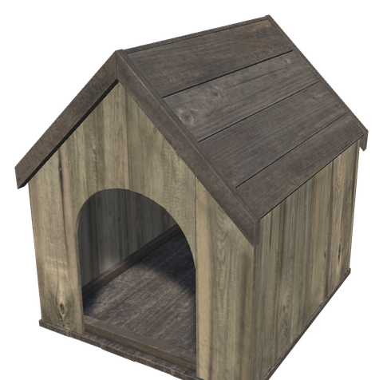
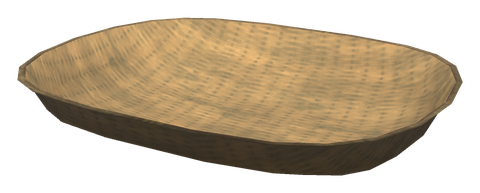
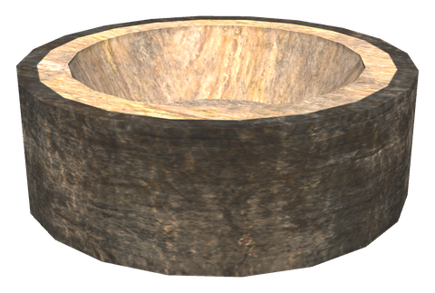
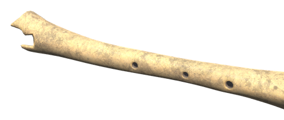
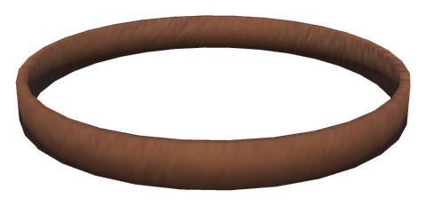

# 🐕 Dog

[← Back to the README](../README.MD)

## 🐕 DOG

Buy a puppy from the Bog Witch, carry it home in your pack and let it out. It grows up over ten days if you care for it, and a grown dog follows you and fights for you.

- **Buying**: the Bog Witch sells a brown, a black and white and a golden puppy for 1000 coins each. You can have one dog at a time. When it dies or runs away, you can buy a new one. A puppy from a litter or one left behind by an old dog can only be let out by a player who has no dog.
- **Letting it out**: use the puppy from the hotbar or right-click it in the inventory. You must be under the open sky, and you give it a name. The nearest Dog House within 30 m is its home; without one, home is where you let it out. A Dog House you build near its home later becomes the new home.
- **Care**: the dog needs food, a Dog House and a Dog Bed under a roof within 30 m of home. It eats meat from the Dog Bowl, a Feeding Trough or the ground. Its hover text shows how far it has grown and what it lacks.
- **Growing**: the puppy only grows on days it has eaten and has both a house and a bed. It stays around home, cannot be commanded and does not fight. At 100% it is a grown dog about the size of a large hound. Use it to make it follow you or stay, like a tame wolf.
- **Rest**: at night the dog walks home and sleeps in its bed. When you sleep in a bed within 30 m of its home, it lies down on the floor beside you instead. Without a bed it sleeps in the house, and in the rain it shelters there. It gets up at dawn, when you tell it to follow you, when it is hurt and when it sees an enemy.
- **Neglect**: a dog that has had no house or bed at home for 3 days runs away. A dog that has not eaten for 15 days starves to death. While the dog's area is not loaded, at most one day counts, so a long journey does not kill it.
- **Death**: a dead dog leaves its remains, which carry its name and how many days it lived. Cut a Dog's Gravestone from them at the stonecutter, and raise it with the hammer as a Dog's Grave: the name and age are chiselled into the stone. The dog does not come back.
- **Learning**: the Dog House, Dog Bed, Dog Bowl, Dog Water Bowl, Dog's Grave, Dog Whistle, collars, Bone Broth, gravestone, Stick, Dog Treat, Dog Bandage and Dog Coat stay unknown until you buy your first puppy.
- **Following**: a grown dog sits down when you stand still for 3 seconds and gets up when you walk on. It goes through portals with you when it is within 10 m, and keeps following after it has been out of range.
- **Bond**: every creature the dog kills, or you kill with the dog within 30 m, gives it experience equal to the creature's health. Each of its 10 levels gives +10% health and +5% damage. Level 1 takes 250 experience, level 10 takes 25 000.
- **Guard dog**: at home, the dog barks when an enemy comes within 30 m of it, and you get a message when you are within 150 m.
- **Sniffing**: while it follows you, the dog barks at the nearest berry, mushroom or White Hilt plant within 25 m every 20 seconds and marks it on the map for a minute.
- **Cuddling**: petting your dog once a game day gives you Cuddled for 10 minutes: health and stamina regenerate 10% faster.
- **Collars**: use a collar from the hotbar while looking at the dog. The old collar comes back, and a dead dog drops its collar.
- **Bone Broth**: dog food from the Stone Pot. A dog that eats it is fed for two days and healed by half, and a puppy grows twice as fast for a day.
- **Dog Whistle**: blow it to call your dog, or, when it follows you, to send it home. A dog more than 50 m away is brought over at once. It only reaches a dog in the loaded area around you.
- **Map**: your dog and its house are marked on the map.
- **Warnings**: once a game day you get a message, wherever you are, when the dog has not eaten for 3 days, has no dog house or bed and may run away, or is about to starve. Turn it off with `[Dog] OwnerWarnings`.
- **Life**: the tail wags when you are near, after a meal and after a cuddle. While it sits or lies, its head turns to follow you. A puppy has a big head and big paws that grow into a grown dog's proportions. The dog barks, whines when hungry or hurt, and snores in its sleep.
- **Greeting and play**: a grown dog at home runs to greet you when you come home. A puppy sometimes plays around you at home, running in circles and jumping.
- **Stick**: throw a Stick from the hotbar and your grown, following dog fetches it and brings it back to you (+10 bond experience).
- **Ships**: a following dog boards with you when the ship is almost still, and sits on deck until you go ashore.
- **Water**: with a Dog Water Bowl at home the dog walks over and drinks a few times a day. A puppy that has drunk within the last day grows 25% faster.
- **Digging**: at most once a game day, in daylight, the dog may dig a hole in open ground near home and leave what it found: bone fragments, coins, flint, amber or, rarely, an amber pearl. You get a message within 50 m.
- **Age**: the hover text shows how many days the dog has lived. A dog lives about 160 game days (give or take 10%). Its muzzle starts to grey at 40% of its life and is grey at 75%. At 85% it is old: you get a message, and the hover text says so. When its time has come it dies in its sleep at home, or wherever it is a few days later, and leaves a puppy of its own colour in the dog house.
- **Litters**: two grown dogs of different players, both fed, happy and with bond level 3 or more, may have a puppy when they spend a night within 8 m of each other at one's home (25% a night, at most once every 20 days). The puppy, in one of the parents' colours, lies by the dog house, and both owners get a message.
- **Tricks**: make an emote near your dog. *Sit* makes it sit, *Rest* lie down and stay, *Point* stay, *Come here* come and follow, *Bow* or *Kneel* give paw, and *Dance* roll over. Stay and come need no teaching; the others take three lessons, each with a Dog Treat in your pack. A known trick gives 2 bond experience.
- **Mood**: the dog is happy in company and gets lonely when left alone. Cuddles, treats, play, fetching and meals cheer it up; hunger, cold and poison bring it down. A happy dog deals up to 10% more damage, a lonely one 10% less and does not guard.
- **Weather**: the dog shakes the water off after a swim or when it comes in from the rain. Without a Dog Coat it freezes in the mountains and in frost: it shivers and slowly loses health (never below 20%), unless it is by a fire. The coat shows on the dog.
- **Health**: a dog below 35% health limps and runs slower. Swamp water can poison it: it loses health for a while (never below 10%). A Dog Bandage heals half its health and clears the poison; Bone Broth clears the poison too, and resting at home heals slowly.
- **Habits**: the dog yawns, scratches behind its ear, stretches when it gets up, and rolls onto its back for a belly rub when you pet it lying down.
- **Grave**: stand by a Dog's Grave for a moment to get Good Memories (stamina regenerates 15% faster for 30 minutes, once a game day). At dusk the dog's ghost sometimes sits by its grave for a little while.
- **Puppy**: the puppy in your pack is a sleeping puppy in its coat colour, made at start-up from the game's own wolf.

    

| Item | Description | Crafted | Requirements |
|------|-------------|---------|--------------|
| **Puppy** (brown, black and white, golden) | A puppy to let out at home | Bog Witch | 1000 coins |
| **Dog House** | A small house lined with a pelt; marks the dog's home | Hammer (near Workbench) | Wood ×12, Resin ×2, Deer Hide ×2 |
| **Dog Bed** | A wicker basket lined with a pelt; must stand under a roof | Hammer (near Workbench) | Wood ×4, Leather Scraps ×4, Deer Hide ×1 |
| **Dog Whistle** | Calls the dog or sends it home | Workbench | Bone Fragments ×4, Leather Scraps ×2 |
| **Leather Dog Collar** | +4 armour for the dog | Workbench | Leather Scraps ×6, Bronze ×1 |
| **Iron Dog Collar** | +8 armour for the dog | Forge | Iron ×3, Chain ×1, Leather Scraps ×2 |
| **Bone Broth** (×2) | Dog food: fed for two days, heals, faster growth | Stone Pot | Raw Meat ×2, Bone Fragments ×3, Mushroom ×2 |
| **Dog Bowl** | A bark bowl that holds 2 stacks of food | Hammer (near Workbench) | Wood ×2 |
| **Dog Water Bowl** | A bark bowl of water; the dog drinks from it and a puppy grows faster | Hammer (near Workbench) | Wood ×2, Resin ×2 |
| **Dog's Gravestone** | A stone with the dog's name and age chiselled in | Stonecutter | Dog's Remains ×1, Stone ×10 |
| **Dog's Grave** | The gravestone raised over the grave, with the inscription on its face | Hammer | Dog's Gravestone ×1 |
| **Stick** | Throw it for your dog to fetch | Crafting menu | Wood ×1 |
| **Dog Treat** (×6) | Teaches tricks; cheers the dog up | Stone Pot | Raw Meat ×1, Bone Fragments ×1 |
| **Dog Bandage** (×2) | Heals half the dog's health and clears poison | Workbench | Leather Scraps ×2, Resin ×1, Dandelion ×1 |
| **Dog Coat** | Keeps the dog from freezing | Workbench (level 2) | Deer Hide ×2, Leather Scraps ×4, Troll Hide ×1 |

**Settings** (`[Dog]`, admin-only and synced): `Enabled` (true; off: the Bog Witch stops selling puppies, dogs you have stay), `Price` (1000), `GrowDays` (10), `StarveDays` (15), `RunAwayDays` (3), `LifeDays` (160, 0 = never dies of old age), `HealthPerBondLevel` (0.1), `DamagePerBondLevel` (0.05) and `CuddleMinutes` (10). `OwnerWarnings` is your own.

| Setting | Default | What it does |
|---|---|---|
| `BondXpPerLevelSquared` | 250 | Bond experience for a level is the level squared times this |
| `FetchXp` | 10 | Bond experience for fetching a stick |
| `TrickXp` | 2 | Bond experience for a trick it knows |
| `LessonsToLearn` | 3 | Lessons (one Dog Treat each) to learn a trick |
| `Litters` | true | Two dogs of different players may have a puppy |
| `LitterChance` | 0.25 | Chance per night of a puppy |
| `LitterCooldownDays` | 20 | Game days between a dog's litters |
| `LitterMinBond` | 3 | Bond level both dogs need |
| `DigChance` | 0.5 | Chance the dog digs something up at home |
| `SwampPoisonChance` | 0.3 | Chance of poison per care tick in swamp water; 0 = never |
| `BandageHeal` | 0.5 | Share of its health a bandage heals |
| `RestHealPerTick` | 0.01 | Share of its health healed per care tick while resting at home |
| `GuardRadius` | 30 | Metres around home within which it barks at enemies; 0 = never |
| `SniffRange` | 25 | Metres within which it sniffs out forage and pins it on the map; 0 = off |

**Console command:** `whitehilt_rest lie|sleep|sit|off` lays the nearest dog down (needs `devcommands`), to check the resting pose.
