# ⚔️ White Hilt gear

[← Back to the README](../README.MD)

## ⚔️ WEAPONS

All weapons are indestructible and a little stronger than the vanilla weapon they replace: +10% damage, and +2 damage per quality level on each damage type the weapon already deals. Like the armor, they can be upgraded through the biomes, see [Upgrades through the biomes](#-upgrades-through-the-biomes). A black beast trophy bound to a weapon or shield makes it stronger still, and a rune etched into a bound weapon gives it fire, frost, poison, lightning, a web or the grip of the deep, see [Binding and rune etching](smithing.md#-binding-and-rune-etching).

The White Hilt Sword looks and burns like Dyrnwyn - every hit flares up in flames and sets the target briefly alight (+5 fire damage) - but has the Iron Sword's strength.

The White Hilt Crystal Axe is the Battleaxe made one-handed, so a shield goes with it: it swings like the Iron Axe, carries the Crystal Battleaxe's lilac glow on its head and deals +20 spirit damage like it, which bites the undead (`[Gear.Weapons] CrystalAxeSpiritDamage`). Its crystals come from the Mountains, so it unlocks there.

The White Hilt Bearded Axe hooks a foe's shield with its beard: it staggers a target that bears or raises a shield 1.5 times as much (`BeardedAxeShieldStagger`). The White Hilt Seax cuts deeper than the knife and makes its target bleed: 4 damage per second for 6 seconds, +1 per quality level, which armour and resistances do not lessen and a new cut starts again (`BleedDamagePerSecond`, `BleedDamagePerLevel`, `BleedSeconds`). The White Hilt Javelin is made for throwing: thrown, it flies 40% faster, hits 30% harder and costs a quarter less stamina, but it stabs weaker than the spear. The White Hilt Throwing Axe hews like the Iron Axe (slash and chop, axe skill) and is thrown like a spear, spinning end over end, and lands where it hits. Both thrown weapons fly as themselves.

Some White Hilt weapons belong to a later biome: they take that biome's materials, unlock with it in linear progression and have the strength of its vanilla weapons. From the Mountains: the **Dane Axe**, a two-handed axe with the Crystal Battleaxe's strength (without its spirit) and a quarter more reach; the **Flail**, whose head swings past the guard so 30% of its blows cannot be blocked (`FlailGuardBreakChance`); the **War Hammer**, which crushes and pierces and mines ore like an iron pickaxe; and the **Ice Sword**, with the Silver Sword's strength, frost that slows in place of spirit, and a blade that glows icy blue. From the Plains: the **Morning Star**, whose spikes break armour so the target takes 15% more damage for 8 seconds (`ArmorBreakExtraDamage`, `ArmorBreakSeconds`), and the **Halberd**, with the Black Metal Atgeir's strength and 25% more damage against large creatures such as trolls, lox, abominations and serpents (`HalberdLargeFoeDamage`). From the Mistlands: the **Claymore**, a two-handed sword with Krom's strength; the **Scythe**, swung like an atgeir with slash and spirit, which heals you for 5% of the damage it deals (`ScytheLifeSteal`); the **Crystal Staff**, a third stronger than the Staff of Ice, its crystal glowing cyan; and the **Wand**, a one-handed fire staff with smaller fireballs for half the eitr, so a shield goes with it. From the Ashlands: the **Rune Sword**, with Nidhogg's strength and runes that glow, and the **Trident**, Splitnir's pierce with 40 lightning and 30% more damage against foes in the water and sea creatures (`TridentSeaDamage`); it keeps Splitnir's look for now.

A third set came later. Swamp: the **Viking Sword**, whose last blow of a run strikes three times as hard; the **Hand Axe**, light, with more chop than slash for felling trees; and the **Round Shield**. Mountains: the **Falchion**, whose blows sweep half again as wide, and the **Bardiche**, a pole-axe that slashes. Plains: the **Gladius**, a short sword with slash and pierce, a backstab bonus and cheaper blows; the two-handed **War Axe**; the **Pike**, with half again the reach of a spear; the **Recurve Bow**, drawn in 60% of the time; and the **Hird Shield**, with half again the parry bonus. Mistlands: the **Pike Axe**, whose gilded head glows, and the **Bec de Corbin**, whose beak breaks armour. The Trident now has a model of its own and flies as itself when thrown, as the Pike does. The Bardiche and the War Axe are plain grey: their models have no texture.

Any White Hilt weapon or shield can be made to glow in a colour of your own with a **Glow Rune**, or burn in one with a **Flame Rune**, see [Glow and flame](smithing.md#glow-and-flame).

The White Hilt weapons and shields have their own models with white hilts, grips, shafts and painted boards. The staffs share a dark scepter with a white grip wrap and burn with a red (fire), blue (ice) or white-blue (lightning) flame while held; the Necromancer's Staff bears a skull with a green flame and green-burning eyes. The bow's limbs bend and its string follows the drawing hand. The White Hilt Crossbow is a real crossbow: it shoots bolts (e.g. White Hilt Bolts), reloads, and shows its string drawn back with a bolt on the stock when loaded.

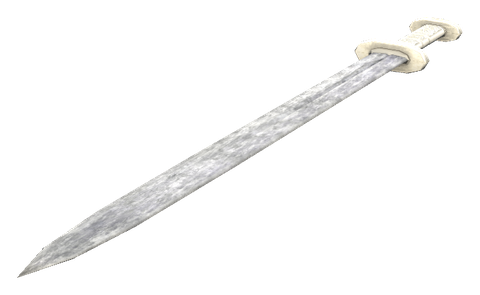 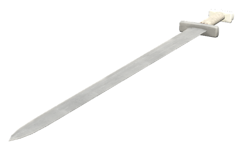 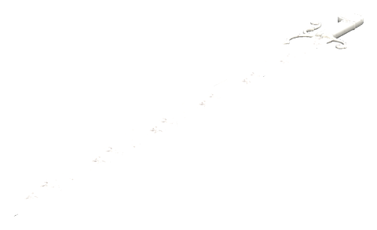 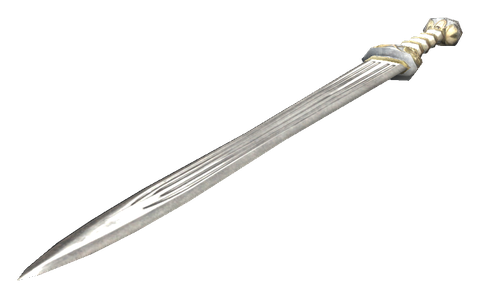 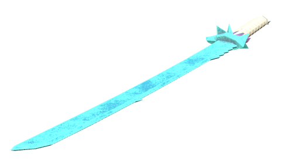 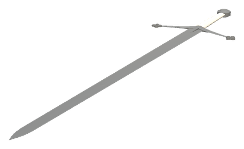 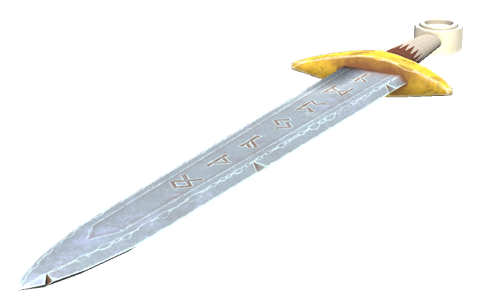 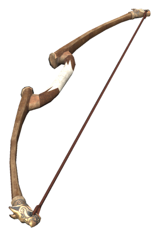 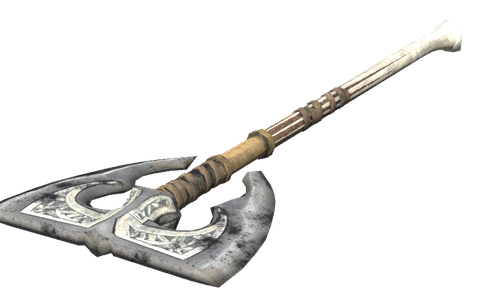 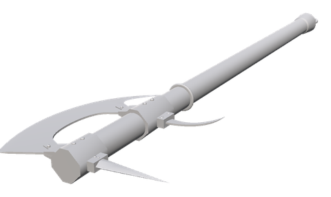 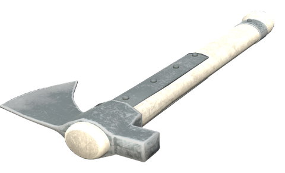 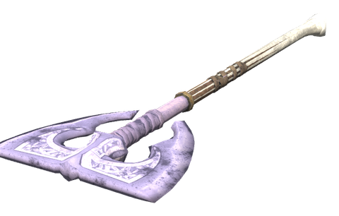 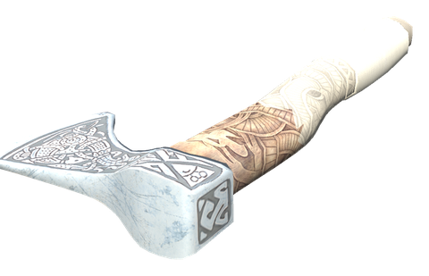 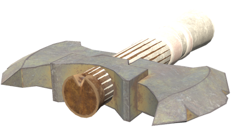 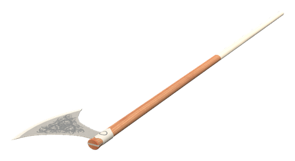 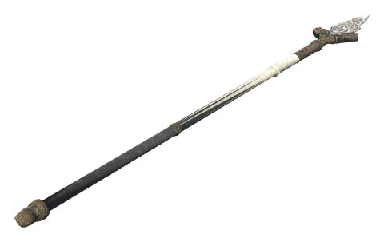 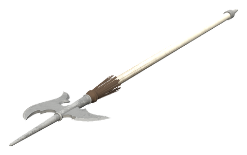 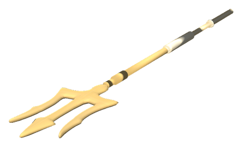 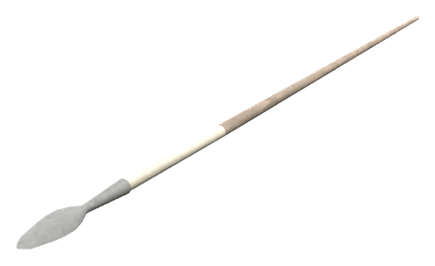 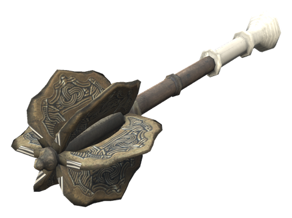 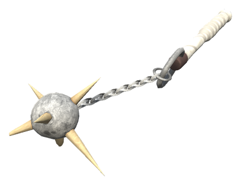 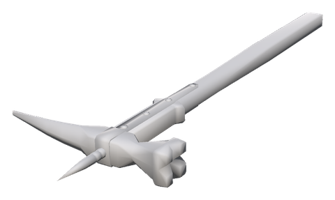 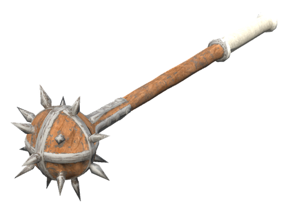 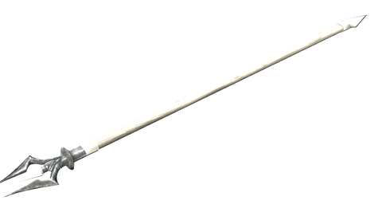 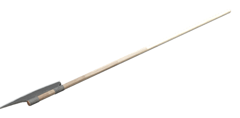 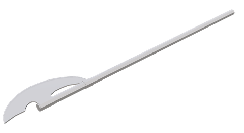 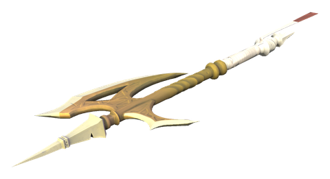 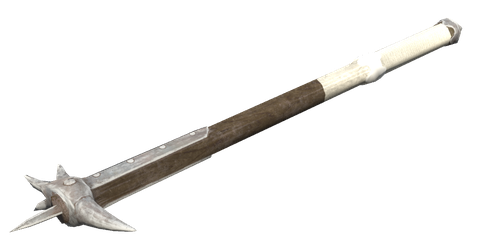 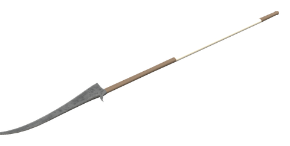 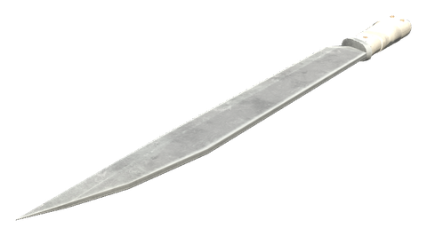 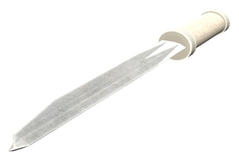 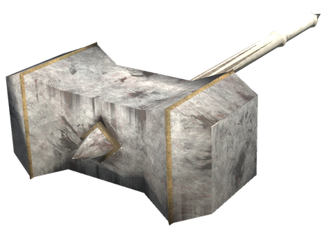 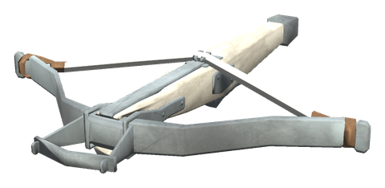 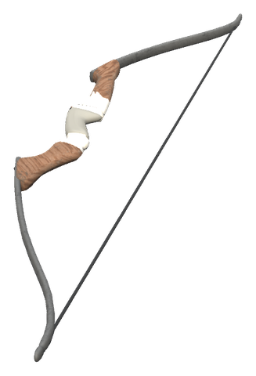 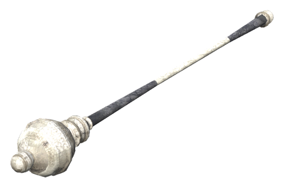 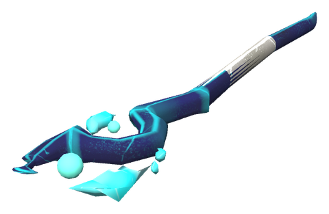 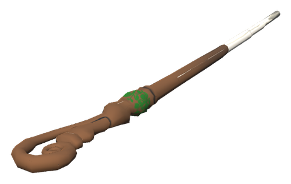 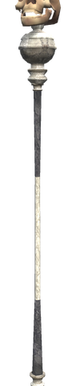 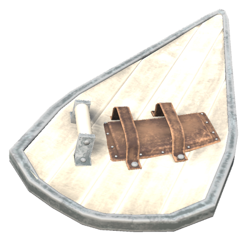 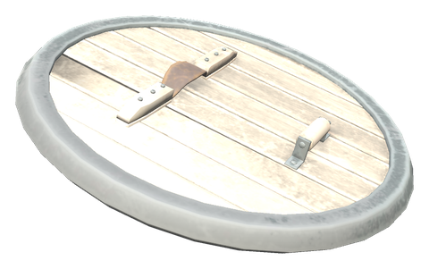 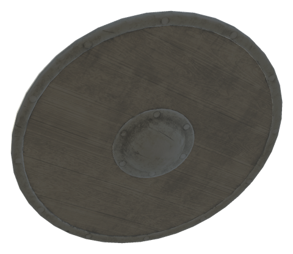 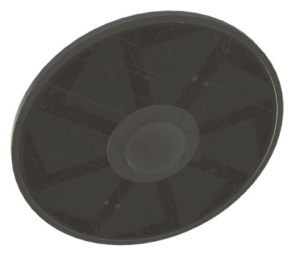

| Item | Description | Crafting Station | Requirements |
|------|-------------|------------------|--------------|
| **White Hilt Sword** | The Indestructible Sword of Dyrnwyn | Forge (Level 2) | Bronze ×20, Surtling Core ×5, Bronze Sword ×1 |
| **White Hilt Ice Sword** | The Indestructible Ice Sword of Dyrnwyn. Its frost slows what it cuts. | Forge (Level 2) | Silver ×20, Freeze Gland ×10, Crystal ×5 |
| **White Hilt Claymore** | The Indestructible Claymore of Dyrnwyn. A great blade for both hands. | Forge (Level 2) | Black Metal ×30, Yggdrasil Wood ×10, Carapace ×10 |
| **White Hilt Rune Sword** | The Indestructible Rune Sword of Dyrnwyn. Its carved runes glow. | Forge (Level 2) | Flametal ×20, Charred Bone ×10, Refined Eitr ×10 |
| **White Hilt Viking Sword** | The Indestructible Viking Sword of Dyrnwyn. The last blow of a run strikes hardest. | Forge (Level 2) | Iron ×20, Guck ×3, Leather Scraps ×5 |
| **White Hilt Falchion** | The Indestructible Falchion of Dyrnwyn. Its broad blade sweeps wide. | Forge (Level 2) | Silver ×20, Wolf Pelt ×5, Obsidian ×3 |
| **White Hilt Gladius** | The Indestructible Gladius of Dyrnwyn. Short, quick, and deadly from behind. | Forge (Level 2) | Black Metal ×15, Linen Thread ×5, Needle ×5 |
| **White Hilt Bow** | The Indestructible Bow of Dyrnwyn | Forge (Level 2) | Iron ×20, Feathers ×20, Finewood Bow ×1 |
| **White Hilt Battleaxe** | The Indestructible Battleaxe of Dyrnwyn | Forge (Level 2) | Iron ×30, Ancient Bark ×10, Bronze Axe ×1 |
| **White Hilt Crystal Axe** | The Indestructible Crystal Axe of Dyrnwyn | Forge (Level 2) | Iron ×20, Crystal ×10, Iron Axe ×1 |
| **White Hilt Bearded Axe** | The Indestructible Bearded Axe of Dyrnwyn. Its beard hooks a foe's shield. | Forge (Level 2) | Iron ×20, Chain ×2, Bronze Axe ×1 |
| **White Hilt Throwing Axe** | The Indestructible Throwing Axe of Dyrnwyn. Hew with it, or throw it. | Forge (Level 2) | Iron ×15, Feathers ×5, Flint Axe ×1 |
| **White Hilt Dane Axe** | The Indestructible Dane Axe of Dyrnwyn. Its long haft reaches far. | Forge (Level 2) | Silver ×20, Wolf Fang ×10, Battleaxe ×1 |
| **White Hilt Hand Axe** | The Indestructible Hand Axe of Dyrnwyn. Light, and quick through timber. | Forge (Level 2) | Iron ×15, Fine Wood ×5, Leather Scraps ×3 |
| **White Hilt War Axe** | The Indestructible War Axe of Dyrnwyn. A great axe with a spike, for both hands. | Forge (Level 2) | Black Metal ×25, Fine Wood ×10, Needle ×5 |
| **White Hilt Pike** | The Indestructible Pike of Dyrnwyn. It reaches farther than any other spear. | Forge (Level 2) | Black Metal ×15, Fine Wood ×15, Linen Thread ×5 |
| **White Hilt Spear** | The Indestructible Spear of Dyrnwyn | Forge (Level 2) | Iron ×20, Ancient Bark ×10, Bronze Spear ×1 |
| **White Hilt Mace** | The Indestructible Mace of Dyrnwyn | Forge (Level 2) | Iron ×20, Withered Bone ×5, Bronze Mace ×1 |
| **White Hilt Flail** | The Indestructible Flail of Dyrnwyn. Its head swings past a raised shield. | Forge (Level 2) | Silver ×15, Chain ×3, Iron Mace ×1 |
| **White Hilt War Hammer** | The Indestructible War Hammer of Dyrnwyn. Its pick bites into foe and ore alike. | Forge (Level 2) | Silver ×15, Obsidian ×5, Iron Pickaxe ×1 |
| **White Hilt Morning Star** | The Indestructible Morning Star of Dyrnwyn. Its spikes break armour. | Forge (Level 2) | Black Metal ×20, Needle ×10, Linen Thread ×5 |
| **White Hilt Atgeir** | The Indestructible Atgeir of Dyrnwyn | Forge (Level 2) | Iron ×25, Ancient Bark ×10, Bronze Atgeir ×1 |
| **White Hilt Javelin** | The Indestructible Javelin of Dyrnwyn. Light, and made to be thrown. | Forge (Level 2) | Iron ×10, Ancient Bark ×5, Feathers ×10 |
| **White Hilt Seax** | The Indestructible Seax of Dyrnwyn. Its wounds bleed. | Forge (Level 2) | Iron ×10, Bloodbag ×5, Copper Knife ×1 |
| **White Hilt Halberd** | The Indestructible Halberd of Dyrnwyn. Made to bring down big game. | Forge (Level 2) | Black Metal ×25, Fine Wood ×10, Linen Thread ×10 |
| **White Hilt Scythe** | The Indestructible Scythe of Dyrnwyn. What it reaps, it gives back to you. | Forge (Level 2) | Black Metal ×15, Yggdrasil Wood ×10, Refined Eitr ×10 |
| **White Hilt Trident** | The Indestructible Trident of Dyrnwyn. The sea's own, crackling with lightning. | Forge (Level 2) | Flametal ×15, Serpent Scale ×10, Thunderstone ×5 |
| **White Hilt Bardiche** | The Indestructible Bardiche of Dyrnwyn. A long axe-blade on a pole. | Forge (Level 2) | Silver ×20, Fine Wood ×10, Wolf Fang ×5 |
| **White Hilt Pike Axe** | The Indestructible Pike Axe of Dyrnwyn. Its gilded head glows. | Forge (Level 2) | Black Metal ×20, Yggdrasil Wood ×10, Refined Eitr ×8 |
| **White Hilt Bec de Corbin** | The Indestructible Bec de Corbin of Dyrnwyn. Its beak breaks armour. | Forge (Level 2) | Black Metal ×20, Yggdrasil Wood ×10, Carapace ×8 |
| **White Hilt Knife** | The Indestructible Knife of Dyrnwyn | Forge (Level 2) | Iron ×10, Leather Scraps ×5, Flint Knife ×1 |
| **White Hilt Sledge** | The Indestructible Sledge of Dyrnwyn | Forge (Level 2) | Iron ×30, Ymir Remains ×10, Stagbreaker ×1 |
| **White Hilt Recurve Bow** | The Indestructible Recurve Bow of Dyrnwyn. Quick to draw. | Forge (Level 2) | Black Metal ×10, Fine Wood ×10, Linen Thread ×10 |
| **White Hilt Crossbow** | The Indestructible Crossbow of Dyrnwyn | Forge (Level 2) | Iron ×20, Root ×10, Finewood Bow ×1 |
| **White Hilt Staff of Fire** | The Indestructible Staff of Fire of Dyrnwyn | Forge (Level 2) | Surtling Core ×10, Ancient Bark ×10, Guck ×5 |
| **White Hilt Staff of Ice** | The Indestructible Staff of Ice of Dyrnwyn | Forge (Level 2) | Iron ×10, Ancient Bark ×10, Guck ×5 |
| **White Hilt Staff of Lightning** | The Indestructible Staff of Lightning of Dyrnwyn | Forge (Level 2) | Thunderstone ×5, Ancient Bark ×10, Guck ×5 |
| **White Hilt Crystal Staff** | The Indestructible Crystal Staff of Dyrnwyn. Its shards cut colder than the Staff of Ice. | Forge (Level 2) | Yggdrasil Wood ×15, Refined Eitr ×16, Crystal ×10 |
| **White Hilt Wand** | The Indestructible Wand of Dyrnwyn. Small fire for half the eitr, and a hand free for a shield. | Forge (Level 2) | Yggdrasil Wood ×5, Refined Eitr ×8, Surtling Core ×5 |
| **White Hilt Necromancer's Staff** | A skull on the dark scepter, burning green: raises skeletons and wakes fallen friends at their grave | Galdr Table | Yggdrasil Wood ×10, Refined Eitr ×16, Draugr Elite Trophy ×1, Skeleton Trophy ×1 |
| **White Hilt Tower Shield** | The Indestructible Tower Shield of Dyrnwyn | Forge (Level 2) | Iron ×30, Chain ×10, Banded Shield ×1 |
| **White Hilt Round Shield** | The Indestructible Round Shield of Dyrnwyn. The shield of every viking. | Forge (Level 2) | Iron ×10, Fine Wood ×10, Leather Scraps ×5 |
| **White Hilt Hird Shield** | The Indestructible Hird Shield of Dyrnwyn. Made for the perfect parry. | Forge (Level 2) | Black Metal ×10, Fine Wood ×10, Linen Thread ×5 |
| **White Hilt Buckler** | The Indestructible Buckler of Dyrnwyn | Forge (Level 2) | Iron ×15, Chain ×5, Bronze Buckler ×1 |

The staffs burn in their own colours: red for fire, blue for ice, white-blue for lightning and green for the Necromancer's Staff.

### Waking the fallen

The Necromancer's Staff raises skeletons to fight for you, like the Dead Raiser it is made from. Its other gift is for a friend who has fallen: hold it at their gravestone within 10 minutes of the death and use the grave.

- **They are asked** wherever they woke: *"Kari would wake you at your grave, with your gear and the skills you lost. Go?"*
- **If they agree**, stand still for 4 seconds while a green flame rises from the grave, with a band of green from you to it. Moving away or being hit breaks it, and nothing is paid.
- **Then you pay**: half your maximum health, all your stamina and 60 eitr, and *Death's Price* for 3 minutes (no health regeneration, half stamina regeneration). The staff then rests for 5 minutes. It never kills you: with too little health it refuses.
- **They are brought to the grave**, take their gear from it and get back the skills the death took.

You cannot wake yourself, and graves from before this version cannot be woken.

### Attack styles

The melee weapons swing in several styles, a signature one and others that suit their grip, and the Rune Sword has cuts of its own. See [Attack styles & animations](attack-styles.md).

---

## 🛡️ ARMOR

All armor pieces are indestructible and weightless, a little better than iron: +4 armor per piece, and no slowdown (the iron armor's -5% is taken off; no piece makes you faster). The White Hilt Helmet has the Flametal helmet's look with the Iron Helmet's stats. Armor, uniforms included, is upgraded through the biomes like the weapons, see [Upgrades through the biomes](#-upgrades-through-the-biomes).

The White Hilt Cape gives feather fall, so it needs a Deathsquito trophy from the Plains (and unlocks in the Plains tier in linear mode).

| Item | Description | Crafting Station | Requirements |
|------|-------------|------------------|--------------|
| **White Hilt Cape** | The Indestructible Cape of Dyrnwyn | Forge (Level 3) | Feathers ×30, Deathsquito Trophy ×1, Troll Hide Cape ×1 |
| **White Hilt Helmet** | The Indestructible Helmet of Dyrnwyn | Forge (Level 3) | Iron ×30, Iron Nails ×100, Iron Helmet ×1 |
| **White Hilt Chestplate** | The Indestructible Chestplate of Dyrnwyn | Forge (Level 3) | Iron ×20, Deer Hide ×10, Bronze Chestplate ×1 |
| **White Hilt Greaves** | The Indestructible Greaves of Dyrnwyn | Forge (Level 3) | Iron ×20, Deer Hide ×10, Bronze Greaves ×1 |
| **White Hilt Shield** | The Indestructible Shield of Dyrnwyn | Forge (Level 3) | Iron ×30, Iron Nails ×100, Iron Buckler ×1 |

The **White Hilt Banner Cape** is not part of the indestructible set: a white troll hide cape with the White Hilt logo on the back and the troll hide cape's stats, without the troll set bonus. Workbench (Level 2): Troll Hide ×4, Leather Scraps ×4, Bone Fragments ×2.

### Black uniforms

Two black uniforms with gold trim, the White Hilt badge on the left breast and the logo on the cape. They are indestructible and weightless, with the same armor and biome upgrades as the White Hilt Chestplate, Greaves and Cape (the cape does not give the White Hilt Cape's feather fall). The tunic and the officer's jerkin are both chest pieces, so wear one of them with its own trousers or breeches. The officer's pieces copy the Deep North medium armor, which vanilla Valheim does not let you craft yet, so a game update may change how they look.

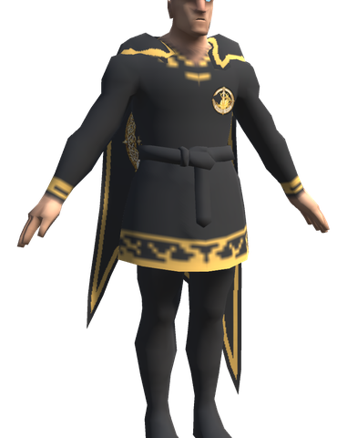 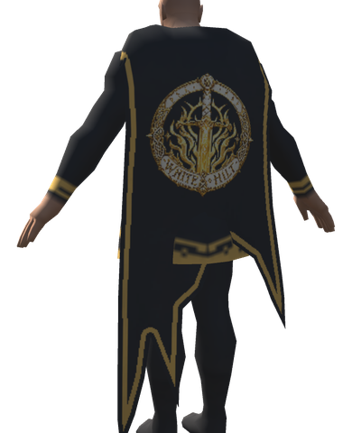 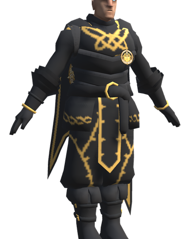 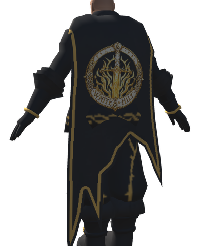

| Item | Description | Crafting Station | Requirements |
|------|-------------|------------------|--------------|
| **White Hilt Uniform Tunic** | Black tunic with gold collar, cuffs and hem, and the White Hilt badge | Workbench (Level 2) | Deer Hide ×6, Leather Scraps ×4, Coal ×4, Coins ×20 |
| **White Hilt Uniform Trousers** | Black trousers and boots | Workbench (Level 2) | Deer Hide ×4, Leather Scraps ×4, Coal ×2 |
| **White Hilt Officer's Jerkin** | Black jerkin with gold knotwork and the White Hilt badge | Workbench (Level 2) | Deer Hide ×6, Leather Scraps ×4, Coal ×4, Coins ×20 |
| **White Hilt Officer's Breeches** | Black breeches with gold trim | Workbench (Level 2) | Deer Hide ×4, Leather Scraps ×4, Coal ×2 |
| **White Hilt Uniform Cape** | Black cape with a gold edge and the White Hilt on the back | Workbench (Level 2) | Troll Hide ×4, Coal ×4, Coins ×30 |

---

## 📈 UPGRADES THROUGH THE BIOMES

White Hilt weapons, shields and armor (the uniforms included) go past quality 4: one more level for each biome after the Swamp, paid with that biome's material. Every shield upgrade also takes a **Lindorm Scale** (see [Lindorm & giant spiders](monsters.md)). A piece stays a little below the best vanilla gear of the biome it is upgraded for, which is the price of being weightless and indestructible. From quality 5 the station level of quality 4 is enough. The recipe's own materials are only paid when the piece is crafted.

| Quality | Biome | Upgrade cost | Helmet, chest, legs | Cape | Sword (slash) | Shield / Tower Shield (block) |
|---|---|---|---|---|---|---|
| 1 | Swamp | the recipe | 18 | 5 | 55 | 42 / 52 |
| 2, 3, 4 | Swamp | Iron ×5 each | 20, 22, 24 | 6, 7, 8 | 63, 71, 79 | 48, 54, 60 / 58, 64, 70 |
| 5 | Mountain | Silver ×10 | 26 | 10 | 85 | 68 / 80 |
| 6 | Plains | Black Metal ×10 | 30 | 12 | 101 | 85 / 101 |
| 7 | Mistlands | Carapace ×10 | 36 | 14 | 120 | 102 / 122 |
| 8 | Ashlands | Flametal ×10 | 42 | 16 | 137 | 119 / 143 |

| Biome | Best vanilla armor | Best vanilla sword (quality 4) | Best vanilla shield / tower shield (quality 3) |
|---|---|---|---|
| Swamp | Iron 20 | Iron 73 | Banded 54 / Iron Tower 64 |
| Mountain | Wolf 26 | Silver 93 + 45 spirit | Silver 72 |
| Plains | Padded 32 | Black Metal 113 | Black Metal 90 / Black Metal Tower 116 |
| Mistlands | Carapace 38 | Mistwalker 75 + 58 frost | Carapace 108 |
| Ashlands | Flametal 44 | Nidhogg 153 | Flametal 126 / Flametal Tower 152 |

- **Weapons** gain a share of their base damage at each biome level, on every damage type they deal: 10%, 30%, 35% and 30% (in all 105% at quality 8). The table shows the sword's tooltip; its hits are 10% harder (`DamageMultiplierBonus`). The other weapons follow the same shares, the bow and crossbow included.
- **Shields** (White Hilt Shield, Tower Shield and Buckler) gain 20%, 40%, 40% and 40% of their base block power.
- **The three staffs** stay at quality 4: they already have the strength of the Mistlands staffs.
- **Capes** gain 2 armor at each biome level.

---

## 💍 ACCESSORIES

| Item | Description | Crafting Station | Requirements |
|------|-------------|------------------|--------------|
| **White Hilt Megingjord** | Belt of Dyrnwyn - +700 carry weight | Forge (Level 2) | Iron ×10, Ymir Remains ×10, Megingjord ×1 |
| **Megingjord upgrade** | The trader's Megingjord can be upgraded to quality 4. Each level adds +50 carry weight on top of its own +150 (+300 at quality 4); the tooltip shows the total | Forge (level 2, 3 and 4) | Per level: Iron ×8, Chain ×1, Troll Hide ×3, Surtling Core ×1 |
| **Belt Pouch** | Use it once for one more inventory row for good (one per character). The row is a vanilla row, so it stays without the mod | Workbench (Level 2) | Troll Hide ×6, Leather Scraps ×10, Iron ×4 |

The upgrade can be switched off (`Megingjord` → `Upgrades`) and the carry weight per level changed (`CarryWeightPerLevel`).

---

## 🏹 AMMUNITION

High-damage ammunition crafted in large quantities (200 per craft). Enhanced with fire and spirit damage.

| Item | Description | Crafting Station | Requirements |
|------|-------------|------------------|--------------|
| **White Hilt Arrows** | Indestructible Arrows of Dyrnwyn | Forge (Level 2) | Iron ×2, Feathers ×5, Wood ×10 |
| **White Hilt Bolts** | Indestructible Bolts of Dyrnwyn | Forge (Level 2) | Iron ×2, Feathers ×3, Wood ×5 |

---

## 🔧 TOOLS

All tools are indestructible with reduced stamina usage (stamina modifier -1).

| Item | Description | Crafting Station | Requirements |
|------|-------------|------------------|--------------|
| **White Hilt Hammer** | The Indestructible Hammer of Dyrnwyn | Workbench | Wood ×5, Stone ×1, Resin ×1 |
| **White Hilt Axe** | The Indestructible Axe of Dyrnwyn | Workbench | Wood ×10, Stone ×5, Resin ×5 |
| **White Hilt Pickaxe** | The Indestructible Pickaxe of Dyrnwyn | Workbench | Wood ×10, Stone ×5, Resin ×5 |
| **White Hilt Hoe** | The Indestructible Hoe of Dyrnwyn | Workbench | Wood ×10, Stone ×5, Resin ×5 |
| **White Hilt Cultivator** | The Indestructible Cultivator of Dyrnwyn | Workbench | Wood ×10, Stone ×5, Resin ×5 |

---

## Config

All admin only, synced from the server. The attack style settings are on [Attack styles & animations](attack-styles.md).

| Setting | Default | What it does |
|---|---|---|
| `[Gear.Indestructible] Weight` | 0 | Weight of every indestructible White Hilt item |
| `[Gear.Weapons] DamageMultiplierBonus` | 0.1 | Added to the primary attack's damage multiplier of every weapon and shield (0.1 = 10% more damage) |
| `[Gear.Weapons] BonusDamagePerLevel` | 2 | Added per quality level to each damage type the weapon already deals |
| `[Gear.Weapons] SwordFireDamage` | 5 | Fire damage of the White Hilt Sword |
| `[Gear.Weapons] UpgradeSwamp` | Iron:5 | Cost of each weapon upgrade to quality 2, 3 and 4 (`Prefab:Amount`, comma separated) |
| `[Gear.Weapons] UpgradeMountain` / `UpgradePlains` / `UpgradeMistlands` / `UpgradeAshlands` | Silver:10 / BlackMetal:10 / Carapace:10 / FlametalNew:10 | Cost of the weapon upgrade to quality 5, 6, 7 and 8. Empty: weapons stop at the level before |
| `[Gear.Weapons] MountainDamage` / `PlainsDamage` / `MistlandsDamage` / `AshlandsDamage` | 0.1 / 0.3 / 0.35 / 0.3 | Share of the base damage a weapon gains at quality 5, 6, 7 and 8 |
| `[Gear.Shields] UpgradeSwamp` | Iron:5, WhiteHilt_LindormScale:1 | Cost of each shield upgrade to quality 2, 3 and 4 |
| `[Gear.Shields] UpgradeMountain` / `UpgradePlains` / `UpgradeMistlands` / `UpgradeAshlands` | the weapon costs + WhiteHilt_LindormScale:1 | Cost of the shield upgrade to quality 5, 6, 7 and 8. Empty: shields stop at the level before |
| `[Gear.Shields] MountainBlock` / `PlainsBlock` / `MistlandsBlock` / `AshlandsBlock` | 0.2 / 0.4 / 0.4 / 0.4 | Share of the base block power a shield gains at quality 5, 6, 7 and 8 |
| `[Gear.Armor] ArmorBonus` | 4 | Armor added to each armor piece |
| `[Gear.Armor] ArmorPerLevelBonus` | 0 | Added to the armor per quality level up to quality 4 |
| `[Gear.Armor] MovementBonus` | 0.05 | Taken off the slowdown of each armor piece that has one (0.05 = 5%); never makes a piece faster |
| `[Gear.Armor] UpgradeSwamp` | Iron:5 | Cost of each upgrade to quality 2, 3 and 4 (`Prefab:Amount`, comma separated) |
| `[Gear.Armor] UpgradeMountain` | Silver:10 | Cost of the upgrade to quality 5. Empty: armor stops at quality 4 |
| `[Gear.Armor] UpgradePlains` | BlackMetal:10 | Cost of the upgrade to quality 6. Empty: armor stops at the level before |
| `[Gear.Armor] UpgradeMistlands` | Carapace:10 | Cost of the upgrade to quality 7. Empty: armor stops at the level before |
| `[Gear.Armor] UpgradeAshlands` | FlametalNew:10 | Cost of the upgrade to quality 8. Empty: armor stops at the level before |
| `[Gear.Armor] MountainArmor` | 2 | Armor a helmet, chest or leg piece gains at quality 5 |
| `[Gear.Armor] PlainsArmor` | 4 | Armor a helmet, chest or leg piece gains at quality 6 |
| `[Gear.Armor] MistlandsArmor` | 6 | Armor a helmet, chest or leg piece gains at quality 7 |
| `[Gear.Armor] AshlandsArmor` | 6 | Armor a helmet, chest or leg piece gains at quality 8 |
| `[Gear.Armor] CapeArmorPerBiome` | 2 | Armor a cape gains at each quality from 5 to 8 |
| `[Gear.Tools] HomeItemsStaminaReduction` | 1.0 | Taken off the stamina use for building, farming and cultivating (1 = no stamina) |
| `[Necromancy] HealthCostPercent` | 50 | Share of your maximum health a waking takes; the staff refuses rather than kill you |
| `[Necromancy] EitrCost` | 60 | Eitr a waking takes |
| `[Necromancy] DrainStamina` | on | A waking empties your stamina |
| `[Necromancy] WindowMinutes` | 10 | Minutes after a death within which its grave can be woken |
| `[Necromancy] CooldownMinutes` | 5 | Minutes before the staff can wake someone again |
| `[Necromancy] PriceMinutes` | 3 | Minutes of Death's Price after a waking |
| `[Necromancy] ChannelSeconds` | 4 | Seconds you must stand still at the grave |
| `[Necromancy] RestoreSkills` | on | The woken get back the skills the death took |
| `[Necromancy] AskFirst` | on | The fallen are asked before they are woken |
| `[Necromancy] AnswerSeconds` | 30 | Seconds the fallen have to answer |
| `[Gear.Ammunition] PierceMultiplier` | 2 | Multiplies the pierce damage of arrows and bolts |
| `[Gear.Ammunition] BonusFireDamage` | 30 | Fire damage added to arrows and bolts |
| `[Gear.Ammunition] BonusSpiritDamage` | 20 | Spirit damage added to arrows and bolts |
| `[Gear.Ammunition] BurningFlames` | 0.5 | Each player's own: how strong the flames, sparks and light of anything burning are, so a burning monster can still be seen; 1 as in the game, 0 none. Applies to all burning (also the blue, green and undead kinds), not only from White Hilt arrows. Takes effect on flames lit after the change |
| `[Gear.WhiteHiltBeltPouch] Weight` | 1 | Weight of the Belt Pouch |
