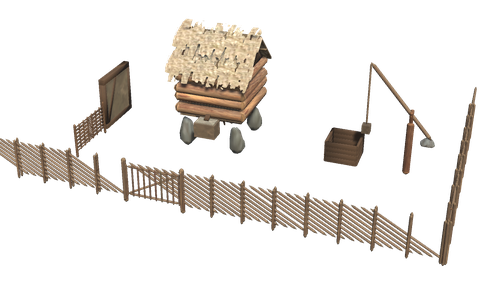
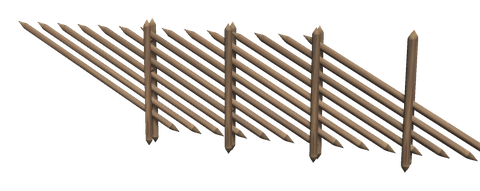
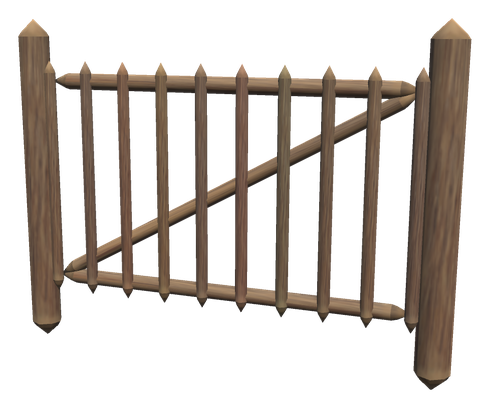
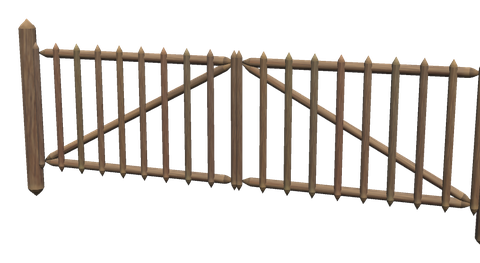
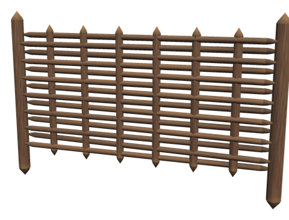
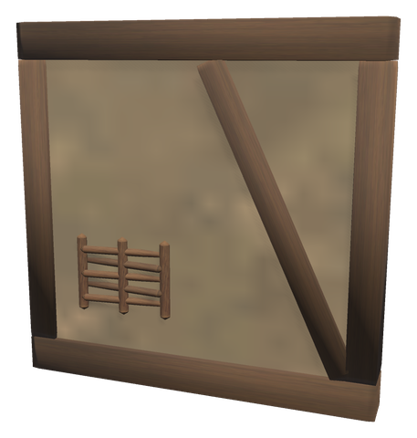
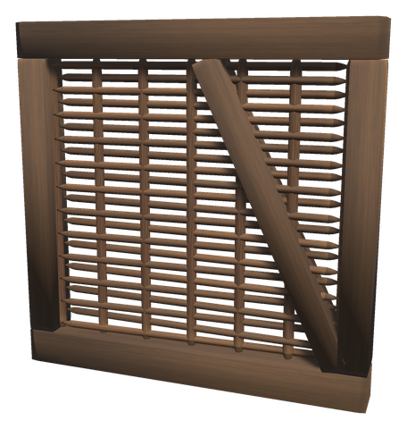
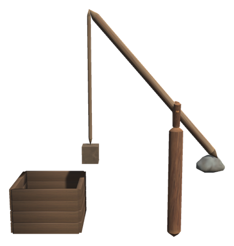
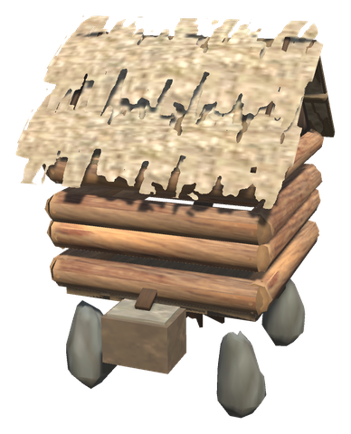

# 🌾 The farm

Fences, gates, walls and the work buildings of an old Norwegian farm: the grey skigard round the fields, wattle fences round the garden, cheap walls of wattle and daub for the byre and the smithy, a well with a sweep, and a little stream mill that grinds your barley without wind. Everything is built with the ordinary Hammer near a Workbench.

## 🪵 SKIGARD AND GATES

  

The *skigard* is the fence of the Norwegian countryside: pairs of upright stakes bound together with withies, and split poles laid slanting in the bands, each resting on the next. Its poles reach past the end of each section into the next one, so sections snapped end to end run on without a seam, and the last one slopes down to the ground like a real skigard's end. The poles are weathered grey.

The **Farm Gate** and the **Double Farm Gate** fit in the skigard. They are [self-closing doors](base.md#-self-closing-doors) like every other door: they shut by themselves a while after you, so the animals stay in, and Shift + Use holds one open.

| Piece | Description | Crafting Station | Requirements |
|-------|-------------|------------------|--------------|
| **Skigard** (`piece_whitehilt_skigard`) | 4 m long, 1.3 m high | Hammer (Workbench) | Wood ×8 |
| **Skigard 2 m** (`piece_whitehilt_skigard_2m`) | 2 m long | Hammer (Workbench) | Wood ×4 |
| **Farm Gate** (`piece_whitehilt_grind`) | A gate 2 m wide between two posts | Hammer (Workbench) | Wood ×6 |
| **Double Farm Gate** (`piece_whitehilt_dobbelgrind`) | Two gates opening from the middle, 4 m wide, for a cart | Hammer (Workbench) | Wood ×12 |

## 🧺 WATTLE AND DAUB

  

Withies woven between stakes make a **Wattle Fence** round a garden or a pen. Woven between the timbers of a frame and daubed with clay they make the **Wattle and Daub Wall**, the cheapest wall there is, for the byre, the smithy or a house of the first summer; a patch where the daub has fallen shows the wattle underneath. The [Paint Bench](painting.md) can whitewash it. Left bare, the **Wattle Wall** lets the wind through a shed or a pen. The walls are 2 m high and snap like the vanilla walls.

| Piece | Description | Crafting Station | Requirements |
|-------|-------------|------------------|--------------|
| **Wattle Fence** (`piece_whitehilt_flettgjerde`) | 2 m long, 1 m high | Hammer (Workbench) | Wood ×3 |
| **Wattle and Daub Wall** (`piece_whitehilt_bindingsverk`) | A timber frame with clay daub, 2 × 2 m | Hammer (Workbench) | Wood ×4, Stone ×2 |
| **Wattle and Daub Wall 1 m** (`piece_whitehilt_bindingsverk_1m`) | The same, 1 × 2 m | Hammer (Workbench) | Wood ×2, Stone ×1 |
| **Wattle Wall** (`piece_whitehilt_flettverk`) | A timber frame with bare wattle, 2 × 2 m | Hammer (Workbench) | Wood ×4 |

## 🪣 WELL SWEEP

A well with a timber curb and a sweep (*brønnvippe*): a long pole on a forked post, with a stone tied to its short end to balance the bucket. **Use** it and the sweep tips down and lowers the bucket straight into the well; a while after, it rises again. It is for the look of the farm: the game has no water to draw.

| Piece | Description | Crafting Station | Requirements |
|-------|-------------|------------------|--------------|
| **Well Sweep** (`piece_whitehilt_bronnvipp`) | A well with a curb and a sweep | Hammer (Misc, Workbench) | Wood ×12, Stone ×6 |

## ⚙️ STREAM MILL

Most Norwegian farms had a *bekkekvern* by their stream: a little mill house on stone feet, with a horizontal wheel under its floor turned by water from a chute. The **Stream Mill** grinds barley into barley flour like the vanilla windmill, and takes as much, but always at full speed, whatever the wind. Put barley in the hopper at the back and take the flour from the bin at the front; the wheel under the floor turns while it grinds. Set it by a stream, where it belongs.

| Piece | Description | Crafting Station | Requirements |
|-------|-------------|------------------|--------------|
| **Stream Mill** (`piece_whitehilt_bekkekvern`) | A mill house that grinds barley into flour without wind | Hammer (Crafting, Workbench) | Wood ×20, Fine Wood ×10, Stone ×20, Black Metal ×2 |

## Config

The farm pieces are switched on and off and priced in `[Content]` and `[Recipes]` like the other White Hilt pieces. With linear progression, everything is there from the start except the Stream Mill, which comes with the Plains, where the barley grows.
