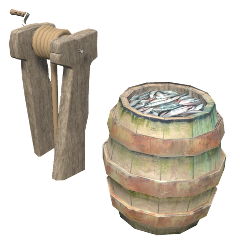
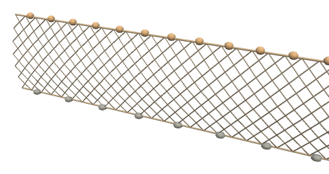

# 🎣 Fishing nets

[← Back to the README](../README.MD)

Set nets out in the water from the shore, and let them fill a fish barrel while you do other things.

- **Net Winch**: a winch and a fish barrel for the shore. The barrel is a chest of 4×2 slots (`BarrelRows`) that the nets fill with fish. Open it with the use key, as any chest.
- **Shore Net**: a 10 m net with wooden floats along the top, stones along the bottom and a stake at each end. It is placed on the water surface, at most 25 m from a Net Winch (`Range`), and a rope runs from its nearest stake to the winch. A winch takes the catch from up to 2 nets (`MaxNets`). The net cannot be placed without a winch nearby, next to a winch that already has all its nets, or where the water is too shallow.
- **Catching**: each net catches one fish every 6 minutes (`Minutes`) where the water is at least 1.5 m deep along the whole net (`MinDepth`). A net that is only partly that deep catches less, and nets closer than 8 m to each other share the fish (`CrowdRadius`). Hover over a net to see how well it catches, and over the winch to see how many fish an hour its nets bring in.
- **The fish**: the same as the ship's net, after the waters the net lies in: perch and pike in the Meadows, trollfish in the Black Forest, giant herring in the Swamp, tuna, coral cod and pufferfish on the ocean, and so on. Now and then a fish is one size bigger (`BiggerFishChance`), and the nets bring up seaweed and, on the ocean, an amber pearl (`Bycatch`).
- **While you are away**: the winch counts the time since it last checked, so the nets go on catching for up to 2 hours while nobody is near (`CatchUpHours`). They stop when the barrel is full.
- **Bait**: put fishing bait, entrails or neck tails in the barrel (`BaitItems`). As long as there is bait, the nets catch 40% faster (`BaitTime`), and each fish uses one bait.
- **Mending**: after 40 fish the nets are torn and catch nothing until they are mended (`WearCatches`). Use the winch with the alternative key (Shift + E) to mend them with 4 Leather Scraps (`MendItem`, `MendAmount`). You can mend them at any time; the hover text shows how worn they are.
- **Fishing skill**: whoever opens the barrel gets Fishing experience for each fish caught since it was last opened (`SkillRaise`).

The White Hilt Ship has its own Fishing Net that fills the hold while the ship sails, see [Ships](ships.md).

 

| Piece | Description | Crafted | Requirements |
|------|-------------|---------|--------------|
| **Net Winch** | Winch and fish barrel (4×2) for the shore; takes the catch from up to 2 Shore Nets within 25 m | Hammer (near Workbench) | Wood ×10, Fine Wood ×4, Bronze ×2 |
| **Shore Net** | 10 m net set out on the water; catches where the water is at least 1.5 m deep | Hammer (near Workbench) | Wood ×4, Leather Scraps ×12, Resin ×4, Stone ×6 |

## Config

Section `[Fishing.Net]` (admin only, synced from the server):

| Setting | Default | What it does |
|---|---|---|
| `Minutes` | 6 | Minutes for one net in deep enough water to catch a fish |
| `MaxNets` | 2 | Nets one winch takes the catch from |
| `Range` | 25 | Metres a net may lie from its winch |
| `MinDepth` | 1.5 | Water depth in metres a net needs to catch |
| `CrowdRadius` | 8 | Nets closer than this, in metres, share the fish; 0: never |
| `CatchUpHours` | 2 | Hours the nets go on catching while nobody is near; 0: only while someone is near |
| `BarrelRows` | 2 | Rows in the barrel, 4 slots each. Fewer rows hide the fish in the removed rows until there are more again |
| `BiggerFishChance` | 0.1 | Chance a fish is one size bigger |
| `SkillRaise` | 0.5 | Fishing experience per fish, given to whoever opens the barrel |
| `BaitItems` | FishingBait, … , Entrails, NeckTail | Prefab names of the bait, comma separated; empty: no bait |
| `BaitTime` | 0.6 | Share of the catching time with bait: 0.6 catches 40% faster |
| `WearCatches` | 40 | Fish caught before the nets are torn; 0: they never tear |
| `MendItem` | LeatherScraps | Prefab name of the item that mends the nets |
| `MendAmount` | 4 | How many of it one mending takes; 0: free |
| `Bycatch` | true | The nets now and then bring up seaweed, and on the ocean an amber pearl |
| `SeaweedChance` | 0.1 | Chance per fish of seaweed |
| `PearlChance` | 0.03 | Chance per fish on the ocean of an amber pearl |

The Net Winch and the Shore Net can also be switched off or get other recipes under `[Content]` and `[Recipes]`, like every White Hilt piece (see [Settings & progression](progression.md)).
