# 🍄 Foraging & food

[← Back to the README](../README.MD)

## 🍄 FORAGING & FOOD

New ingredients grow in the **Meadows**, the **Black Forest**, the **Swamp**, the **Mountains** and the **Plains**. They are cooked in the **Stone Pot**, which is built from Meadows materials and must stand over a fire. Each biome's dishes are better than the last, so you can eat well before you move on. The Mountain dishes need a **Herb Tray** next to the pot (Stone Pot level 2), and the smoked dishes a **Smoke Oven** as well (level 3). Smoked dishes also give a small buff for the first half of the meal, so it has worn off when you can eat the dish again. All recipes are available from the start; you only need the ingredients.

The plants spawn in zones that have not been generated yet. In areas you have already explored:
- a vanilla **Mushroom** has a 30% chance to also give a Chanterelle in the Meadows, or a Porcini in the Black Forest, and a 40% chance to give Cranberries in the Swamp, and a 25% chance to give Sphagnum Moss there
- a vanilla **Dandelion** has a 30% chance to also give Wild Garlic
- a vanilla wild **Turnip** in the Swamp has a 30% chance to also give Bog Bean, and a 20% chance each to give Cattail and Meadowsweet
- a vanilla **Blueberry bush** has a 30% chance to also give Lingonberries
- a vanilla **Thistle** has a 30% chance to also give Sweet Gale in the Swamp, and a 30% chance to give Reed there, and a 20% chance to give Labrador Tea there
- **Wolves** have a 20% chance to drop 1–2 Crowberries, and a 10% chance to drop 1–2 Wolf Lichen
- **Stone Golems** have a 50% chance to drop 1–2 Rock Lichen
- a vanilla **Cloudberry bush** on the Plains has a 30% chance to also give Rosehips, a 15% chance to give Madder Root and a 10% chance to give Hop Cones
- a vanilla wild **Flax** on the Plains has a 20% chance to also give Yarrow, and a 15% chance to give Woad
- a vanilla wild **Barley** on the Plains has a 20% chance to also give Caraway, a 15% chance to give Ergot and a 10% chance to give Henbane
- a vanilla wild **Onion** in the Mountains has a 25% chance to also give Mountain Sorrel, a 20% chance each to give Juniper Berries and Angelica, and a 15% chance to give Iceland Moss

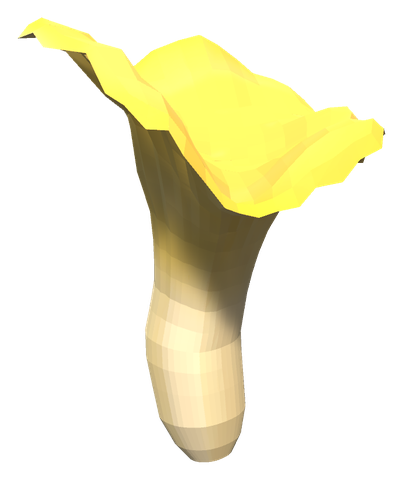 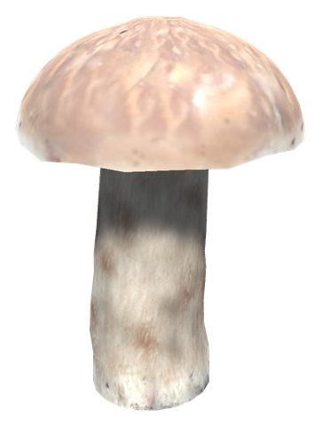 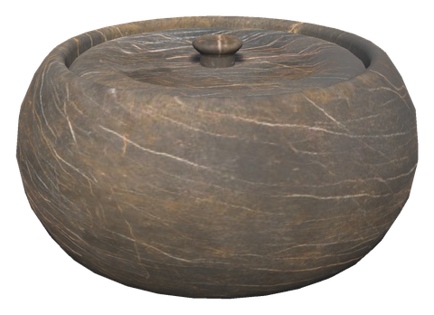 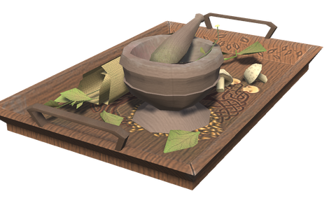 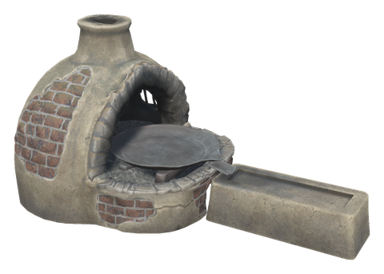 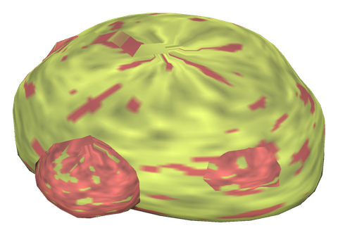 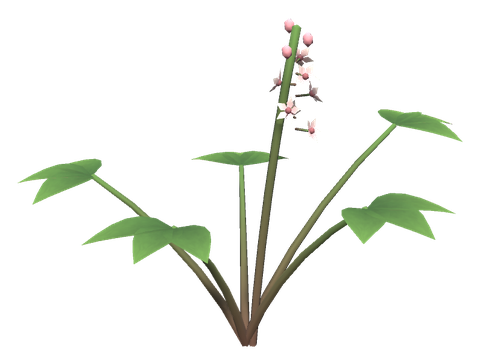 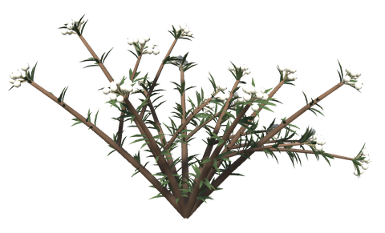 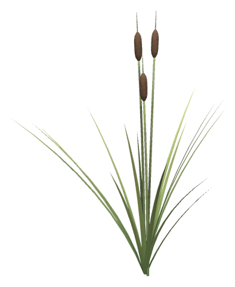 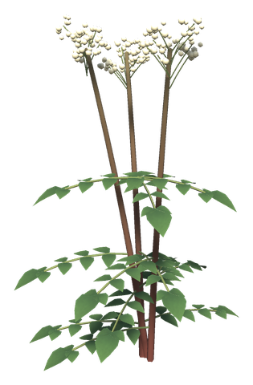 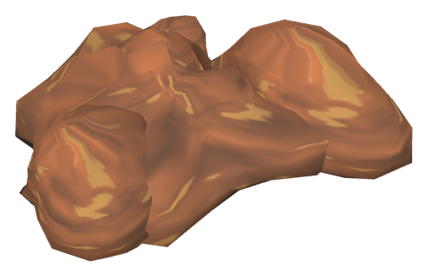 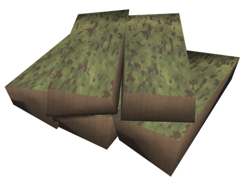 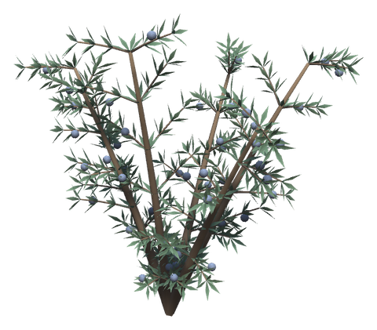 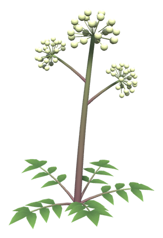 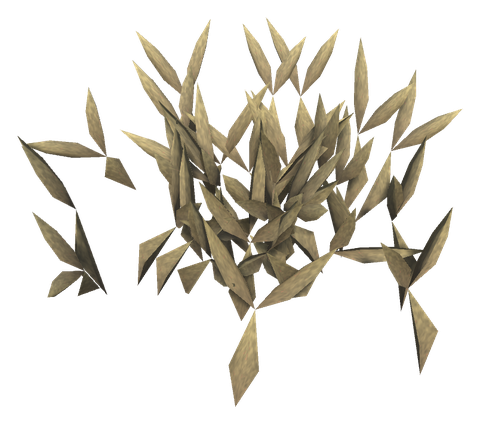 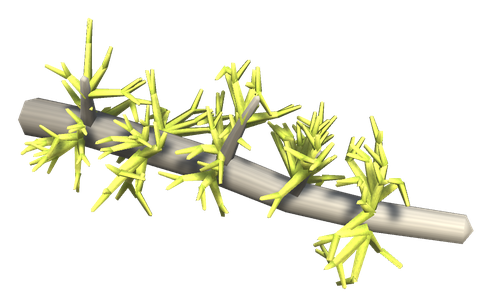 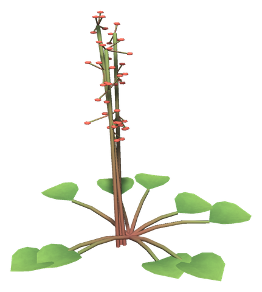 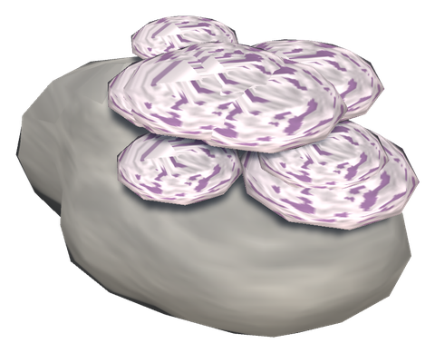 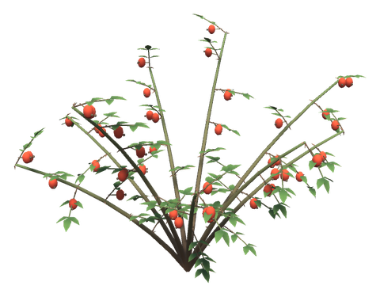 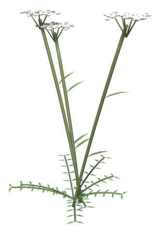 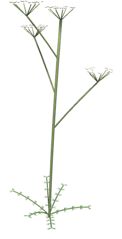 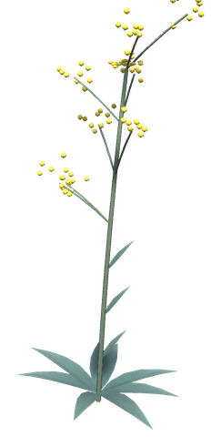 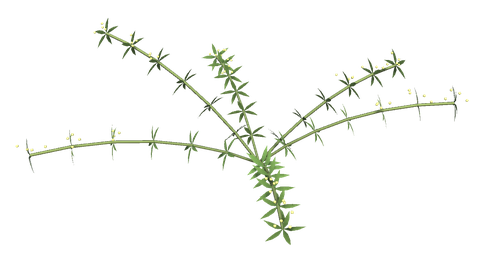 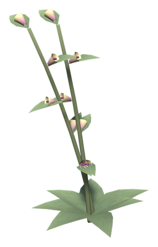  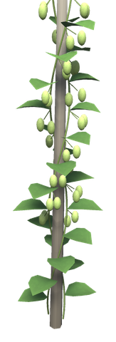

| Item | Description | Found / Crafted | Requirements |
|------|-------------|-----------------|--------------|
| **Chanterelle** | Golden funnel-shaped mushroom | Meadows forest edges, or extra drop from Mushroom | – |
| **Wild Garlic** | Broad leaves with white flowers | Meadows forest shade, or extra drop from Dandelion | – |
| **Porcini** | Brown-capped mushroom | Inside the Black Forest, or extra drop from Mushroom there | – |
| **Lingonberries** | Tart red berries | Black Forest bushes, or extra drop from Blueberry bush | – |
| **Cranberries** | Sour dark red berries | Swamp tussocks, or extra drop from Mushroom there | – |
| **Sweet Gale** | Bitter bog shrub | Swamp, or extra drop from Thistle there | – |
| **Reed** | Tall swamp reed for [reed thatch](roofs.md) | The water's edge in the Swamp, or extra drop from Thistle there | – |
| **Sphagnum Moss** | Red and green cushions of bog moss, for dyes and healing drinks | Wet ground in the Swamp, or extra drop from Mushroom there | – |
| **Bog Bean** | Bitter water plant with fringed white flowers | The edge of the Swamp water, or extra drop from wild Turnip there | – |
| **Labrador Tea** | Low bog shrub with white flower heads and a sharp smell | Swamp hummocks, or extra drop from Thistle there | – |
| **Cattail** | Tall bog grass with brown velvet heads; the roots give flour | The water's edge in the Swamp, or extra drop from wild Turnip there | – |
| **Meadowsweet** | Frothy cream flowers that sweeten mead and dull pain | Damp edges of the Swamp, or extra drop from wild Turnip there | – |
| **Bog Iron** | Rust-brown lumps; the Smelter turns each into Iron | Mud and shallow water in the Swamp | – |
| **Peat** | Cut peat; burns like two pieces of wood when used from the hotbar on a wood fire, and the Charcoal Kiln turns it into Coal | Drier banks of the Swamp | – |
| **Crowberries** | Small black berries | Open Mountain slopes, or dropped by Wolves | – |
| **Roseroot** | Mountain herb with yellow flowers | Rocky Mountain slopes | – |
| **Juniper Berries** | Bitter blue berries from a prickly shrub; the smoke keeps the dead away | Mountain slopes, or extra drop from wild Onion there | – |
| **Angelica** | Tall herb with green flower globes, chewed for strength | Mountains, or extra drop from wild Onion there | – |
| **Iceland Moss** | Curly brown lichen, boiled into porridge | Mountain heath, or extra drop from wild Onion there | – |
| **Wolf Lichen** | Bright yellow lichen once used to poison wolves | Dead branches in the Mountains, or dropped by Wolves | – |
| **Mountain Sorrel** | Round sour leaves with red seed spikes | Damp Mountain ledges, or extra drop from wild Onion there | – |
| **Rock Lichen** | Grey stone crusts that dye purple | Mountain stones, or dropped by Stone Golems | – |
| **Rosehips** | Red hips of the thorny dog rose | Plains, or extra drop from Cloudberry bush there | – |
| **Yarrow** | Feathery herb with flat white flower heads, for wounds and ale | Plains, or extra drop from wild Flax there | – |
| **Caraway** | Anise-scented seeds, the northern spice | Plains, or extra drop from wild Barley there | – |
| **Woad** | Blue-green leaves that give the deep blue dye | Plains, or extra drop from wild Flax there | – |
| **Madder Root** | Red roots of a scrambling plant, the red dye | Plains, or extra drop from Cloudberry bush there | – |
| **Henbane** | Sticky weed with pale, purple-veined flowers, for visions and madness | Plains fields, or extra drop from wild Barley there | – |
| **Ergot** | Black horns of a barley blight that bring dread | Blighted wild barley on the Plains, or extra drop from wild Barley there | – |
| **Hop Cones** | Bitter green cones of the wild hop vine | Old stakes on the Plains, or extra drop from Cloudberry bush there | – |
| **Stone Pot** | Cooking station for foraged food (place over a fire) | Hammer (near Workbench) | Stone ×10, Flint ×4, Wood ×4 |
| **Herb Tray** | Stone Pot extension with a mortar and herbs, gives level 2 | Hammer (next to the Stone Pot) | Fine Wood ×2, Stone ×5, Bronze ×1, Thistle ×3 |
| **Smoke Oven** | Stone Pot extension, a clay oven for smoking fish and meat, gives level 3 together with the Herb Tray | Hammer (next to the Stone Pot) | Stone ×10, Wood ×6, Iron ×2, Resin ×5 |
| **Chanterelle Stew** | Meadows: 30 health, 22 stamina, 25 min | Stone Pot | Chanterelle ×3, Wild Garlic ×1, Raw Meat ×1 |
| **Wild Garlic Soup** | Meadows: 18 health, 32 stamina, 25 min | Stone Pot | Wild Garlic ×2, Chanterelle ×1, Raspberries ×2 |
| **Porcini Stew** | Black Forest: 40 health, 26 stamina, 30 min | Stone Pot | Porcini ×3, Chanterelle ×1, Deer Meat ×1 |
| **Lingonberry Soup** | Black Forest: 24 health, 42 stamina, 30 min | Stone Pot | Lingonberries ×3, Wild Garlic ×1, Honey ×1 |
| **Sweet Gale Sausages** | Swamp: 48 health, 26 stamina, 32 min | Stone Pot | Sweet Gale ×2, Wild Garlic ×1, Entrails ×3 |
| **Cranberry Soup** | Swamp: 26 health, 48 stamina, 32 min | Stone Pot | Cranberries ×3, Lingonberries ×1, Turnip ×1 |
| **Bog Fish Stew** | Swamp: 50 health, 30 stamina, 32 min | Stone Pot | Trollfish ×1, Cattail ×2, Wild Garlic ×1 |
| **Cattail Porridge** | Swamp: 22 health, 52 stamina, 32 min | Stone Pot | Cattail ×3, Cranberries ×2, Honey ×1 |
| **Mountain Stew** | Mountains: 52 health, 34 stamina, 35 min | Stone Pot level 2 | Crowberries ×3, Porcini ×1, Wolf Meat ×1 |
| **Roseroot Broth** | Mountains: 30 health, 55 stamina, 35 min | Stone Pot level 2 | Roseroot ×3, Lingonberries ×1, Onion ×1 |
| **Moss Porridge** | Mountains: 30 health, 56 stamina, 35 min | Stone Pot level 2 | Iceland Moss ×3, Crowberries ×2, Honey ×1 |
| **Candied Angelica** | Mountains: 20 health, 38 stamina, 50 min | Stone Pot level 2 | Angelica ×2, Honey ×3 |
| **Mountain Sorrel Salad** | Mountains: 28 health, 48 stamina, 35 min, 4 health per tick | Stone Pot level 2 | Mountain Sorrel ×3, Onion ×1, Wild Garlic ×1 |
| **Smoked Fish** | 56 health, 32 stamina, 40 min. Buff: swim 50% faster, swimming uses 50% less stamina | Stone Pot level 3 | Perch ×1, Sweet Gale ×1, Lingonberries ×2 |
| **Smoked Wolf Jerky** | 34 health, 58 stamina, 40 min. Buff: running and jumping use 20% less stamina | Stone Pot level 3 | Wolf Meat ×1, Wild Garlic ×1, Roseroot ×1 |
| **Juniper-Smoked Wolf Ham** | 58 health, 30 stamina, 40 min. Buff: frost damage taken is halved | Stone Pot level 3 | Wolf Meat ×2, Juniper Berries ×3, Onion ×1 |
| **Octopus Stew** | Ocean: 50 health, 40 stamina, 35 min | Stone Pot level 2 | Octopus ×1, Turnip ×2, Wild Garlic ×1 |
| **Kraken Feast** | Ocean: 70 health, 40 stamina, 40 min. Buff: health and stamina regenerate 25% faster | Stone Pot level 3 | Kraken Tentacle ×1, Kraken Ink ×1, Turnip ×2, Roseroot ×1 |
| **Lingonberry Mead** | Frost resistance (keeps Cold and Freezing away), 10 min. The base ferments into 6 meads | Cauldron, then Fermenter | Honey ×10, Lingonberries ×10, Sweet Gale ×3 |
| **Roseroot Mead** | Stamina regenerates 50% faster, 10 min. The base ferments into 6 meads | Cauldron, then Fermenter | Honey ×10, Roseroot ×5, Crowberries ×5 |
| **Cranberry Mead** | Poison resistance, 10 min. The base ferments into 6 meads | Cauldron, then Fermenter | Honey ×10, Cranberries ×10, Lingonberries ×3 |
| **Sweet Gale Ale** | +75 carry weight, 10 min. The base ferments into 6 ales | Cauldron, then Fermenter | Honey ×10, Sweet Gale ×10, Blueberries ×5 |
| **Crowberry Wine** | Health regenerates 50% faster, 10 min. The base ferments into 6 bottles | Cauldron, then Fermenter | Honey ×10, Crowberries ×10, Roseroot ×2 |
| **Meadowsweet Mead** | 15% more armor and 25% less stagger, 10 min. The base ferments into 6 meads | Cauldron, then Fermenter | Honey ×10, Meadowsweet ×8, Cranberries ×4 |
| **Bog Bean Bitter** | Ends poison, burning, frost, shock, tar and smoke at once and keeps them off, 3 min. The base ferments into 6 bottles | Cauldron, then Fermenter | Bog Bean ×10, Sweet Gale ×3, Honey ×5 |
| **Labrador Tea Brew** | Leeches, deathsquitoes and ticks do not notice you, 10 min. The base ferments into 6 bottles | Cauldron, then Fermenter | Labrador Tea ×8, Sweet Gale ×2, Honey ×5 |
| **Juniper Sahti** | Spirit damage taken is halved, 10 min. The base ferments into 6 ales | Cauldron, then Fermenter | Juniper Berries ×10, Honey ×8, Crowberries ×3 |

## Config

Admin only, synced from the server. The spawn, drop and Stone Pot food settings are listed in [Progression](progression.md).

Each forageable has a section `[Foraging.<Name>]` (e.g. `[Foraging.WildGarlic]`):

| Setting | Default | What it does |
|---|---|---|
| `GroupSizeMin` / `GroupSizeMax` | per plant (below) | Plants in one group, in zones generated from now on |
| `RegrowMinutes` | 0 | Minutes before a picked plant grows back; 0 = as the vanilla plant it copies |
| `PickAmount` | 0 | Items per pick; 0 = as the vanilla plant |
| `FuelValue` | 2 | Peat only: how much wood one brick is worth in a wood fire |

| Forageable | Group size |
|---|---|
| Chanterelle, Porcini, Cranberries, Crowberries, Labrador Tea, Angelica, Rosehips, Woad, Madder Root, Henbane | 1–3 |
| Lingonberries | 1–2 |
| Bog Iron, Peat, Juniper Berries, Wolf Lichen, Rock Lichen, Hop Cones | 1–2 |
| Roseroot, Sweet Gale, Sphagnum Moss, Meadowsweet, Iceland Moss, Caraway, Ergot | 2–4 |
| Wild Garlic | 3–6 |
| Bog Bean, Mountain Sorrel, Yarrow | 2–5 |
| Reed, Cattail | 3–6 |

Each mead has a section `[Meads.<Name>]` (e.g. `[Meads.SweetGaleAle]`) with `DurationMinutes` (10, the Bog Bean Bitter 3), plus:

| Mead | Setting | Default |
|---|---|---|
| Crowberry Wine | `HealthRegenMultiplier` | 1.5 |
| Roseroot Mead | `StaminaRegenMultiplier` | 1.5 |
| Sweet Gale Ale | `CarryWeight` | 75 |
| Meadowsweet Mead | `ArmorMultiplier`, `StaggerReduction` | 0.15, 0.25 |
| Labrador Tea Brew | `IgnoredBy` (prefab names) | Leech, Leech_cave, Deathsquito, Tick |

Mead changes apply on the next drink.
