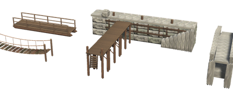
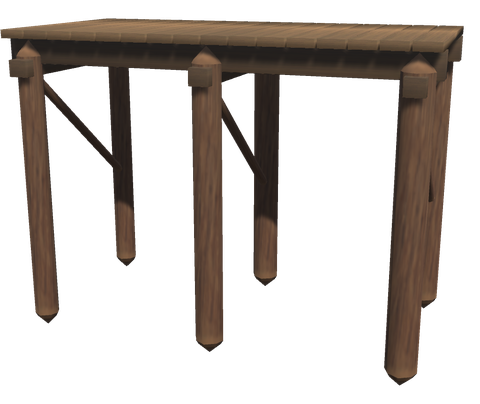
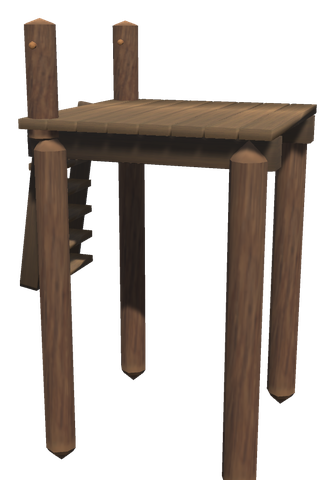
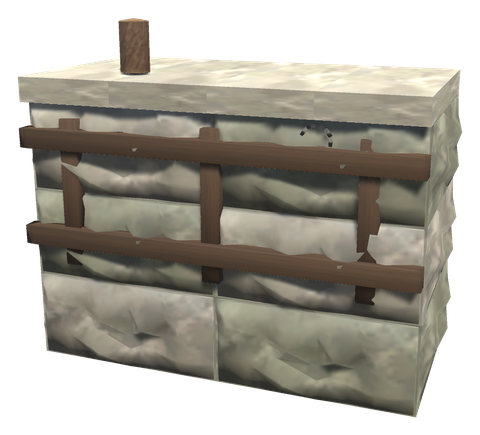
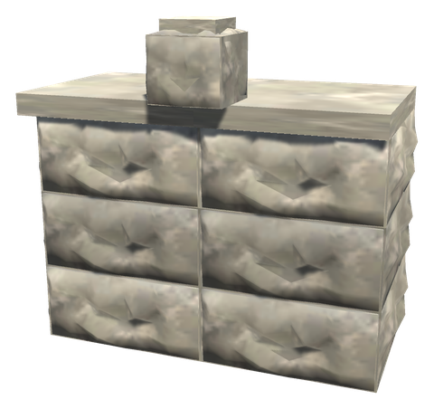
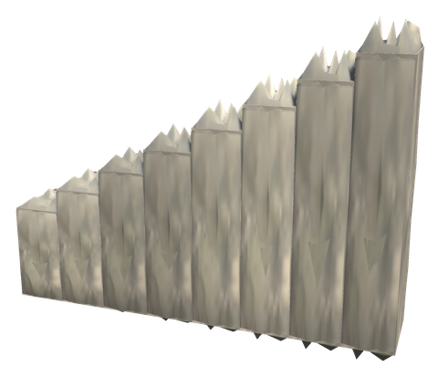
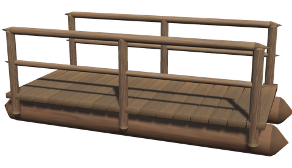
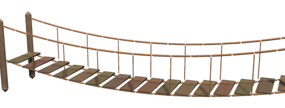
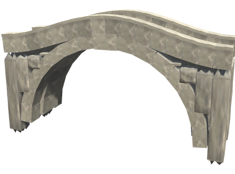

# ⚓ Bridges, jetties and quays

Building pieces for the water's edge: jetties out from the shore on piles, stone quays with steps down to the water, and bridges of logs, of stone and of rope. They snap end to end, and each meets the land or the next piece with its walking surface at the height of its snap points, so place the first one at the height of the bank. What is under them, the piles, the quay's face and the bridge's abutments, reaches 3 m down into the water and the ground.

## 🪵 JETTIES

 

A **Jetty** is 4 m of deck 2 m wide on tarred piles; build out from the shore section by section and finish it with a **Jetty Head**, which has a bollard on each outer corner and a stair down its end for climbing up from a boat. The [Mooring Post](ships.md) and the [Harbour Crane](base.md#harbour-crane) stand on a jetty too.

| Piece | Description | Crafting Station | Requirements |
|-------|-------------|------------------|--------------|
| **Jetty** (`piece_whitehilt_brygge`) | 4 m of deck on piles, 2 m wide | Hammer (Workbench) | Wood ×12, Core Wood ×4 |
| **Jetty 2 m** (`piece_whitehilt_brygge_2m`) | 2 m of deck on piles | Hammer (Workbench) | Wood ×6, Core Wood ×2 |
| **Jetty Head** (`piece_whitehilt_bryggehode`) | The end, with bollards and a stair down | Hammer (Workbench) | Wood ×10, Core Wood ×3 |

## 🧱 QUAYS

  

A **Stone Quay** is 4 m of coursed stone with a cope of long stones on top, a timber fender along its face, an iron ring and a bollard; its face goes to the water. The **Stone Quay Corner** turns it round an outer corner, and the **Quay Steps** run down along its face to 2 m below the top. They are stone like the stone defences: they stand in the water without wearing and take little from blows.

| Piece | Description | Crafting Station | Requirements |
|-------|-------------|------------------|--------------|
| **Stone Quay** (`piece_whitehilt_kai`) | 4 m long, 2 m deep, 3 m down | Hammer, near a Stonecutter | Stone ×40 |
| **Stone Quay Corner** (`piece_whitehilt_kai_hjorne`) | The outer corner, with a big bollard | Hammer, near a Stonecutter | Stone ×30 |
| **Quay Steps** (`piece_whitehilt_kaitrapp`) | Steps down along the face, 4 m long | Hammer, near a Stonecutter | Stone ×24 |

## 🌉 BRIDGES

  

The **Log Bridge** lies on two log stringers from bank to bank, with a railing of logs, in 4 and 8 m. The **Rope Bridge** hangs 8 m between two pairs of posts, its treads sagging half a metre in the middle. The **Stone Bridge** spans 8 m over an arch 6 m across, its deck humping 0.8 m between low parapets. Place a bridge at the height of the banks, its ends on them.

| Piece | Description | Crafting Station | Requirements |
|-------|-------------|------------------|--------------|
| **Log Bridge** (`piece_whitehilt_tommerbru`) | 4 m long, 2 m wide | Hammer (Workbench) | Wood ×10, Core Wood ×4 |
| **Log Bridge 8 m** (`piece_whitehilt_tommerbru_8m`) | 8 m long, 2 m wide | Hammer (Workbench) | Wood ×18, Core Wood ×8 |
| **Rope Bridge** (`piece_whitehilt_hengebru`) | 8 m long, 1.2 m wide | Hammer (Workbench) | Wood ×16, Core Wood ×4, Leather Scraps ×8 |
| **Stone Bridge** (`piece_whitehilt_steinbru`) | 8 m long over an arch 6 m across | Hammer, near a Stonecutter | Stone ×80 |

## Config

The pieces are switched on and off and priced in `[Content]` and `[Recipes]` like the other White Hilt pieces. With linear progression they come with the Black Forest; the stone pieces are built near a Stonecutter, like the stone defences.
