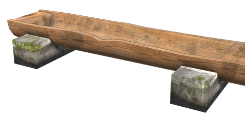
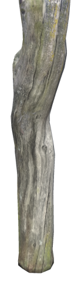
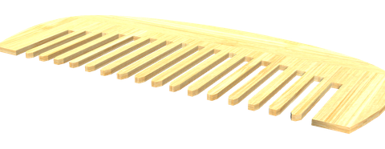
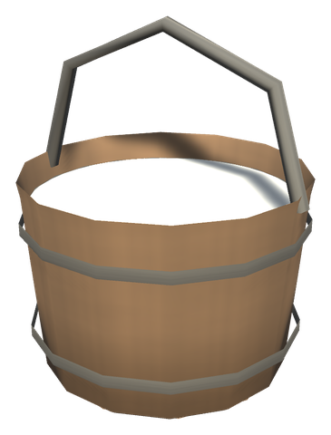

# 🐗 Animal husbandry

[← Back to the README](../README.MD)

## 🐗 ANIMAL HUSBANDRY

Feed, groom and keep your tame animals instead of throwing food on the ground.

- **Feeding Trough**: fill it with food. Hungry animals within 15 m walk over and eat from it, taming and feeding just as with food on the ground (which they still eat first). Animals pick their favourite food first.
- **Favourite food**: each animal has one, shown when you look at it. It tames 50% faster and keeps the animal fed twice as long. Boar: Chanterelle and Porcini · Wolf: Sausages · Lox: Crowberries · Hen: Lingonberries · Asksvin: Smoke Puff. The White Hilt forageables are added to the animals' diets.
- **Animal Husbandry skill**: rises while you tame, feed, groom and breed animals (everyone within 30 m gets the experience). At level 100 animals near you tame in 40% less time, stay fed 50% longer, carry 30% shorter and a herd may be 2 larger. From level 50 animals can have twins, and from 75 young can be born one star stronger (see [Skills & milestones](skills.md)).
- **Tether Post**: use it to keep the tame animals within 10 m wandering around the post; use it with the alternative key to set them free. Works like the "stay" command, around the post.
- **Grooming Comb**: put it on the hotbar and use it on a tame animal once a day. A groomed animal is content for a day: it breeds faster (half the pregnancy, fewer missed breeding checks) and gives one more of each drop, except the trophy, when slaughtered.
- **Produce**: a content, fed animal puts something in a Feeding Trough within 15 m: Boar Leather Scraps and Wolf Wolf Hair every day, Lox a Lox Pelt every third day.
- **Lox Milk**: crouch and use a tame lox to milk it once a day: 2 Lox Milk, 3 from a groomed lox. Shift+Use still renames it. The milk goes into the Plains dishes ([Foraging & food](foraging.md)).

   

| Item | Description | Crafted | Requirements |
|------|-------------|---------|--------------|
| **Feeding Trough** | Holds 8 stacks of food for animals nearby | Hammer (near Workbench) | Wood ×8, Stone ×4 |
| **Tether Post** | A weathered post with a chain that keeps tame animals around it | Hammer (near Workbench) | Wood ×4, Leather Scraps ×2 |
| **Grooming Comb** | Grooms a tame animal once a day | Workbench | Bone Fragments ×3, Deer Hide ×1 |
| **Lox Milk** | Milk for the Plains dishes | Crouch and use a tame lox, once a day | – |

## Config

Section `[Husbandry]` (admin only, synced from the server; it was `[Ranching]` before 0.49.0, and its values are moved over):

| Setting | Default | What it does |
|---|---|---|
| `HusbandryEffects` | true | The skill's bonuses to nearby animals; off: the skill still gains experience |
| `FavoriteFoods` | true | Favourite foods tame faster, last longer and are eaten first |
| `AnimalProduction` | true | Groomed, fed animals put products in a trough |
| `GroomingBonus` | true | Groomed animals breed faster and drop more |
| `TamingTimeReduction` | 0.4 | Share of the taming time taken off at skill 100 |
| `FedDurationBonus` | 0.5 | How much longer food lasts at skill 100 |
| `PregnancyReduction` | 0.3 | Share of the pregnancy taken off at skill 100 |
| `ExtraHerdSize` | 2 | More animals a herd may hold at skill 100 |
| `HusbandryRange` | 30 | Metres within which players get experience and lend their skill |
| `TamingTickExperience` | 0.2 | Experience per taming tick (every 3 s) |
| `TamedExperience` | 50 | Experience when an animal becomes tame |
| `FeedingExperience` | 3 | Experience when an animal eats |
| `BirthExperience` | 15 | Experience when an animal is born or an egg is laid |
| `GroomExperience` | 10 | Experience for grooming |
| `ProduceExperience` | 5 | Experience when an animal puts something in a trough |
| `FavoriteTamingSpeed` | 1.5 | How much faster a favourite food tames |
| `FavoriteFedDuration` | 2 | How much longer a favourite food keeps an animal fed |
| `FavoriteFoodsList` | `Boar:WhiteHiltChanterelle\|WhiteHiltPorcini, Wolf:Sausages, Lox:WhiteHiltCrowberries, Hen:WhiteHiltLingonberries, Asksvin:MushroomSmokePuff` | `Creature:Item\|Item`, comma separated (prefab names). Applies on the next world load |
| `Products` | `Boar:LeatherScraps:1, Wolf:WolfHairBundle:1, Lox:LoxPelt:3` | `Creature:Item:Days`, comma separated |
| `ContentBreedingFactor` | 0.5 | Multiplier on a groomed animal's pregnancy time and missed breeding checks |
| `ContentDropBonus` | 1 | Extra of each drop (not the trophy) from a groomed animal |
| `TetherRange` | 10 | Metres a tether post reaches |
| `TroughRange` | 15 | Metres within which animals use a feeding trough |
| `LoxMilking` | true | Tame lox can be milked by crouching and using them |
| `MilkPerLox` | 2 | Lox Milk from one milking; a groomed lox gives one more |
| `MilkDays` | 1 | In-game days before a lox can be milked again |
