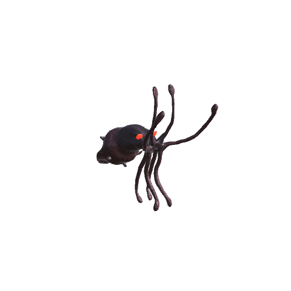
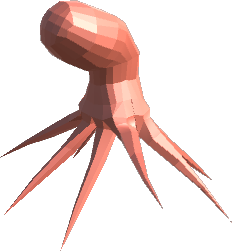

# 🐙 Kraken & octopus

[← Back to the README](../README.MD)

 

The sea is no longer empty. Octopuses swim in the deep, and on a still, foggy night the Kraken may rise beside your ship.

Creature labels use localized names: Kraken and Kraken Tentacle (Kraken and Krakententakkel in Norwegian), not their internal `WhiteHilt_` prefab identifiers.

## Octopus

Octopuses swim below the surface of the ocean, jetting along mantle first in short pulses. Catch them with a fishing rod and ocean bait, like the fish they share the water with. Cook them into **Octopus Stew** in the Stone Pot (see [Foraging & food](foraging.md)).

## The Kraken

The Kraken only comes when everything lines up:

- you sail a ship on the **ocean**, over at least 25 m of water,
- it is **night**,
- the weather is **misty** (fog),
- the wind is **calm** (at most 0.35),
- **Bonemass** is slain.

Then, once a minute, there is an 8% chance it rises with one player aboard. Each additional player on the same ship adds 8 percentage points: 16% with two players, 24% with three, and 40% with five, capped at 100%. Players on other ships do not contribute to that ship's chance. All the conditions above still apply. It comes at most once every 90 minutes in the whole world.

### Horn of the Deep

The [Horn of the Deep](difficulty.md#horn-of-the-deep) can deliberately call Kraken: equip it and attack to complete a horn call while aboard a ship in **Ocean**, over at least the configured `MinDepth`, after the configured `RequiredKey` boss is defeated. No fog, calm wind, night or chance roll is needed. Kraken must be enabled. The server applies the horn's own cooldown and nearby-encounter checks.

On dedicated servers, the server checks network data and authorizes the caller's client to raise Kraken beside the loaded ship. The cooldown starts only after successful spawn confirmation. Update both server and clients to 0.78.1 or newer; `Horn:` log entries show rejections and results.

A horn-called Kraken does not retreat merely because it is daytime. Its normal `RetreatMinutes` limit and retreat when players leave still apply. Naturally occurring Kraken is unchanged.

### The fight

1. The sea shakes and **the Kraken rises** beside the ship, with dark wine-black hide, narrow red eyes and more of its head above water.
2. **Six tentacles** break the surface in a ring around the ship and lash at everyone aboard.
3. The Kraken **holds the ship fast** and periodically lifts the hull up to **1.8 m** above its usual waterline. A roar and camera shake give **three seconds of warning**, then the ship rises and lowers over four seconds. The ship's network owner applies bounded forces, not teleports.
4. **Kill the Kraken** to free the ship. Its tentacles die with it, and the dead Kraken sinks into the deep.
5. It gives up after 5 minutes, at dawn, or when no one is near, and sinks back with its tentacles, without loot.

On Kraken's target [White Hilt Ship](ships.md), a lit Ship Lantern flickers before the tentacles appear, then goes out for the encounter. It cannot be lit while the living Kraken remains within the configured lantern encounter range. After death or retreat it stays off until a sailor uses the lantern to light it again. Other ships, the brazier and mast wisp are unaffected. The warning timing and flicker cadence are server-synced settings under `[Ships]`; this works even with ship holding/lifting disabled.

| | Health | Attack |
|---|---|---|
| **Kraken** | 8000 | Slam, 140 blunt, reaches about 13 m |
| **Kraken Tentacle** | 900 | Lash, 70 blunt, reaches about 12 m |

**The ship tent is not a safe hiding place.** On its target White Hilt Ship, one of the existing tentacles attempts a sweep every **18-30 seconds** while alive. If the Ship Tent upgrade is installed and a living sailor stands beneath it with room for the tentacle, it fixes a horizontal lane through the side opening at that sailor's position. Everyone aboard receives a **two-second warning** before the tentacle reaches in and withdraws over **three seconds**. Move away from the lane to avoid it. Sailors still in its path take **10 base blunt damage** and a strong shove toward the opposite side opening, at most once per sweep. The hit can be blocked or dodged and uses normal crew/enrage damage scaling. The indestructible hull remains unaffected; players on the tent roof or other ships are not targeted. No extra tentacle is spawned, and killing the designated tentacle stops these sweeps for that encounter. Removing the tent, killing Kraken, retreating or leaving the encounter range cancels a sweep. Ship holding and lifting are not required.

Below **50% health**, Kraken becomes enraged: body and tentacle damage rises by **50%**, the body's animation runs **1.4x** faster, and subsequent hull lifts come sooner. The three-second warning is never shortened, and a lift already underway keeps its original duration. The base attack interval is three seconds; animation duration and AI targeting also limit actual attack frequency. Ships receive **50%** of the configured attack damage before crew, enrage and world scaling. Bring a prepared crew; the hull can be lost.

Within **80 m** of a living Kraken that is not retreating, [Odin and Freya](potions.md#during-a-kraken-fight) are weakened but remain useful. Odin keeps +30 maximum HP, +0.5 HP/s, 1.25x health regeneration and 30% fall-damage protection at default settings; drinking it heals 25% of maximum HP instead of filling health. Freya keeps +20 stamina regeneration and reduced action costs instead of restoring stamina from actions. Potion durations do not change, and full strength returns automatically outside the encounter, on death or retreat. Other potions are unchanged.

Both shrug off chop and pickaxe damage and poison, resist fire and frost, and are weak to lightning.

Large crews face harder blows. When the Kraken rises, it remembers how many players are aboard its target ship. Both the body and tentacles deal an extra **15% of solo damage to players** and **3% of solo ship damage** per additional crew member. These bonuses multiply the configured damage shares and stack with vanilla multiplayer and world-difficulty scaling; the attack values above are base values, before armor and resistances.

| Players aboard at spawn | Extra damage to players | Extra damage to the ship |
|---|---|---|
| 1 | None | None |
| 2 | +15% | +3% |
| 3 | +30% | +6% |
| 5 | +60% | +12% |
| 10 | +135% | +27% |

The crew bonus stays fixed for that encounter, even if players jump overboard, die or join later. It is saved with the Kraken and copied to its tentacles, including for admin-summoned encounters. Older Krakens without a saved crew count retain solo damage. This crew bonus does not change health or tentacle count; vanilla effective-health scaling still applies. Set either extra-player damage setting to 0 to disable that bonus. A damage share of 0 still prevents that kind of damage entirely.

The Kraken has its own deep, watery calls for idle, alert, slam, injury and death, with deeper pitch, periodic ambient calls and lift/enrage warning roars. Its tentacles share the calls and use a separate wet lash sound when striking. Sounds carry up to 180 m at default settings. Set `[Kraken] Sounds` to false to keep the previous vanilla sounds (custom warning and ambient calls stop).

### Loot

| Item | Description | Used for |
|------|-------------|----------|
| **Kraken Tentacle** ×4–6 | A slab of tentacle | Kraken Feast, the Grip of the Deep rune ([Smithing](smithing.md#-binding-and-rune-etching)) |
| **Kraken Ink** ×3–5 | Thick black ink | Kraken Feast, a black dye at the Paint Bench ([Painting](painting.md)), the Storm and Grip of the Deep runes ([Smithing](smithing.md#-binding-and-rune-etching)) |
| **Kraken Trophy** | Proof you lived | Your wall |
| **Chitin** ×6–10 | Hard shell | Vanilla recipes |

## Config

Section `[Kraken]` (admin only, synced from the server):

| Setting | Default | What it does |
|---|---|---|
| `Enabled` | true | The Kraken can come at all |
| `RequiredKey` | defeated_bonemass | Global key needed first; empty for none |
| `FogWeathers` | Misty | Weathers that count as fog |
| `MaxWind` | 0.35 | Strongest wind that counts as calm |
| `NightOnly` | true | Only at night |
| `ChancePerMinute` | 8 | Base percent per minute for one player while every condition holds; 0 disables natural attacks |
| `ChancePerExtraPlayer` | 8 | Extra percentage points per additional player on the same ship, capped at 100% total; 0 disables the crew bonus |
| `CooldownMinutes` | 90 | Real minutes between Krakens, world-wide |
| `MinDepth` | 25 | Least depth of water under the ship |
| `Tentacles` | 6 | Tentacles around the ship (0–8) |
| `TentSweep` | true | One existing tentacle can sweep under an installed White Hilt Ship tent |
| `TentSweepInterval` / `TentSweepJitter` | 18 / 12 | Minimum seconds between attempts plus up to this many random extra seconds |
| `TentSweepWarning` | 2 | Warning seconds before entering the side opening |
| `TentSweepSeconds` | 3 | Seconds reaching in and withdrawing |
| `TentSweepRadius` | 0.65 | Hit radius in metres; paths without clearance are skipped |
| `TentSweepDamage` | 10 | Base blunt damage, scaled by the usual crew/enrage settings |
| `TentSweepPush` | 30 | Knockback force toward the opposite side opening |
| `TentSweepRange` | 60 | Maximum distance from Kraken to its target ship, metres |
| `BodyHealth` / `TentacleHealth` | 8000 / 900 | Health |
| `BodyDamage` / `TentacleDamage` | 140 / 70 | Blunt damage per blow |
| `CrewDamagePercent` | 100 | Share of the damage the crew takes; 0 = never hurt |
| `ShipDamagePercent` | 50 | Share of the damage the ship takes; 0 = never hurt |
| `CrewDamagePerExtraPlayer` | 15 | Extra percent of solo damage to players per additional crew member at spawn, on top of vanilla scaling; 0 disables the bonus |
| `ShipDamagePerExtraPlayer` | 3 | Extra percent of solo ship damage per additional crew member at spawn; 0 disables the bonus |
| `HoldShip` | true | The Kraken holds the ship fast |
| `LiftShip` | true | Periodic hull lift; also requires `HoldShip` |
| `LiftHeight` | 1.8 | Maximum lift above the usual hull waterline, metres (0–4) |
| `LiftInterval` | 14 | Seconds between lift cycles, shortened by enrage but never below warning + lift duration |
| `LiftWarningSeconds` | 3 | Warning seconds before lifting, preserved during enrage |
| `LiftSeconds` | 4 | Seconds raising and lowering the hull, shortened for subsequent enraged lifts |
| `LiftAcceleration` | 8 | Maximum vertical acceleration, m/s² |
| `EnrageHealthShare` | 0.5 | Health fraction for enrage; 0 disables it |
| `EnrageDamage` | 1.5 | Body and tentacle damage multiplier while enraged |
| `EnrageSpeed` | 1.4 | Body-animation and subsequent lift-cycle speed while enraged |
| `AttackInterval` | 3 | Minimum melee attack interval, seconds (after a restart) |
| `SoundVolume` | 1 | Kraken/tentacle sound volume, 0–1 (after a restart) |
| `SoundRange` | 180 | Audible range, metres (after a restart) |
| `SoundPitch` | 0.75 | Sound pitch; lower sounds deeper (after a restart) |
| `AmbientSeconds` | 9 | Seconds between ambient body calls |
| `PotionRange` | 80 | Range for Odin/Freya attenuation; 0 disables it |
| `OdinBonusShare` | 0.6 | Retained fraction of max-health and fall-protection bonuses |
| `OdinHealingShare` | 0.25 | Retained fraction of instant/passive healing and regeneration bonus |
| `FreyaShare` | 0.5 | Retained stamina benefits; costs blend toward normal, never negative while attenuated |
| `RetreatMinutes` | 5 | Minutes before it gives up |
| `Scale` | 1.5 | Size of the Kraken (after a restart) |
| `Sounds` | true | Own watery calls and tentacle lash (after a restart) |
| `LootMultiplier` | 1 | Multiplier on the meat, ink and chitin it drops; the trophy stays one (after a restart) |

Section `[Octopus]`: `Enabled`, `MaxSpawned` (2) and `SpawnChance` (20%).

On upgrade to 0.79.0, the previous defaults for tentacle count, health, damage and ship-damage share migrate once. Custom values are preserved. Setting a retained potion share to 1 keeps that benefit at full strength.

## Console commands

- `whitehilt_kraken` shows every condition where you are, whether it holds, the number of players aboard and the resulting chance per minute before conditions and cooldown are applied.
- `whitehilt_kraken summon` (admins) raises the Kraken beside your ship now.
