# 🪵 Log house and stave walls

Build a house the Norwegian way: *laft*, core wood logs laid on top of each other and notched where the walls meet, so the log ends cross and stick out past the corners. Set it on a dry-laid stone foundation, lay the floors in large pieces, hang doors 3 m high that you walk through upright, put in windows at eye height, go up by a stair, a spiral stair or a ladder, and down through a hatch to the cellar. Or build the other old way, with stave walls, run a svalgang round a stave hall and dress it after Borgund stave church, with ridge dragons, a ridge turret, carved columns and a bell tower. Everything is built with the ordinary Hammer near a Workbench.

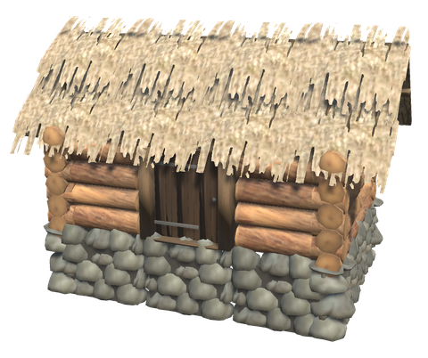

## 🪵 LOG WALLS

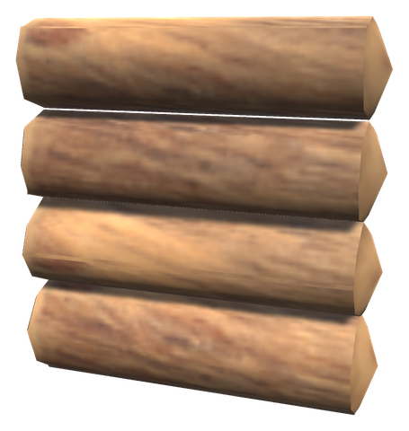 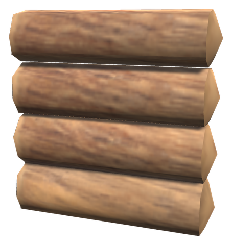 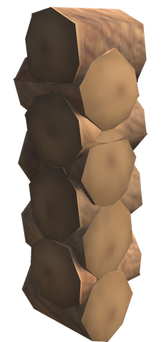 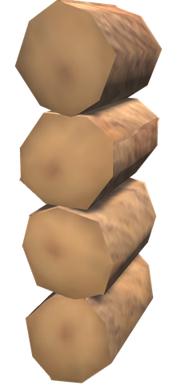

In a log house the logs of two walls that meet lie half a log apart in height, so that each log rests in the notch of the one across it. The walls therefore come in two kinds:

- The **Log Wall** starts with a whole log on the floor: its logs lie at 0.25, 0.75, 1.25 and 1.75 m.
- The **Offset Log Wall** lies half a log higher. Its lowest log is sunk half into the floor or foundation, like the half log a real house starts its end walls with, and its top log is the lowest log of whatever stands on it, a wall or a gable.

Build two opposite walls of the house with the Log Wall and the other two with the Offset Log Wall. Logs are 0.5 m apart, so walls, low walls and gables of the same kind stack on each other at every metre and keep the rhythm. Walls snap end to end and on top of each other like the vanilla walls, with their snap points on the centre line of the logs.

The **Log Corner** puts the crossing log ends (*laftehoder*) on a corner: set it on the corner, where the centre lines of the two walls meet. Turn it until its logs follow the walls. At two of the four corners of a house they will not, and the **Log Corner, Mirrored** fits there. A corner piece is 2 m high, so stack two for a two-storey house. Where an inner wall meets an outer one, the **Log Wall Joint** lets the inner wall's logs run through and stick out on the outside, as in *krysslaft*; build the inner wall with the Offset Log Wall.

| Piece | Description | Crafting Station | Requirements |
|-------|-------------|------------------|--------------|
| **Log Wall** (`piece_whitehilt_laftvegg`) | 2 m long, 2 m high | Hammer (Workbench) | Core Wood ×4 |
| **Log Wall 1 m** (`piece_whitehilt_laftvegg_1m`) | 1 m long, to close a gap | Hammer (Workbench) | Core Wood ×2 |
| **Log Wall 4 m** (`piece_whitehilt_laftvegg_4m`) | Whole 4 m logs, without a joint in the middle | Hammer (Workbench) | Core Wood ×8 |
| **Offset Log Wall** (`piece_whitehilt_laftvegg_forskutt`) | 2 m long, 2 m high, logs half a log higher | Hammer (Workbench) | Core Wood ×4 |
| **Offset Log Wall 1 m** (`piece_whitehilt_laftvegg_forskutt_1m`) | 1 m long | Hammer (Workbench) | Core Wood ×2 |
| **Offset Log Wall 4 m** (`piece_whitehilt_laftvegg_forskutt_4m`) | Whole 4 m logs | Hammer (Workbench) | Core Wood ×8 |
| **Low Offset Log Wall** (`piece_whitehilt_laftvegg_forskutt_lav`) | 2 m long, 1 m high, for under a 26° gable | Hammer (Workbench) | Core Wood ×2 |
| **Log Corner** (`piece_whitehilt_laftehjorne`) | The crossing log ends of a corner, 2 m high | Hammer (Workbench) | Core Wood ×3 |
| **Log Corner, Mirrored** (`piece_whitehilt_laftehjorne_speilet`) | The same, the other way round | Hammer (Workbench) | Core Wood ×3 |
| **Log Wall Joint** (`piece_whitehilt_laftekryss`) | An inner wall's log ends through the outer wall | Hammer (Workbench) | Core Wood ×2 |

Log pieces have 200 health per core wood they cost, so a 2 m wall has 800, and burn like other wood.

## 🔺 GABLES

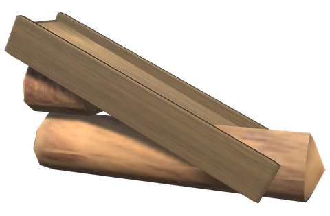 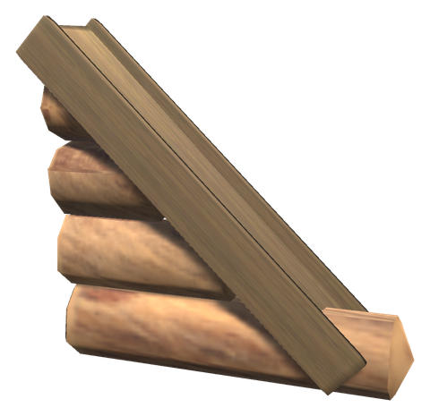

A gable is half the end of the house, 2 m wide: offset logs cut to the slope of the vanilla 26° or 45° roof, with barge boards over their ends and a rafter on top for the roof to lie on. Its lowest log reaches past the corner like the corner's logs under it. Set it on top of an end wall (an Offset Log Wall) and turn it so it rises towards the ridge; the other half of the end wall takes another, turned the other way.

For a house wider than 4 m, the inner part of the end wall rises higher: under a 45° gable put a 2 m Offset Log Wall, under a 26° gable a Low Offset Log Wall, and the gable on top of that.

| Piece | Description | Crafting Station | Requirements |
|-------|-------------|------------------|--------------|
| **Log Gable 26°** (`piece_whitehilt_laftgavl_26`) | 2 m wide, rising 1 m | Hammer (Workbench) | Core Wood ×2 |
| **Log Gable 45°** (`piece_whitehilt_laftgavl_45`) | 2 m wide, rising 2 m | Hammer (Workbench) | Core Wood ×3 |

Every [White Hilt roof](roofs.md) has the same slopes as the vanilla roofs, so turf, slate and shingles fit the gables too.

## 🪨 FOUNDATION

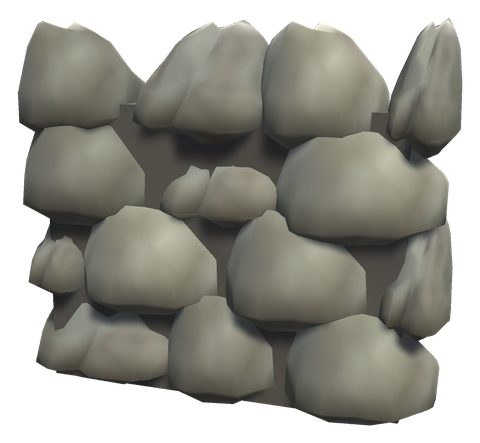 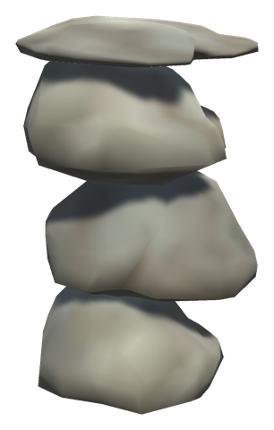

A *grunnmur* of big field stones laid dry keeps the logs off the damp ground and the house level on a slope. It stands 1 m high and reaches 0.6 m into the ground, so it does not hang in the air where the ground falls away. Log walls, floors and the vanilla pieces snap to its top. It is stone in the building rules: it holds what stands on it like the ground does, does not wear in the rain and sounds like stone when struck.

The **Cornerstone** goes under each corner, where the log ends stick out past the foundation walls, or alone as a pillar under a floor.

| Piece | Description | Crafting Station | Requirements |
|-------|-------------|------------------|--------------|
| **Stone Foundation** (`piece_whitehilt_grunnmur`) | 2 m long, 1 m high | Hammer (Workbench) | Stone ×12 |
| **Stone Foundation 4 m** (`piece_whitehilt_grunnmur_4m`) | 4 m long, 1 m high | Hammer (Workbench) | Stone ×24 |
| **Cornerstone** (`piece_whitehilt_hjornestein`) | A stone pillar 0.8 m square, 1 m high | Hammer (Workbench) | Stone ×8 |

## 🟫 FLOORS

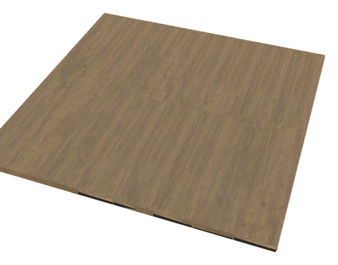 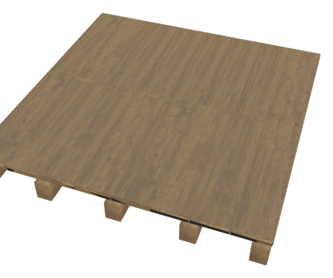

Plank floors in more sizes, laid from the vanilla floor's boards, so they look the same and the boards keep their size. They cost what the vanilla floors they cover cost. The **Joisted Floor** lies on hewn joists 1 m apart, for a loft: from below you see the joists, not the underside of the boards.

| Piece | Description | Crafting Station | Requirements |
|-------|-------------|------------------|--------------|
| **Plank Floor 4×4** (`piece_whitehilt_plankegulv_4x4`) | 4 × 4 m | Hammer (Workbench) | Wood ×8 |
| **Plank Floor 4×2** (`piece_whitehilt_plankegulv_4x2`) | 4 × 2 m | Hammer (Workbench) | Wood ×4 |
| **Plank Floor 2×1** (`piece_whitehilt_plankegulv_2x1`) | 2 × 1 m, for a strip along a wall | Hammer (Workbench) | Wood ×1 |
| **Joisted Floor 4×4** (`piece_whitehilt_bjelkelag_4x4`) | 4 × 4 m on joists | Hammer (Workbench) | Wood ×12 |

## 🚪 DOORS

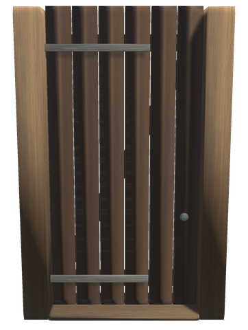 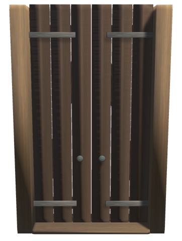 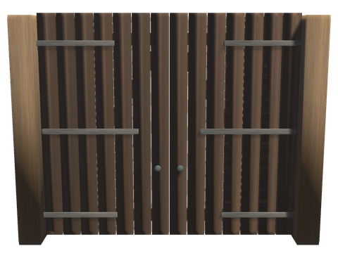 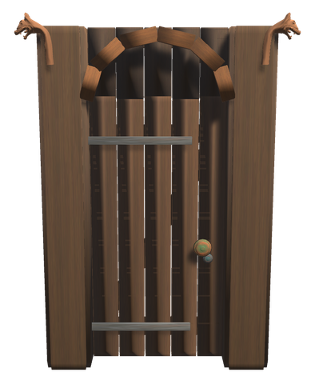

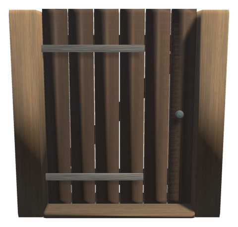 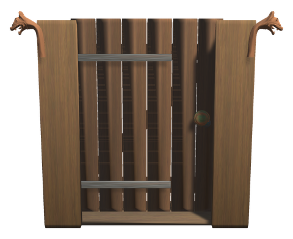 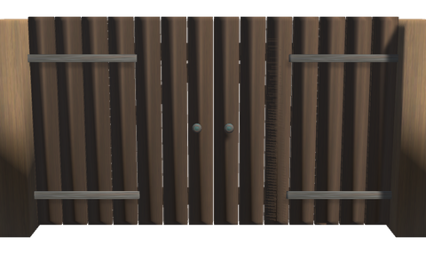

**How high a door should be.** Your character stands 1.85 m tall and is nearly a metre wide (the game's capsule has a radius of 0.49 m). The vanilla door's leaf is 1.39 × 1.88 m in a 2 × 2 m piece: a hand over your head, and the camera behind you bumps into the wall over it. That is why so many build the vanilla gate instead, whose leaf is 1.68 × 3 m. The tall doors here are 3 m high like the gate, a metre over your head, and snap in its place: a 2 m wall and the metre above it. Fill over them with a **Low Log Wall** or a **Low Stave Wall** in a wall of two rows. The doors 2 m high are for low outbuildings and the barn.

All doors snap in place of a wall like the vanilla door and fit log walls, stave walls and vanilla walls alike. Open and close them with **Use**; they are [self-closing doors](base.md#-self-closing-doors) like every other door, so Shift + Use holds one open and they shut by themselves when a raid comes.

| Piece | Description | Crafting Station | Requirements |
|-------|-------------|------------------|--------------|
| **Tall Plank Door** (`piece_whitehilt_hoy_plankedor`) | A board door 1.5 m wide and 3 m high between hewn posts, 2 × 3 m | Hammer (Workbench) | Wood ×8, Resin ×2 |
| **Double Door** (`piece_whitehilt_dobbeldor`) | Two narrow leaves 3 m high opening from the middle, 1.6 m wide together, 2 × 3 m | Hammer (Workbench) | Wood ×10, Resin ×2 |
| **Hall Doors** (`piece_whitehilt_haldor`) | Two leaves 1.7 m wide and 3 m high with long iron straps, 4 × 3 m | Hammer (Workbench) | Wood ×20, Iron ×2 |
| **Stave Church Portal** (`piece_whitehilt_stavkirkeportal`) | Broad boards round a narrow door with a round head, 1.2 × 2.4 m, dragon heads and a bronze ring, 2 × 3 m | Hammer (Workbench) | Fine Wood ×10, Wood ×4, Bronze ×2 |
| **Plank Door** (`piece_whitehilt_plankedor`) | A door of tarred boards on strap hinges between two hewn posts, 2 × 2 m | Hammer (Workbench) | Wood ×6, Resin ×2 |
| **Dragon Portal** (`piece_whitehilt_dorportal`) | A door in a portal of broad boards with two dragon heads and a bronze ring, 2 × 2 m | Hammer (Workbench) | Fine Wood ×8, Wood ×4, Bronze ×1 |
| **Barn Doors** (`piece_whitehilt_lavedor`) | Two tarred board doors, 4 × 2 m, wide enough for a cart | Hammer (Workbench) | Wood ×16, Resin ×4 |
| **Low Log Wall** (`piece_whitehilt_laftvegg_lav`) | A plain log wall 2 m long and 1 m high, to fill over a tall door | Hammer (Workbench) | Core Wood ×2 |

## 🪟 WINDOWS

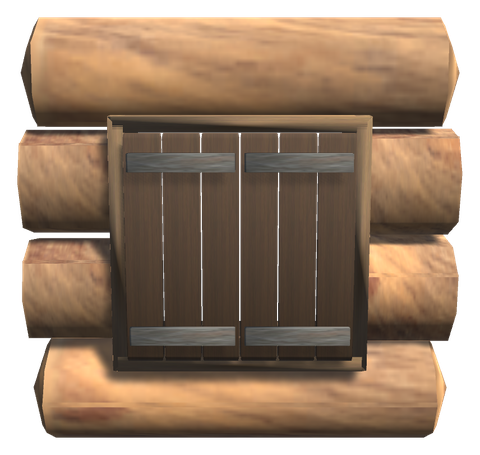 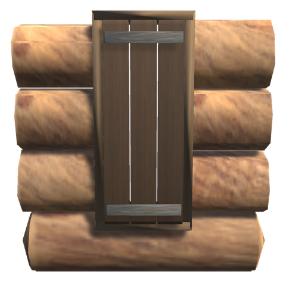 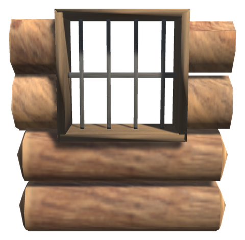 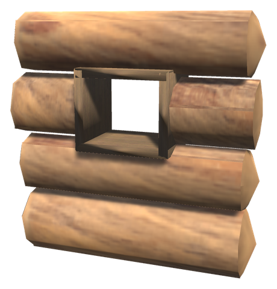

The windows are walls with an opening framed in boards, in both kinds of log wall and in the stave wall, and take the place of a 2 m wall. They lie round your eyes, at about 1.6 m when you stand on the floor the wall stands on, as high as the logs let them: from 1 to 2 m in the plain log wall and from 0.77 to 1.73 m in the offset wall, where the logs lie half a log lower.

The shutters open with **Use** and always swing out against the wall, whichever side you open them from. They are windows to the [self-closing doors](base.md#-self-closing-doors), so they close when rain, a storm or night begins (and can be opened again while it lasts), and at once when a raid comes. A *glugg* is the small opening of the oldest houses, high up, which let in light and let out smoke.

| Piece | Description | Crafting Station | Requirements |
|-------|-------------|------------------|--------------|
| **Log Wall with Window** (`piece_whitehilt_laftvegg_vindu`) | Window 1 m wide, from 1 to 2 m, with two shutters | Hammer (Workbench) | Core Wood ×4, Wood ×2 |
| **Offset Log Wall with Window** (`piece_whitehilt_laftvegg_forskutt_vindu`) | The same in the offset wall, from 0.77 to 1.73 m | Hammer (Workbench) | Core Wood ×4, Wood ×2 |
| **Log Wall with Narrow Window** (`piece_whitehilt_laftvegg_smal_vindu`) | Window 0.6 m wide from 0.5 m up to the top of the wall, one shutter | Hammer (Workbench) | Core Wood ×4, Wood ×2 |
| **Offset Log Wall with Narrow Window** (`piece_whitehilt_laftvegg_forskutt_smal_vindu`) | The same in the offset wall, from 0.77 to 1.73 m | Hammer (Workbench) | Core Wood ×4, Wood ×2 |
| **Log Wall with Barred Window** (`piece_whitehilt_laftvegg_sprosser`) | Window 1 m wide behind iron bars, for a storehouse or a smithy | Hammer (Workbench) | Core Wood ×4, Iron ×1 |
| **Offset Log Wall with Barred Window** (`piece_whitehilt_laftvegg_forskutt_sprosser`) | The same in the offset wall | Hammer (Workbench) | Core Wood ×4, Iron ×1 |
| **Log Wall with Glugg** (`piece_whitehilt_laftvegg_glugg`) | A small open window one log high, from 1.5 to 2 m | Hammer (Workbench) | Core Wood ×4 |
| **Offset Log Wall with Glugg** (`piece_whitehilt_laftvegg_forskutt_glugg`) | The same in the offset wall, from 1.27 to 1.73 m | Hammer (Workbench) | Core Wood ×4 |

The stave wall's windows are under [Stave walls](#-stave-walls-and-the-svalgang).

## ⛪ STAVE WALLS AND THE SVALGANG

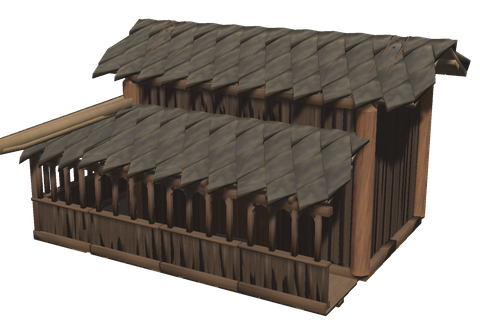

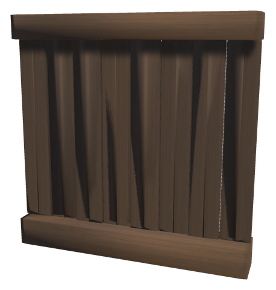 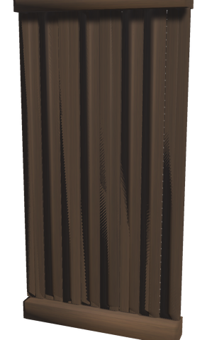 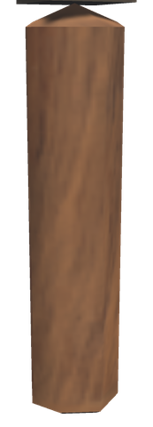 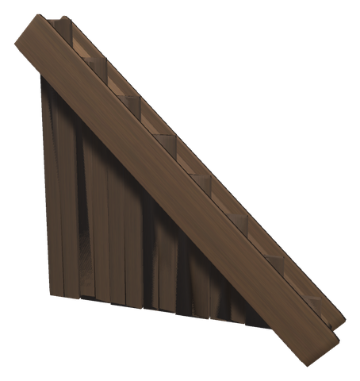 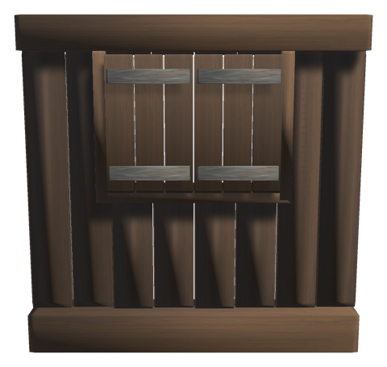 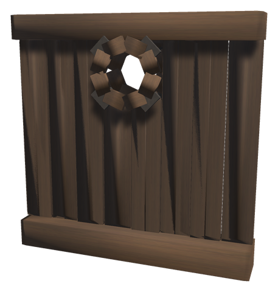

The other old way of building in wood: tarred boards standing on end between a sill (*sville*) and a wall plate (*stavlegje*), as on the stave churches and the oldest halls. Stave walls are built from wood and resin, so they come before the log house, but are not as strong. They snap end to end and on each other like the vanilla walls; a **Corner Stave** covers the joint where two meet. The **Tall Stave Wall** is 4 m high, for a hall or a church, and the **Low Stave Wall** fills over a tall door. The gables are built like the log gables.

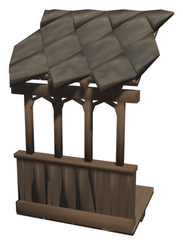 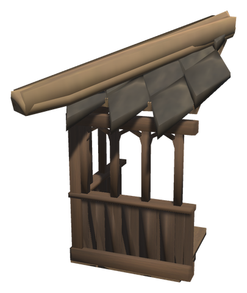

The **Svalgang** is the covered gallery round a stave church: a board floor, a low wall, an arcade of small posts and round arches, and a lean-to of the vanilla dark shingles. Snap it to the foot of a wall on its outside; its roof meets the wall 3.25 m up, so it wants the Tall Stave Wall (or two rows of walls). The **Svalgang Corner** goes round an outer corner, under a hipped corner of shingles.

| Piece | Description | Crafting Station | Requirements |
|-------|-------------|------------------|--------------|
| **Stave Wall** (`piece_whitehilt_stavvegg`) | 2 m long, 2 m high | Hammer (Workbench) | Wood ×6, Resin ×1 |
| **Stave Wall 1 m** (`piece_whitehilt_stavvegg_1m`) | 1 m long, 2 m high | Hammer (Workbench) | Wood ×3, Resin ×1 |
| **Stave Wall 4 m** (`piece_whitehilt_stavvegg_4m`) | 4 m long, 2 m high | Hammer (Workbench) | Wood ×12, Resin ×2 |
| **Tall Stave Wall** (`piece_whitehilt_stavvegg_hoy`) | 2 m long, 4 m high | Hammer (Workbench) | Wood ×12, Resin ×2 |
| **Low Stave Wall** (`piece_whitehilt_stavvegg_lav`) | 2 m long, 1 m high | Hammer (Workbench) | Wood ×3, Resin ×1 |
| **Corner Stave** (`piece_whitehilt_hjornestav`) | A round corner post 2 m high | Hammer (Workbench) | Wood ×4, Resin ×1 |
| **Tall Corner Stave** (`piece_whitehilt_hjornestav_4m`) | A round corner post 4 m high | Hammer (Workbench) | Wood ×8, Resin ×1 |
| **Stave Gable 26°** (`piece_whitehilt_stavgavl_26`) | 2 m wide, rising 1 m | Hammer (Workbench) | Wood ×3, Resin ×1 |
| **Stave Gable 45°** (`piece_whitehilt_stavgavl_45`) | 2 m wide, rising 2 m | Hammer (Workbench) | Wood ×4, Resin ×1 |
| **Stave Wall with Window** (`piece_whitehilt_stavvegg_vindu`) | Window 1 m wide from 1 m up to the wall plate, two shutters | Hammer (Workbench) | Wood ×8, Resin ×1 |
| **Stave Wall with Round Glugg** (`piece_whitehilt_stavvegg_glugg`) | A small round window high up | Hammer (Workbench) | Wood ×6, Resin ×1 |
| **Svalgang** (`piece_whitehilt_svalgang`) | 2 m of covered gallery, 2 m deep | Hammer (Workbench) | Wood ×10, Fine Wood ×4, Resin ×2 |
| **Svalgang Corner** (`piece_whitehilt_svalgang_hjorne`) | The gallery's outer corner, 2 × 2 m | Hammer (Workbench) | Wood ×10, Fine Wood ×4, Resin ×2 |

## ⛪ AFTER BORGUND STAVE CHURCH

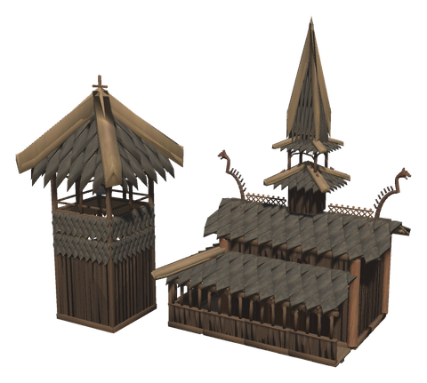

[Borgund stave church](https://en.wikipedia.org/wiki/Borgund_Stave_Church) in Lærdal, built of timber felled in the winter of 1180/81, is the best kept of the stave churches. These pieces take after it: what stands on its roofs, the frame inside it, its svalgang and the bell tower beside it.

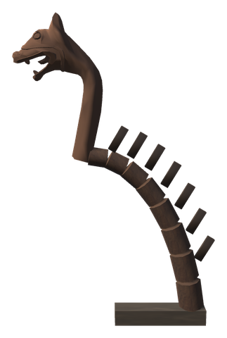 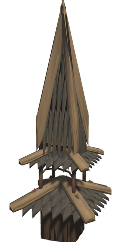 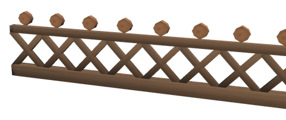 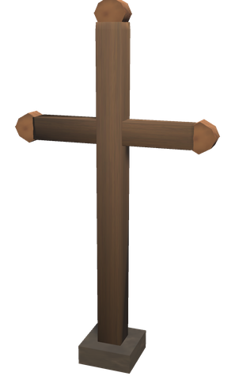

**On the roofs.** Dragon heads on tall curved necks look out from the ends of Borgund's ridges, like the prows of the old ships. The ridges carry carved crests of openwork, which Borgund is one of the few stave churches to have kept, the lower gables carry crosses, and where the roofs meet stands a turret with tiers of shingles, an open belfry and a tall spire. Set the **Ridge Dragon** on a ridge at the gable, the **Ridge Crest** along a ridge, the **Gable Cross** on the top of a gable and the **Ridge Turret** on the ridge.

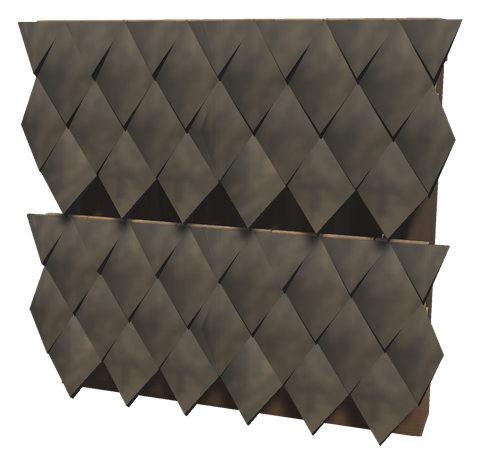 

**Walls and portal.** Borgund's walls and gables are clad in pointed scale shingles; the **Shingled Stave Wall** is a stave wall clad in them. The **Stave Church Portal** has half-columns with a base and a capital either side of its round-headed door, as on the church's west portal.

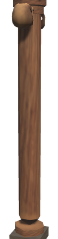 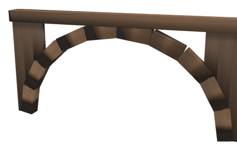 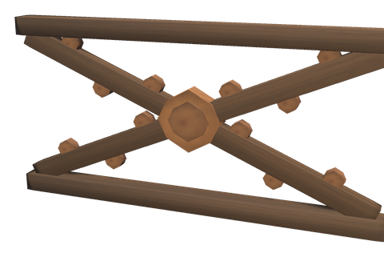 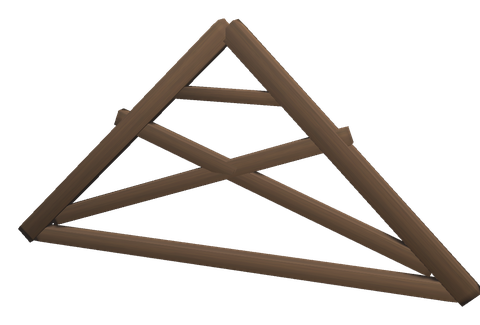

**Inside.** Twelve round columns stand round Borgund's nave, with grotesque masks carved at their tops and round arches between them. Over the arcade, St Andrew's crosses with a sun in the middle and carved leaves down the arms brace the columns into a second storey, and scissor trusses carry the steep roof. Stand **Nave Columns** 2 m apart, set an **Arcade Arch** between each two at 3 m and a **St Andrew's Cross** on it, and put **Scissor Trusses** across the walls under a 45° roof.

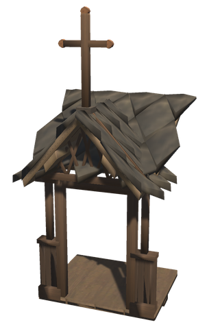 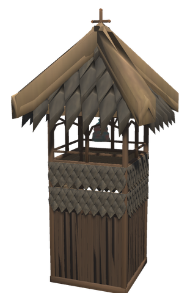 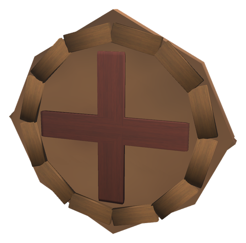

**Round the church.** Where a door opens onto the svalgang, the **Svalgang Porch** leaves a way in under a steep little gable with lattice and a cross. South of Borgund stands Norway's only stave-built free-standing bell tower, a *støpul*; the **Bell Tower** is one, and its bell rings like the [Alarm Bell](defences.md#-defending-the-walls): use it at the foot of the tower, and it rings by itself when a raid comes. Borgund's consecration crosses are still painted on its south wall; hang a **Consecration Cross** on yours.

| Piece | Description | Crafting Station | Requirements |
|-------|-------------|------------------|--------------|
| **Ridge Dragon** (`piece_whitehilt_monedrage`) | A dragon head on a tall curved neck for the end of a ridge | Hammer (Workbench) | Wood ×4, Fine Wood ×6 |
| **Gable Cross** (`piece_whitehilt_gavlkors`) | A cross with round ends on a short post | Hammer (Workbench) | Wood ×3 |
| **Ridge Crest** (`piece_whitehilt_monekam`) | 2 m of openwork crest for a ridge | Hammer (Workbench) | Wood ×2, Fine Wood ×2 |
| **Ridge Turret** (`piece_whitehilt_takrytter`) | Three tiers, a belfry and a spire, 7.5 m high | Hammer (Workbench) | Wood ×24, Fine Wood ×8 |
| **Shingled Stave Wall** (`piece_whitehilt_sponvegg`) | A stave wall clad in scale shingles, 2 × 2 m | Hammer (Workbench) | Wood ×10 |
| **Tall Shingled Stave Wall** (`piece_whitehilt_sponvegg_hoy`) | The same, 2 × 4 m | Hammer (Workbench) | Wood ×20 |
| **Nave Column** (`piece_whitehilt_skipsstav`) | A round column 4 m high with a capital and masks | Hammer (Workbench) | Wood ×6, Fine Wood ×2 |
| **Arcade Arch** (`piece_whitehilt_arkadebue`) | A round arch 2 m wide between two columns | Hammer (Workbench) | Wood ×4 |
| **St Andrew's Cross** (`piece_whitehilt_andreaskors`) | Crossed boards with a sun and leaves, 2 × 1 m | Hammer (Workbench) | Wood ×3, Fine Wood ×2 |
| **Scissor Truss** (`piece_whitehilt_saksesperre`) | Crossed rafters under a 45° roof 4 m wide | Hammer (Workbench) | Wood ×6 |
| **Svalgang Porch** (`piece_whitehilt_svalgang_inngang`) | 2 m of svalgang with a way in under a little gable | Hammer (Workbench) | Wood ×10, Fine Wood ×4, Resin ×2 |
| **Bell Tower** (`piece_whitehilt_stopul`) | A stave bell tower 3 × 3 m and 9.5 m high, with a bell that rings | Hammer (Workbench) | Wood ×40, Fine Wood ×10, Bronze ×6 |
| **Consecration Cross** (`piece_whitehilt_vigselskors`) | A painted cross in a ring for the wall | Hammer (Furniture, Workbench) | Wood ×1, Raspberries ×2 |

The carved work is put together from the game's own meshes, so it is carving in outline, not the interlace of the originals: the dragon head is the longship's, the masks are the skeleton trophy's skull in wood, and the shingles are the vanilla dark shingle roof stood upright.

## 🪜 STAIRS, LADDERS AND RAILINGS

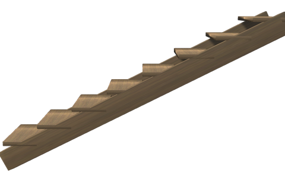 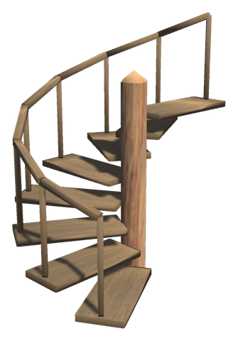 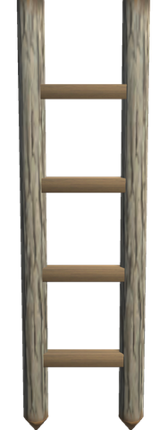 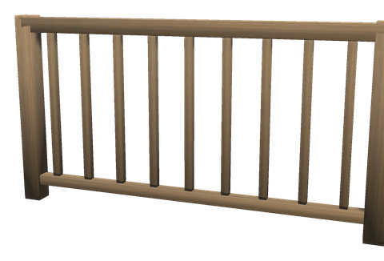 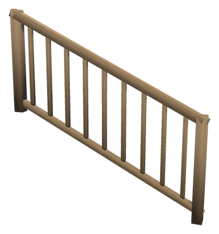

The **Narrow Stair** is 1 m wide and rises 2 m over 4 m, as steep as the vanilla stair, so it reaches a loft or the next storey in one piece. The **Spiral Stair** winds round a post with a handrail, rising 2 m in three quarters of a turn, 2.4 m across: you go up facing one way and come off a quarter turn to the left. Snap another on top for the next storey: it turns itself a quarter back to go on where the one below ends. Cut the hole in the floor above yourself, by leaving out a floor piece.

The **Loft Ladder** stands against the edge of a loft 2 m up. **Use** it at its foot to climb onto the loft behind it; on the loft, the alternate key (Shift by default) and **Use** take you down.

The **Railing** is 1 m high, for the edge of a loft or a stair well, and the **Stair Railing** follows the slope of the vanilla stair and the Narrow Stair (two go along one Narrow Stair).

| Piece | Description | Crafting Station | Requirements |
|-------|-------------|------------------|--------------|
| **Narrow Stair** (`piece_whitehilt_smal_trapp`) | 1 m wide, rising 2 m over 4 m | Hammer (Workbench) | Wood ×6 |
| **Spiral Stair** (`piece_whitehilt_vindeltrapp`) | Rising 2 m in three quarters of a turn | Hammer (Workbench) | Wood ×14 |
| **Loft Ladder** (`piece_whitehilt_stige`) | 2.3 m long, up to a loft 2 m up | Hammer (Workbench) | Wood ×4 |
| **Railing** (`piece_whitehilt_rekkverk`) | 2 m long, 1 m high | Hammer (Workbench) | Wood ×3 |
| **Railing 1 m** (`piece_whitehilt_rekkverk_1m`) | 1 m long | Hammer (Workbench) | Wood ×2 |
| **Stair Railing** (`piece_whitehilt_trapperekkverk`) | 2 m along a stair, rising 1 m | Hammer (Workbench) | Wood ×3 |

## 🧱 CELLAR

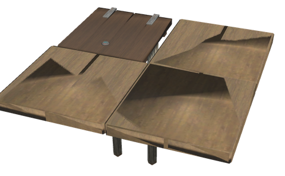 

Dig out a cellar under the house with the pickaxe, line it with the **Cellar Wall**, and lay a **Floor Hatch** in the floor over it. The hatch is a 2 × 2 m floor with a lid in one corner and a ladder 2 m down under it. **Use** the lid to lift it; it is a door to the self-closing doors and falls shut a while after you went through. From the cellar, **Use** the ladder to climb up onto the floor beside the hatch; from there, the alternate key and **Use** take you down.

| Piece | Description | Crafting Station | Requirements |
|-------|-------------|------------------|--------------|
| **Floor Hatch** (`piece_whitehilt_lem`) | A 2 × 2 m floor with a hatch and a ladder 2 m down | Hammer (Workbench) | Wood ×8 |
| **Cellar Wall** (`piece_whitehilt_kjellermur`) | Field stones laid dry, 2 m long and 2 m high | Hammer (Workbench) | Stone ×20 |

## 🏡 BUILDING A HOUSE, STEP BY STEP

1. Lay the **Stone Foundation** round the house and a **Cornerstone** at each corner.
2. Put **Log Walls** along the two long sides and **Offset Log Walls** along the two ends, on top of the foundation. Leave a 2 m gap for the door.
3. Set a **Log Corner** on each corner, turning it until its logs follow the walls; where no turn fits, use the **Log Corner, Mirrored**.
4. Put the **Plank Door** in the gap, swap a wall or two for a **Log Wall with Window**, and lay the **floor** inside, on the foundation.
5. On top of the end walls, set two **Log Gables** each, rising to the ridge, and put the roof on.

## Config

The log house pieces are switched on and off and priced in `[Content]` and `[Recipes]` like the other White Hilt pieces. With linear progression, the log walls, corners, gables and windows, the Dragon Portal, the Stave Church Portal, the svalgang and the carved Borgund pieces (those with fine wood) come with the Black Forest (core wood and fine wood need the bronze axe), the Hall Doors and the barred windows with the Swamp (iron); the stave walls, foundation, floors, the other doors, stairs, ladder, railings, hatch and cellar wall are there from the start.
