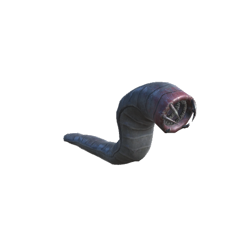
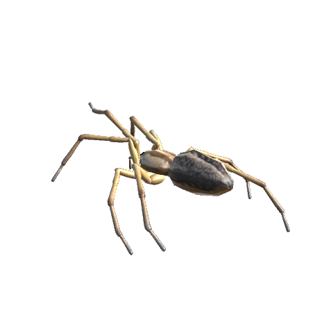
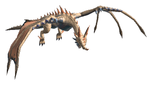

# 🕷️ Lindorm, giant spiders & Desert Dragons

[← Back to the README](../README.MD)

  

New monsters haunt the land: the Lindorm that breaks out of the ground at night, giant spiders that nest among the trees, and Desert Dragons that breathe fire over the Plains.

Creature labels use localized names: Lindorm, Giant Spider and Desert Dragon (Lindorm, Kjempeedderkopp and Ørkendrage in Norwegian), not their internal `WhiteHilt_` prefab identifiers.

## The Lindorm

A great worm that lies in wait under the forest floor.

The Lindorm is about **6.4 m long** at the default size and bites for **75 pierce damage**. One and two stars add 15% and 30% visual size; higher stars also use the difficulty size settings. It has its own low growls and rasps for idle, alert, bite, injury and death.

It only comes when everything lines up:

- you are **on foot** in the **Black Forest** or the **Swamp** (not on a ship, in the water, indoors or near your base),
- it is **night**,
- **Eikthyr** is slain.

Then, once a minute, there is a 3% chance it **breaks out of the ground** 9–15 m from you, in a burst of earth and stone. Each player can meet it at most once every 30 minutes.

- It cannot be hurt and does not move while it is still breaking out.
- It **burrows back down**, without loot, when it has lost you for about 25 seconds, or soon after dawn.
- When slain it writhes, falls still and sinks into the ground.

Its strength is set when it emerges, according to the world's defeated bosses, not the victim's equipment. It starts at 0 stars after Eikthyr, then gains a minimum of 1, 2, 3, 4 and 5 stars after the Elder, Bonemass, Moder, Yagluth and the Queen. This ignores ordinary biome star limits, so new players in an advanced world should be wary. Natural encounters and `whitehilt_lindorm summon` use the same progression.

| Latest defeated boss | Stars | Health | Pierce damage |
|---|---|---|---|
| Eikthyr | 0 | 700 | 75 |
| The Elder | 1 | 1400 | 112.5 |
| Bonemass | 2 | 2100 | 150 |
| Moder | 3 | 2450 | 168.75 |
| Yagluth | 4 | 2800 | 187.5 |
| The Queen | 5 | 3150 | 206.25 |

These values use the default difficulty star formulas, before pressure bonuses (up to +20% health and +10% damage). The chosen stars and pressure bonuses stay fixed for that encounter. Empty `ProgressionStars` disables boss-based stars; disabling difficulty stars disables the pressure bonus, not the configured boss-based stars.

## Giant spiders

Giant spiders live around **spider nests** in the Black Forest: a pale, web-covered mound with a ring of eggs. A nest keeps up to 3 spiders near it and sends out a new one every 20 seconds or so while someone is close. **Destroy the nest** to stop them; it drops Spider Silk.

Their bite is **poisonous** and **webs** you: you move at half speed for 3 seconds. They are afraid of fire, avoid water and are weak to blunt and fire damage.

A normal spider is about **2.4 m across** (50% larger than before). One and two stars add 15% and 30% visual size, respectively; higher stars also use the [Difficulty](difficulty.md) size settings. They have their own dry clicks, rasps and hisses for idle, alert, bite, injury and death.

Nests appear in about 15% of the Black Forest's zones as the land is generated. Land generated before the spiders came gets its nests once, when the server starts: the same zones win the same roll, and the nest goes on a free, flat forest spot at least 50 m from anything built (`[OldLand]`, see [Progression](progression.md)).

At night, a **lone spider** may also come out anywhere in the forest, nest or no nest.

## Desert Dragons

Once **Moder** is slain, sand-coloured dragons about 8 m from wingtip to wingtip take to the skies over the **Plains**, by day and by night. A Desert Dragon never lands: it circles 5–12 m above the ground, swoops down and **breathes a stream of fire** at you from up to 25 m away. The fire leaves its mouth about as wide as the mouth and widens to 3 m on its way down, so step aside rather than back. It sets you burning, so fire resistance helps.

- Breath hitting dry terrain leaves **ground flames for 6 seconds**, with a **1.5 m radius** and **10 fire damage per second** before resistance. Nearby impacts merge; at most 3 new patches per breath and 6 active per dragon. Overlapping fields apply only their strongest damage, not their sum. Fire does not spread, change the terrain or ignite water. Damage is checked once per second and scales with stars and black beast bonuses like the breath.
- Its fire only hurts players and creatures; buildings are safe unless `BurnsBuildings` is on.
- It is immune to fire and spirit damage, weak to frost, resists poison and ignores chop and pickaxe damage. Bring a bow.
- When slain it tumbles out of the sky and lies where it fell for a while.
- It has its own growls, roars and fiery breath sounds for idle, alert, attack, injury and death. The Black Dragon inherits them too.

In the dark hour and under a blood moon, its black cousin, the **Black Dragon**, may come for you in the Mountains and the Plains, like the other black beasts (see [Difficulty](difficulty.md)).

With default settings, a 0/1/2-star Desert Dragon has **1200/2400/3600 health**, **20/30/40 fire damage per breath flame** and **10/15/20 ground fire damage per second** before resistance and any pressure bonuses. A naturally summoned **Black Dragon** has five stars and the existing beast bonuses: **8100 health**, **60 fire damage per breath flame** and **30 ground fire damage per second**, with damage capped by the difficulty settings. Changing difficulty settings changes these values; a plain devcommand spawn does not apply the natural beast encounter bonuses.

| | Health | Attack | Weak to |
|---|---|---|---|
| **Lindorm** | 700 | Bite, 75 pierce | Fire |
| **Giant Spider** | 120 | Bite, 30 pierce + 20 poison, webs you | Blunt, fire |
| **Spider Nest** | 300 | — | — |
| **Desert Dragon** | 1200 | Fire breath, 12 flames of 20 fire; ground flames, 10 fire/sec | Frost |

The Lindorm shrugs off chop and pickaxe damage, resists pierce and poison and is immune to spirit damage. Spiders ignore chop and pickaxe damage and are immune to poison.

## Loot

| Item | From | Chance | Used for |
|------|------|--------|----------|
| **Lindorm Scale** ×2–4 | Lindorm | Always | Every upgrade of a White Hilt shield ([White Hilt gear](equipment.md#-upgrades-through-the-biomes)) |
| **Entrails** ×1–3 | Lindorm | Always | Vanilla recipes |
| **Lindorm Trophy** | Lindorm | 15% | Your wall |
| **Spider Silk** ×1–2 | Giant Spider | Always | Gift of Loki ([Potions](potions.md)), mending Shore Nets ([Fishing nets](fishing.md)), the Spider's Web rune ([Smithing](smithing.md#-binding-and-rune-etching)) |
| **Poison Gland** | Giant Spider | 50% | Gift of Hel ([Potions](potions.md)), the Venom rune ([Smithing](smithing.md#-binding-and-rune-etching)) |
| **Giant Spider Trophy** | Giant Spider | 10% | Your wall |
| **Spider Silk** ×3–5 | Spider Nest | Always | As above |
| **Desert Dragon Scale** ×2–3 | Desert Dragon | Always | Dragonscale Broth, Dragonfire Arrows (below) |
| **Surtling Core** | Desert Dragon | 50% | Vanilla recipes |
| **Desert Dragon Trophy** | Desert Dragon | 10% | Your wall |

### Made from Desert Dragon Scales

| Item | Description | Crafting Station | Requirements |
|------|-------------|------------------|--------------|
| **Dragonscale Broth** | Plains: 50 health, 30 stamina, 40 min. Buff: fire damage taken is halved | Stone Pot level 2 ([Foraging](foraging.md)) | Desert Dragon Scale ×1, Onion ×2, Barley ×2 |
| **Dragonfire Arrow** ×20 | Fire arrows with 30 pierce and 60 fire damage (the vanilla Fire Arrow has 11 and 22). Set in `[Gear.WhiteHiltDragonfireArrow]` `Pierce` and `Fire` | Workbench level 2 | Wood ×8, Feathers ×2, Desert Dragon Scale ×1 |

## Config

Section `[Lindorm]` (admin only, synced from the server):

| Setting | Default | What it does |
|---|---|---|
| `Enabled` | true | The Lindorm can come at all |
| `RequiredKey` | defeated_eikthyr | Global key needed first; empty for none |
| `Biomes` | BlackForest, Swamp | Biomes where it lurks |
| `NightOnly` | true | Only at night |
| `ChancePerMinute` | 3 | Percent per minute while every condition holds |
| `CooldownMinutes` | 30 | Real minutes before it can come for the same player again |
| `Health` / `Damage` | 700 / 75 | Health, and pierce damage of its bite |
| `ProgressionStars` | defeated_gdking:1, defeated_bonemass:2, defeated_dragon:3, defeated_goblinking:4, defeated_queen:5 | Minimum stars after each global boss key, 0–5; highest unlocked value wins. Empty: no boss scaling. Applies to new encounters |
| `Scale` | 1.6 | Size (1 = about 4 m long; default about 6.4 m; after a restart) |
| `StarScale` | 0.15 | Visual growth per star up to two stars (+15% / +30%; after a restart) |
| `Sounds` | true | Own growls and rasps (after a restart) |
| `GiveUpSeconds` | 25 | Seconds without prey in sight before it burrows away |
| `TrophyChance` | 15 | Percent chance of its trophy (after a restart) |

On upgrade to 0.72.2, the previous Lindorm defaults (`Scale` 1.3, `Damage` 55) move to the new defaults once. Other configured values are preserved.

Section `[Giant Spider]`:

| Setting | Default | What it does |
|---|---|---|
| `Enabled` | true | Nests and lone spiders in the Black Forest |
| `Health` | 120 | Health of a spider |
| `Damage` / `Poison` | 30 / 20 | Pierce and poison damage of its bite |
| `WebSeconds` | 3 | Seconds a bite slows you; 0 = no slow |
| `Scale` | 1.5 | Size (1 = about 1.6 m across; default about 2.4 m; after a restart) |
| `StarScale` | 0.15 | Visual growth per star up to two stars (+15% / +30%; after a restart) |
| `Sounds` | true | Own spider clicks, rasps and hisses (after a restart) |
| `NestChancePerZone` | 0.15 | Chance of a nest in each Black Forest zone |
| `NestHealth` | 300 | Health of a nest |
| `NestMaxNear` | 3 | Spiders a nest keeps around it |
| `TrophyChance` | 10 | Percent chance of a spider's trophy (after a restart) |
| `NestSpawnSeconds` | 20 | Seconds between two spiders from a nest (after a restart) |
| `NestLevelUpChance` | 10 | Percent chance a spider from a nest gets a star (after a restart) |
| `NightSpawnChance` | 20 | Percent chance per spawn check of a lone spider at night; 0 = none |
| `NightSpawnSeconds` | 240 | Seconds between two spawn checks for lone spiders |
| `NightSpawnMax` | 1 | Lone spiders around a player at most |

On upgrade to 0.72.1, the previous spider defaults (`Scale` 1, `Damage` 18, `Poison` 15) move to the new defaults once. Other configured values are preserved.

Section `[Desert Dragon]`:

| Setting | Default | What it does |
|---|---|---|
| `Enabled` | true | Desert Dragons over the Plains |
| `RequiredKey` | defeated_dragon | Global key needed first; empty for none |
| `SpawnChance` | 10 | Percent chance per spawn check; 0 = none |
| `SpawnSeconds` | 300 | Seconds between two spawn checks |
| `SpawnMax` | 1 | Desert Dragons around a player at most |
| `Health` | 1200 | Health (after a restart) |
| `FireDamage` / `Flames` | 20 / 12 | Fire damage of each flame, and flames in one breath (after a restart) |
| `BreathSeconds` | 8 | Seconds between two breaths at most (after a restart) |
| `BreathRange` | 25 | Metres it breathes fire from (after a restart) |
| `BreathWidth` | 3 | Metres wide the fire gets halfway through its range, about at the ground (after a restart) |
| `FlySpeed` | 11 | Metres per second when it chases you (after a restart) |
| `FlyHeightMin` / `FlyHeightMax` | 5 / 12 | Metres above the ground it flies at (after a restart) |
| `Scale` | 1 | Size (1 = about 8 m from wingtip to wingtip; after a restart) |
| `Sounds` | true | Own growls, roars and breath sounds, also on Black Dragons (after a restart) |
| `TrophyChance` | 10 | Percent chance of its trophy (after a restart) |
| `BurnsBuildings` | false | Its fire also damages the buildings it hits |
| `GroundFire` | true | Dry terrain impacts leave short-lived flames; no spreading or terrain changes |
| `GroundDamage` | 10 | Base fire damage per second before resistance, scaled like the final breath projectile; overlapping fields do not stack |
| `GroundSeconds` | 6 | Seconds a patch lasts; nearby impacts refresh it |
| `GroundRadius` | 1.5 | Metres around each patch; nearby impacts merge |
| `GroundTickSeconds` | 1 | Seconds between damage checks; damage per check scales with the interval |
| `GroundPerBreath` | 3 | Maximum new patches per breath |
| `GroundMax` | 6 | Maximum active patches per dragon, including earlier breaths |

On upgrade to 0.77.0, previous defaults (`Health` 800, `FireDamage` 15) move to 1200 and 20 once. The older health default 500 is also migrated. Other configured values are preserved. New creature prefabs need a restart; update both server and clients for ground fire. Its particle appearance, multiplayer ownership and performance still need in-game testing.

## Console commands

- `whitehilt_lindorm` shows every condition where you are, and whether it holds.
- `whitehilt_lindorm summon` (admins) lets the Lindorm break out near you now.
- With devcommands: `spawn WhiteHilt_GiantSpider`, `spawn WhiteHilt_SpiderNest`, `spawn WhiteHilt_Lindorm` and `spawn WhiteHilt_DesertDragon`.
