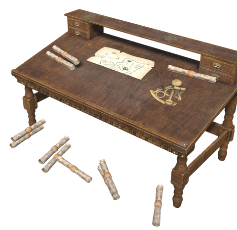
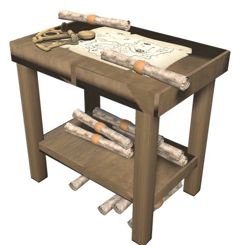
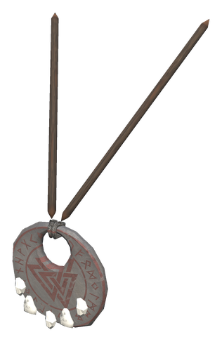
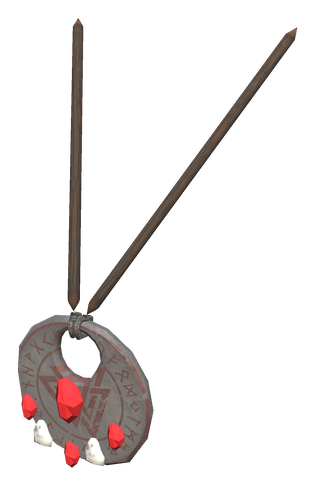
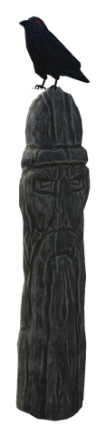

# 🧭 Navigation

[← Back to the README](../README.MD)

## 🧭 NAVIGATION

A new skill, **Exploration**, rises with every patch of map you uncover for the first time. On its own it does nothing; it makes the navigation gear better and opens new things on the way, all listed in the table below. The gear is made at the **Cartographer's Desk**, which works as an extension of the map table and can only be used near one (see [Around the map table](#around-the-map-table)).

### What Exploration gives

| Level | What it gives | Setting |
|-------|---------------|---------|
| 0–100 | The Navigator's Table uncovers 140 m to 300 m around the ship, the Pathfinder's Amulet 120 m to 200 m (vanilla 100 m) | `[Navigation] TableBonus`, `AmuletBonus`, `BonusAtLevelZero` |
| 0–100 | One map scroll on the Cartographer's Desk per 10 levels, one gem in the Pathfinder's Amulet per 20 | – |
| 0–100 | The weather forecast (below) sees 1 to 4 periods ahead | `[Navigation.Forecast] PeriodsAtLevelZero`, `PeriodsAtLevel100` |
| 20 | [Munin's Perch](#-munins-perch-discoveries-on-the-map) markers on the large map | `[Map.Discoveries] LargeMapLevel` |
| 25 | **Lookout** (O): the map opens up 200 m around you (400 m at level 100), and serpents, the Kraken and other ships within reach show on the map for a minute. Once every 5 minutes | `[Skills.Exploration] LookoutLevel` |
| 25 | The [Uncovered](#-exploration-overview) panel on the large map | `[Map.Overview] Level` |
| 30 | Route markers at the Navigator's Table | `[Ships] RouteMarkersLevel` |
| 50 | Map that others have shared with you through a map table is shown like your own, without the see-through layer (hiding shared map data brings the layer back) | `[Navigation] SharedMapRevealLevel` |
| 50 | "Take me there" and explorer mode at the Navigator's Table | `[Ships] RouteSailLevel`, `RouteExploreLevel` |
| 50 | The [Pathfinder's Ruby Amulet](#-pathfinders-ruby-amulet-a-target-on-the-map) | `[Skills.Exploration] RubyPathfinderLevel` |
| 50 | Munin's Perch markers on the minimap | `[Map.Discoveries] MinimapLevel` |

### Around the map table

Four pieces work only while they stand near a map table, within `[Navigation] MapTableRange` (5 m):

| Piece | What it does | Page |
|-------|--------------|------|
| **Cartographer's Desk** | Crafting station for the navigation gear | [below](#-navigation) |
| **Portal Astrolabe** | Every portal shows on everyone's map | [Portals & travel](portals.md#portal-astrolabe) |
| **Harbour Anchor** | Every ship shows on everyone's map | [Ships](ships.md) |
| **Munin's Perch** | What is found on the table's map shows on everyone's map | [below](#-munins-perch-discoveries-on-the-map) |

Near a map table you also get the weather forecast (below).

   

| Item | Description | Crafting Station | Requirements |
|------|-------------|------------------|--------------|
| **Cartographer's Desk** | A writing desk with sea charts, a sextant and map scrolls; one scroll per ten levels of your Exploration skill | Hammer (Workbench), near a map table (`MapTableRange`) | Fine Wood ×10, Bronze ×2, Deer Hide ×2, Resin ×4 |
| **Navigator's Table** | Use it on the helm of a karve, longship, drakkar or White Hilt Ship to set it up on deck; on the White Hilt Ship the mast takes it too, like the ship upgrades (Shift + Use on the helm takes it back). Everyone aboard uncovers the map further: 140 m at level 0, up to 300 m at level 100 (vanilla is 100 m). Use on the table opens the map for route markers at Exploration 30 (up to 5, shown to everyone aboard, with an arrow on the minimap toward the next one); at Exploration 50 "Take me there" lets the ship sail the route on its own, past every marker in turn. It sets off once the one who chose it sits down (within 30 seconds by default, or it is called off), rows at the slowest speed while anyone aboard stands, and takes the sail down to half above 45 knots. **Explorer mode** (also Exploration 50) sails past the markers as close to land as it safely can, following the coast, and never with full sail near land | Cartographer's Desk | Fine Wood ×6, Bronze ×3, Leather Scraps ×4 |
| **Pathfinder's Amulet** | A valknut pendant worn as a trinket, with one gem per twenty levels of Exploration. Uncovers the map further (120 m, up to 200 m). New land fills its adrenaline; when it is full, **Raven Sight** uncovers 500 m around you | Cartographer's Desk | Bronze ×3, Silver Necklace ×1, Ruby ×1 |
| **Pathfinder's Ruby Amulet** | The Pathfinder's Amulet with a large ruby in the middle of the valknut. It does all the Pathfinder does, and leads you to a target you set on the map (see below). Known and made from Exploration 50; one you already have keeps working if the skill drops below that | Cartographer's Desk | Pathfinder's Amulet ×1, Ruby ×3, Iron ×2 |

The table and the amulet do not add up; the wider one counts.

## 💎 Pathfinder's Ruby Amulet: a target on the map

While you wear the Pathfinder's Ruby Amulet, as trinket or in one of the backpack's extra accessory slots:

- **Shift + click** the large map to set a target there. Click on one of your pins, and the target takes the pin's place and name. Shift + click the target again to remove it.
- An **arrow at the top of the screen** points toward the target from where the camera looks, with its name and distance under it.
- The target is a red ring on the **large map** (with its name) and on the **minimap**. While it lies beyond the minimap, a red arrow on the minimap's edge points to it, with the distance.
- If you keep moving away from the target, for 4 seconds at 1 m/s or more and more than 135° off its direction, the ruby tells you: *"You are going the wrong way: Home lies to the north-east"*, and the arrow pulses. Not within 50 m of the target, and not more than once every 30 seconds. It goes by the way you actually move, so looking around does not set it off, and it works aboard a ship too.
- Within 15 m you have reached the target; a message says so and the target is removed.

The target is yours alone. It is saved with your character for each world, so it is still there the next time you play, and it does not follow you into another world. Take the amulet off and the arrows and the marker go away; put it on again and they come back.

## 🌦️ Weather forecast

The game draws the weather for each period of about 11 minutes from the weathers of the biome, and the wind from the time, so the coming weather can be worked out ahead. Open the large map within 10 m of a **map table** or the **Cartographer's Desk**, or aboard a ship with a **Navigator's Table**, and a forecast shows at the top right:

- the weather now and in the coming periods, each with its icon, *In 7 min*, the weather, and the wind and where it blows from;
- 1 period ahead at Exploration 0, up to 4 (about 45 minutes) at Exploration 100;
- it holds for the biome where you are. Sailing into another biome brings that biome's weather. Weather forced by an event, a boss or a special place cannot be foretold, and the panel says so.

**Storm warning:** aboard a ship with a Navigator's Table, everyone is told *A storm is coming in 3 min!* and the ship's bell rings when the next period where you are brings thunder or a snowstorm.

## 📊 Exploration overview

From Exploration 25, the large map has an **Uncovered** panel under its bottom-left corner (right of **Munin's memory** when that shows). Click its header to open it upwards over the map:

- every biome with a bar for the share you have uncovered and the area in km², and the whole world below;
- from Exploration 50, map shared with you through a map table counts too, as it is drawn as your own;
- if a Munin's Perch shares discoveries, what has been found, by group.

The first time it opens in a world, the panel measures the map for a few seconds (it shows how far it has come); after that it is up to date at once.

## 🪨 Stone Dowser

The rocks a **Mysterious Rock** is made from (Rock + Coal) lie in Black Forest clearings around a big boulder, 22 in each. The **Stone Dowser** helps you find the next clearing, the way the Wishbone finds silver.

| Item | Description | Crafting Station | Requirements |
|------|-------------|------------------|--------------|
| **Stone Dowser** | A Wishbone in grey stone, worn in an accessory slot. Every 30 seconds it finds the nearest clearing within 3000 m that still has rocks, marks it on the map with the number left, and tells you the direction and distance when it changes. Within 40 m of a rock it pings like the Wishbone, faster the closer you come, at a lower pitch so the two can be told apart | Stonecutter | Stone ×20, Iron ×2, Greydwarf Eye ×5 |

- The server knows every clearing in the world, also those nobody has been near; those count as full.
- In a clearing someone has visited, only the rocks not yet picked count. Clearings with none left are skipped.
- Taking the dowser off removes the pin.

## 🖼️ Player portraits on the map

Other players are shown on the map as a portrait of their Viking on a see-through black disc, with the name under it in a soft shadow, instead of the red figure. You are shown with your own portrait. The portraits are drawn on top of the other map markers. On both the minimap and the large map, your own portrait and gold heading ring draw in front of the other players when markers overlap.

A ring around each portrait shows the heading: a point sticks out of the ring and slides round the edge as you turn. Yours is gold and points where you look, like the vanilla arrow. Other players' rings are white, and point where they face while they are near enough for their Viking to be loaded; further away the ring has no point.

- Your portrait is taken in the main menu when the character is shown: bare head (no helmet), hair and beard, in neutral light, with the head centred. A new one is only taken when the look changes (body, hair, beard or colours).
- When you join, the others get the portrait once (about 10 KB). They keep it on disk, so the next time only a short fingerprint is sent. Nothing extra is needed on the server.
- A player without a portrait gets the first letter of the name on a coloured disc.
- Names are always shown on the large map; on the minimap only if you turn it on.
- Portraits are stored in `BepInEx/config/BrudvikWhiteHilt/portraits/` (moved there from `BepInEx/config/WhiteHilt/` in 0.49.0). Delete `own_<id>.bin` to have yours taken again.

| Setting (section `Map`) | Default | Description |
|-------------------------|---------|-------------|
| `PlayerPortraits` | true | Show portraits, and take and share your own |
| `ShowNamesOnMinimap` | false | Show names under the portraits on the minimap too |
| `HeadingMarker` | true | Ring with a point around the portraits showing the heading |

| Console command | Description |
|-----------------|-------------|
| `whitehilt_portrait` | Shows which players' portraits are known |
| `whitehilt_portrait test` | Adds or removes a pin with your own portrait 20 m east of you |

## 🧭 Compass on the map

A brass compass sits in the bottom-right corner of the minimap and the top-left corner of the large map. The map is always north up, so the letters stay put and the red end of the needle points where you look, with the bearing in degrees under it (0 is north, 90 east). The letters follow the game's language: N, Ø, S, V in Norwegian, N, E, S, W otherwise.

| Setting (section `Map.Compass`) | Default | Description |
|-----------------|---------|-------------|
| `Minimap` | true | Compass on the minimap |
| `LargeMap` | true | Compass on the large map |
| `Degrees` | true | Bearing in degrees under the compass |
| `MinimapSize` | 56 | Width on the minimap, in pixels (32 to 120) |
| `LargeMapSize` | 110 | Width on the large map, in pixels (48 to 220) |

## 🏰 Built areas, fields, pastures and wards

The map shows where people have built. The server looks through the whole world every half minute and groups what it finds into areas of 16 m squares; squares up to two apart belong to the same area, so a path or garden between houses does not split a base.

| Area | What counts | Drawn as |
|------|-------------|----------|
| **Base** | Player-built pieces with a bed and a fire | Filled in the builder's colour, gold border |
| **Outpost** | Player-built pieces with a workbench (or other crafting station) or a portal | Builder's colour, blue border |
| **Building** | Other player-built pieces | Builder's colour, white border |
| **Field** | Planted crops, growing or ripe (ripe ones only beside a farm, since seeds also grow wild) | Green |
| **Pasture** | Tamed animals | Brown, with the number of animals |
| **Ward** | Every ward | Dashed ring showing its reach: green when on, grey when off |

- Each builder has their own colour, the same for everyone. The area takes the colour of whoever built most of it.
- Only areas where you have uncovered the map are drawn.
- Zoom in on the large map to see the names. A sign in the area whose text starts with `#` names it (`#Brudvik`); otherwise it shows the kind and the builder.
- Ships and carts are left out; the Harbour Anchor shows ships.

| Setting (section `Map.Areas`) | Default | Description |
|-------------------------------|---------|-------------|
| `AllowAreas` (server) | true | Find areas and wards at all |
| `ShowOthers` (server) | true | Players see everyone's buildings; off: only their own, and the fields and pastures beside them |
| `MinPieces` (server) | 5 | Fewest pieces for a built area (a lone campfire is left out) |
| `MinPlants` (server) | 4 | Fewest crops for a field |
| `MinAnimals` (server) | 2 | Fewest tamed animals for a pasture |
| `ShowBuildings` / `ShowFields` / `ShowPastures` / `ShowWards` | true | What you draw on your own map |
| `ShowLabels` | true | Names on the large map when zoomed in |

## 🪶 Munin's Perch: discoveries on the map

Munin, Odin's raven of memory, remembers everything found on a map table's map. Place **Munin's Perch** within 5 m of a map table, as you would the Portal Astrolabe and the Harbour Anchor. Everyone's map can then show what has been found: caves, settlements, wild plants, resources and landmarks, each with its in-game icon (blueberries as blueberries, a burial chamber as a skeleton trophy).

| Piece | Description | Crafting Station | Requirements |
|-------|-------------|------------------|--------------|
| **Munin's Perch** | A carved post with a raven on top. While it stands within 5 m of a map table, what is uncovered on that table's map can be shown on everyone's map | Hammer (Workbench) | Fine Wood ×8, Iron ×2, Feathers ×6 |

- **What counts as found**: only what is uncovered on the map of the map table the perch stands at. Players add to it the vanilla way, by recording their map on the table. With several tables that each have a perch, all of their maps count.
- **Nothing shows at first.** A panel under the bottom-left corner of the large map, **Munin's memory**, lists every kind that has been found, by group. Click the header to open it upwards over the map, click an icon to show or hide that kind, and click a group's name to show or hide the whole group. Hovering over an icon shows its name and how many have been found. Your choice is saved with the character.
- A **gold infinity badge at the top-left** marks items already unlimited under the world's current chest mode and unlocks, using the same infinity sign as the chests (`MAX` if the font lacks the sign). Locations do not receive this badge from their illustrative item or trophy.
- A **warm, light background** highlights kinds found in the biome the player currently stands in, not the area under the map cursor. Kinds belonging to several biomes highlight in each of them. Other icons keep their grey background and original colours. Hover text includes unlimited and current-biome status; coloured rims and bottom-right checkmarks still mean the kind is selected for display on the map. Ordering and discovered-only visibility are unchanged.
- Icons keep their original colours on light-grey discs in both states. A coloured rim and a small checkmark mean the kind is shown; a grey rim without a checkmark means it is hidden. The rim brightens on hover.
- **Exploration**: the large map shows the markers from Exploration 20, the minimap from Exploration 50. Below that, the panel only says what level you need.
- Plants and deposits of one kind within 64 m are counted as one marker with their number. Markers that would overlap on screen merge too, so zoom in to tell them apart. Hover over a marker to see its name, its number and, for plants, how many are ready to pick.
- Crops near player-built pieces are left out, since they are planted, not wild. Anything a player has placed is left out too.
- Silver veins are hidden by default, since the Wishbone is the way to find them. Treasure, loose stones and flint are never shown.

| Group | What it shows |
|-------|---------------|
| **Caves and crypts** | Burial chambers, troll caves, sunken crypts, frost caves, infested mines, Morgen's lairs, charred fortresses, Hildir's lost chests |
| **Settlements** | Draugr villages, fuling camps, greydwarf camps, abandoned houses, ruined towers, dvergr outposts |
| **Berries and plants** | Every wild pickable that is food, grows back or gives seeds: berries, mushrooms, thistle, dandelion, wild seeds, flax, barley and the White Hilt forageables |
| **Resources** | Copper, tin, obsidian, flametal and other deposits, guck sacks, tar pits, giant remains (black marble, soft tissue), leviathans (chitin) |
| **Landmarks** | Runestones, boss altars, dragon eggs, Haldor, Hildir and the Bog Witch |

| Setting (section `Map.Discoveries`) | Default | Description |
|-------------------------------------|---------|-------------|
| `AllowDiscoveries` (server) | true | Find discoveries at all |
| `OnlyMapTableMap` (server) | true | Only what is uncovered on the perch's map table counts; off: everything near where players have been |
| `ScanInterval` (server) | 60 | Seconds between two searches of the world |
| `ClusterSize` (server) | 64 | Metres of the squares in which plants and deposits of one kind count as one marker |
| `LargeMapLevel` (server) | 20 | Exploration level for markers on the large map |
| `MinimapLevel` (server) | 50 | Exploration level for markers on the minimap |
| `AllowSilver` (server) | false | Show silver veins |
| `AllowDungeons` / `AllowSettlements` / `AllowPlants` / `AllowResources` / `AllowLandmarks` (server) | true | Which groups may show |
| `ResourceItems` (server) | CopperOre, TinOre, SilverOre, Obsidian, IronScrap, FlametalOreNew, FlametalOre, Chitin, BlackMarble, SoftTissue, Guck, Tar | Items whose deposits and pickables show as resources |
| `IgnoredItems` (server) | Flint, Stone, Wood, StoneRock, Coins, Amber, AmberPearl, Ruby, SilverNecklace, BoneFragments | Items whose pickables never show |
| `PlantItems` (server) | Flax, Barley, Thistle, Dandelion, Fiddleheadfern | Items whose pickables show as plants although they are no food and do not grow back |
| `ShowOnMinimap` | true | Show your picked discoveries on the minimap too |
| `LargeIconSize` / `SmallIconSize` | 26 / 16 | Marker size in pixels on the large map and the minimap |
| `MaxMarkers` | 400 | Most markers drawn at once |

The range to the map table is `[Navigation] MapTableRange`, shared with the Cartographer's Desk, the Portal Astrolabe and the Harbour Anchor.

## Config

All admin only, synced from the server.

| Setting | Default | What it does |
|---|---|---|
| `[Navigation] ExploreRadiusBonus` | true | The Navigator's Table and the Pathfinder's Amulet widen the uncovered circle |
| `[Navigation] TableBonus` | 2 | Extra radius with the table at Exploration 100, as a share of the vanilla 100 m (2 = 300 m) |
| `[Navigation] AmuletBonus` | 1 | Extra radius with the amulet at Exploration 100 (1 = 200 m) |
| `[Navigation] BonusAtLevelZero` | 0.2 | Share of the extra radius already given at Exploration 0 |
| `[Navigation] SkillPerSquareMetre` | 0.0005 | Exploration experience per square metre of new map |
| `[Navigation] SharedMapReveal` | true | Shared map is drawn like your own from `SharedMapRevealLevel` |
| `[Navigation] SharedMapRevealLevel` | 50 | Exploration level for that |
| `[Navigation] RavenSightRadius` | 500 | Metres that Raven Sight uncovers |
| `[Navigation] MapTableRange` | 5 | Metres the Cartographer's Desk, Portal Astrolabe, Harbour Anchor and Munin's Perch may stand from a map table (was `[Portals] MapTableExtensionRange`) |
| `[Gear.WhiteHiltChartTable] Weight` | 10 | Weight of the Navigator's Table item |
| `[Gear.WhiteHiltPathfinder] MaxAdrenaline` | 50 | Adrenaline needed for Raven Sight |
| `[Gear.WhiteHiltPathfinder] AdrenalinePerSquareMetre` | 0.0001 | Adrenaline per square metre of new map |
| `[Gear.WhiteHiltPathfinderRuby] ArrivalRadius` | 15 | Metres from the target at which you have reached it |
| `[Gear.WhiteHiltPathfinderRuby] WrongWayAngle` | 135 | Degrees off the target's direction that count as the wrong way (180 = straight away) |
| `[Gear.WhiteHiltPathfinderRuby] WrongWaySeconds` | 4 | Seconds of moving the wrong way before the message |
| `[Gear.WhiteHiltPathfinderRuby] WrongWayMinDistance` | 50 | No wrong-way message within this many metres of the target |
| `[Gear.WhiteHiltPathfinderRuby] WrongWayMinSpeed` | 1 | Metres per second you must move for it to count |
| `[Gear.WhiteHiltPathfinderRuby] WrongWayCooldown` | 30 | Seconds before the message can come again |
| `[Skills.Exploration] RubyPathfinderLevel` | 50 | Exploration level from which the Pathfinder's Ruby Amulet is known and can be made |
| `[Navigation.Forecast] Forecast` | true | The forecast shows on the large map |
| `[Navigation.Forecast] Range` | 10 | Metres from a map table or Cartographer's Desk |
| `[Navigation.Forecast] PeriodsAtLevelZero` / `PeriodsAtLevel100` | 1 / 4 | Periods ahead foretold at Exploration 0 and 100 |
| `[Navigation.Forecast] StormWarning` | true | Those aboard a ship with a Navigator's Table are warned of a storm |
| `[Navigation.Forecast] StormWarningMinutes` | 3 | Minutes before the storm that the warning comes |
| `[Map.Overview] Overview` | true | The overview of uncovered biomes on the large map |
| `[Map.Overview] Level` | 25 | Exploration level needed for it |
| `[Gear.WhiteHiltStoneDowser] SearchRadius` | 3000 | Metres the Stone Dowser looks for a clearing with rocks left |
| `[Gear.WhiteHiltStoneDowser] RefreshSeconds` | 30 | Seconds between each search |
| `[Gear.WhiteHiltStoneDowser] PingRange` | 40 | Metres within which it pings toward the nearest rock |
| `[Gear.WhiteHiltStoneDowser] ShowPin` | true | Mark the clearing on the map; off: only direction and distance |
| `[Gear.WhiteHiltStoneDowser] Items` | StoneRock | Items whose pickables it counts and pings toward |
| `[Gear.WhiteHiltStoneDowser] Locations` | BigRockClearing | Locations it leads to |

Each player sets these for themselves, in the same section `Gear.WhiteHiltPathfinderRuby`:

| Setting | Default | What it does |
|---|---|---|
| `HudArrow` | true | Show the arrow toward the target at the top of the screen |
| `HudArrowTop` | 110 | Pixels from the top of the screen to the arrow |
| `HudArrowSize` | 44 | Size of the arrow in pixels |
| `ShowDistance` | true | Write the distance under the arrow |
| `[Navigation.Forecast] StormBell` | true | The storm warning rings the ship's bell |
