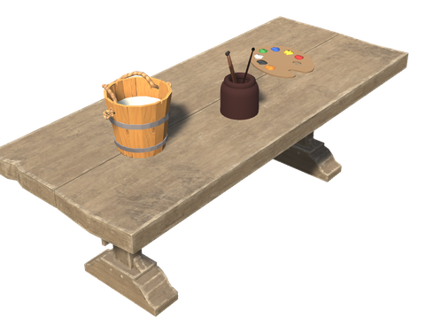
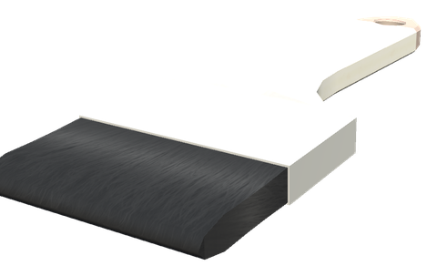
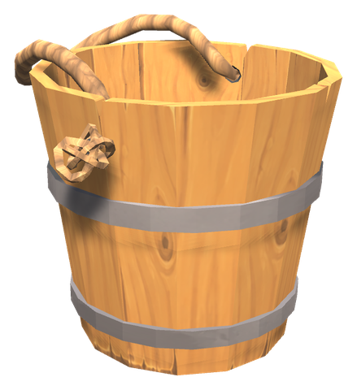
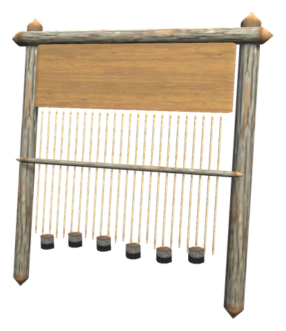

# 🎨 Painting

[← Back to the README](../README.MD)

## 🎨 PAINTING

Paint or stain any building piece in the colour you choose. The colour is saved on the piece, so everyone sees it and it stays; without the mod the pieces just look vanilla again.

  

| Item / Piece | Description | Crafting Station | Requirements |
|-------|-------------|------------------|--------------|
| **Paint Bench** | Use crafts the brush. **Shift + Use** opens the colour wheel | Workbench | Fine Wood ×10, Bronze ×3, Resin ×6, Leather Scraps ×4 |
| **White Hilt Paint Brush** | Everlasting build tool with four actions: **Paint**, **Stain**, **Remove paint**, **Pick colour** | Paint Bench | Fine Wood ×2, Bronze ×1, Feathers ×3 |
| **Paint Pot** | Mixed at the bench; covers 20 pieces, shown as its durability. Use it to load the brush | Paint Bench (colour wheel) | Dyes + Resin ×1 |

- **Colour wheel**: pick hue and saturation on the wheel and brightness on the bar, or type hex or RGB. Eight saved colours (`Painting` → `Favourites`).
- **Dyes**: food and animal products up to the Swamp (berries, mushrooms, dandelion, thistle, carrot, turnip, blood, bones, feathers, hides, guck, ooze, coal, resin and a few dishes) and the coloured White Hilt forageables ([Foraging & food](foraging.md)). Woad gives a true blue and Rock Lichen a purple, though the plants look otherwise. Their colours are measured from their icons, and the bench picks the mix of up to three that comes closest, from your inventory and nearby chests, and shows how close it is. The pot gets exactly the colour you chose.
- **Paint** bleaches the texture first, so light colours and white work; **Stain** tints over the wood, so the grain shows but it can only darken.
- The mouse wheel sets the brush radius (0 = only the aimed piece, up to `MaxRadius`, 8 m); the pieces in reach show the colour before you click. Paint and stain respect wards.
- `Painting` → `PotUses` (20, server-synced) sets how many pieces a Paint Pot covers.

## 🧶 Weaving and dyeing

A Paint Pot also dyes cloth. Use it from the hotbar:

- **looking at a banner**: only the cloth takes the colour, the pole stays wood (1 use). The White Hilt banners and every vanilla banner work.
- **looking at a ship**: the sail takes the colour (5 uses and 4 Linen Cloth).
- **standing at a Loom**: the cape you wear takes the colour (2 uses). The colour stays on the cape, and everyone sees it.

Anywhere else the pot loads the brush as before. A dyed banner or sail can be dyed again in another colour; the Paint Brush still paints the whole piece.

| Item / Piece | Description | Crafting Station | Requirements |
|-------|-------------|------------------|--------------|
| **Loom** | An upright loom with stone weights on the warp. Weaves linen and dyes capes | Hammer (Workbench) | Fine Wood ×8, Stone ×6, Linen Thread ×5 |
| **Linen Cloth** | Plain linen for dyed sails | Loom | Linen Thread ×3 |

Section `[Textiles]` (admin only, synced from the server):

| Setting | Default | What it does |
|---|---|---|
| `LoomRange` | 5 | How near a loom a cape can be dyed, in metres |
| `CapeUses`, `BannerUses`, `SailUses` | 2, 1, 5 | Paint Pot uses to dye a cape, a banner or a sail |
| `SailCloth` | 4 | Linen Cloth to dye a sail |
| `ClothMaterials` | sail,banner,curtain,tapestry | Parts of material names that count as cloth on pieces and ships |
