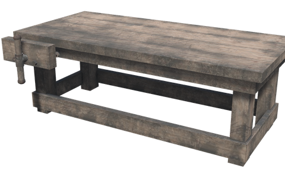
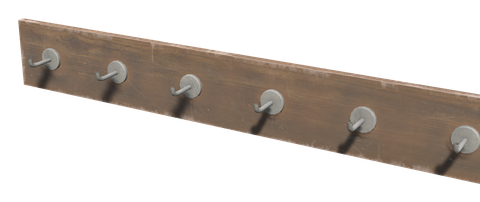
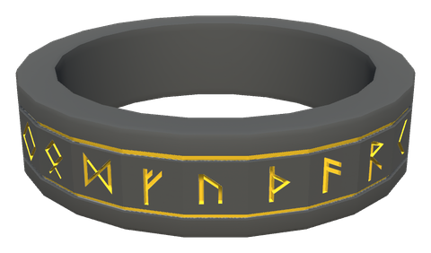
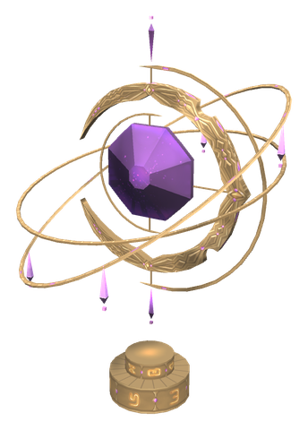
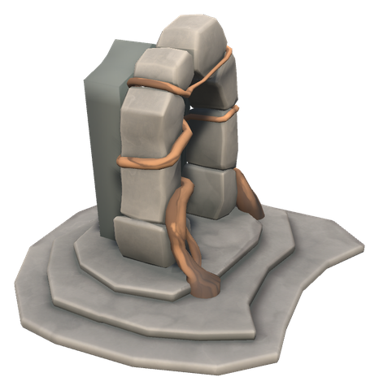
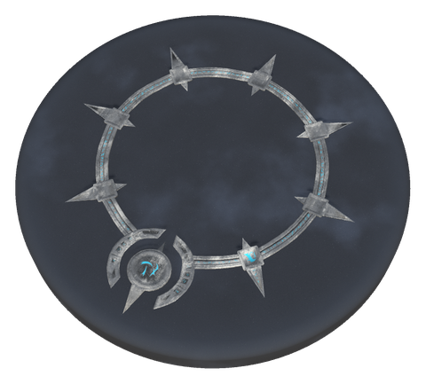
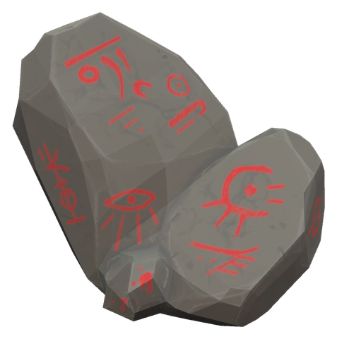

# 🌀 Portals & travel

[← Back to the README](../README.MD)

## 🌀 PORTAL RUNES

Metal cannot go through portals. With runes it can, one metal tier at a time:

1. Build a **Rune Forge** next to a forge and smith runes from iron.
2. Raise a **Rune Post** within 8 m of the portal you travel **from**.
3. Hang runes on the post (use the rune on it, like an item stand). Each rune lets that portal carry its metals. Several posts near one portal count together.
4. With **all six runes on the same post**, the post glows and the portal carries **everything**, including dragon eggs, Hildir's chests and the Deep North boss drop.

Looking at the portal shows which runes it has. Use the post to take the last rune back; a destroyed post drops its runes. Works for every portal that builds on the vanilla portal, also portals from other mods, and for the stations of the Portal Stations mod (not its portable device).

  

| Item | Lets through | Crafting Station | Requirements |
|------|--------------|------------------|--------------|
| **Rune Forge** | Crafting station for the runes | Hammer (next to a Forge) | Fine Wood ×6, Iron ×6, Stone ×10 |
| **Rune Post** | Holds up to six runes | Hammer (Workbench) | Wood ×6, Fine Wood ×4, Iron ×2 |
| **Bronze Rune** | Copper, tin, bronze (ores and scrap) | Rune Forge | Iron ×2 |
| **Iron Rune** | Iron (ore and scrap) | Rune Forge | Iron ×4 |
| **Silver Rune** | Silver (ore) | Rune Forge | Iron ×6 |
| **Black Metal Rune** | Black metal (scrap) | Rune Forge | Iron ×8 |
| **Flametal Rune** | Flametal (ore, also the legacy kind) | Rune Forge | Iron ×10 |
| **Gold Rune** | Gold (ore) | Rune Forge | Iron ×12 |

### Valkyrie Stone

A carved runestone with glowing gold knotwork. Use it and a valkyrie carries you to where you last fell in this world (the death marker on the map) for **one Surtling Core**. You arrive with everything you carry. Each death can be travelled to once; after the next death the stone works again.

| Item | Use | Crafting Station | Requirements |
|------|-----|------------------|--------------|
| **Valkyrie Stone** | Travel to your last death point, 1 Surtling Core per trip | Hammer (Workbench) | Stone ×20, Surtling Core ×2, Withered Bone ×5 |

### Portal Astrolabe

A floating armillary around a glowing amethyst. Place it within 5 m of a map table, and every portal in the world shows on everyone's map and minimap with a portal icon and its name. This covers vanilla portals, portals from other mods that build on them, and Portal Stations stations. Point at a portal on the large map to see which runes it has. Public stations show for everyone; private, guild and group stations only for the player who built them, marked as such. The server looks for changes every 10–20 seconds; remove the astrolabe and the portals disappear from the map.

| Item | Use | Crafting Station | Requirements |
|------|-----|------------------|--------------|
| **Portal Astrolabe** | Shows every portal on the map, with its runes | Hammer (Workbench) | Fine Wood ×6, Bronze ×4, Surtling Core ×1 |

### White Hilt Portals

One portal network instead of pairs: every White Hilt portal leads to every other. Use a portal and the large map opens with a list on the left. Search it, sort it by name or distance (shown from where you stand), pick a portal to see it on the map, or click one on the map to pick it in the list. Double-click or **Travel** to go. From the same panel you can rename the portal you stand at, make it private (only you see and reach it) and set it as your **home**. Shift + Use on a portal also names it. The ordinary portal rules apply: no ore or metal, unless rune posts stand at the portal you travel **from** (see Portal Runes).

Stations built with the Portal Stations mod become White Hilt rune circles, with their names and privacy. Remove Portal Stations from the server and every client at the same time.

The **Home Stone** takes you to your home portal from anywhere. It then rests for 5 minutes (configurable), shown as a status effect with the time left; dying or logging out does not end the rest. Within 2 minutes of going home (`HomeReturnMinutes`, 0 turns it off), using it again takes you back to where you were, even while it rests. It follows the ordinary portal rules, both ways.

  

| Item | Description | Crafting Station | Requirements |
|------|-------------|------------------|--------------|
| **White Hilt Portal** | A standing stone arch with the portal swirl | Hammer (Workbench) | Stone ×30, Fine Wood ×10, Surtling Core ×2, Greydwarf Eye ×10 |
| **White Hilt Rune Circle** | The same portal, as a flat circle of glowing runes on the ground | Hammer (Workbench) | Stone ×20, Bronze ×2, Surtling Core ×2, Greydwarf Eye ×10 |
| **Home Stone** | Takes you to your home portal, then rests; used again within 2 minutes, it takes you back | Rune Forge | Stone ×4, Iron ×2, Surtling Core ×1, Greydwarf Eye ×5 |

The server sends the portal list every 10–20 seconds, so a new or renamed portal shows up in the list after a short while.

## Config

All admin only, synced from the server.

| Setting | Default | What it does |
|---|---|---|
| `[Portals] RunePostRange` | 8 | Metres a rune post may stand from the portal you travel from; 0 turns rune posts off |
| `[Portals] MapTableExtensionRange` | 5 | Metres a Portal Astrolabe or Harbour Anchor may stand from a map table |
| `[Portals] ValkyrieStoneCost` | 1 | Surtling Cores per Valkyrie Stone trip; 0 = free |
| `[Portals] ValkyrieStoneOncePerDeath` | true | Each death point can be travelled to once; off: as often as you like |
| `[Gear.Runes] Weight` | 1 | Weight of each rune |
| `[Gear.Runes] MaxStackSize` | 10 | Runes of a kind per inventory slot |
| `[Gear.WhiteHiltHomeStone] Weight` | 0.5 | Weight of the Home Stone |
