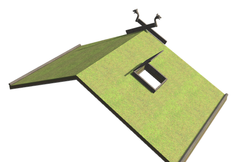
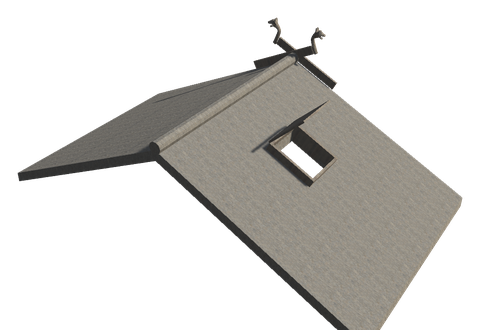
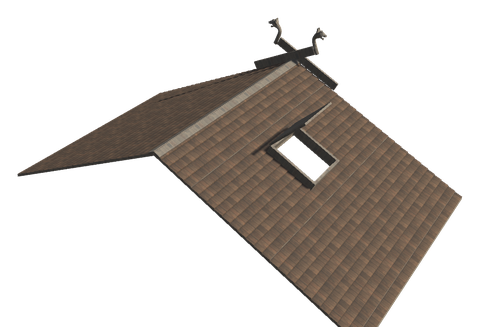
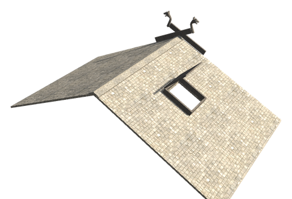

# 🏠 Roofs

[← Back to the README](../README.MD)

Six roof coverings from the Viking age, each in every shape and pitch of the vanilla wooden roof: turf over birch bark, reed and straw thatch, tarred shingles (plain and dragon-scale), and slate. They come with smoke holes that open and close, dragon gables for the ridge ends, and new materials from the Meadows to the Plains. Roseroot can be planted on a turf roof, as it was on the sod roofs of old.

     

## 🏠 THE ROOFS

Every covering comes at **26°, 45° and 67°**, in five shapes: the roof itself, the **ridge**, the **inner corner**, the **outer corner** and the **smoke hole**. They are built with the hammer near a workbench, sit in the build menu's roof group right after the vanilla roofs, and snap to each other, to vanilla roofs and to walls like the vanilla thatch. Each piece costs the recipe below; a smoke hole costs **Wood ×2** more.

| Covering | Description | Biome | Recipe per piece | Health | Burns |
|----------|-------------|-------|------------------|--------|-------|
| **Turf roof** | Sod over layers of birch bark on roof boards, held by a turf log along the eave, as on most Viking houses | Meadows | Wood ×2, Birch Bark ×1, Turf ×2 | 600 | No |
| **Reed thatch** | Thick thatch of grey swamp reed | Swamp | Wood ×1, Reed ×3 | 450 | Yes |
| **Shingle roof** | Hand-split pine shingles brushed with pine tar, with ridge boards, as on the stave churches | Black Forest | Fine Wood ×2, Pine Tar ×1 | 500 | Yes |
| **Scale shingle roof** | Tarred shingles with rounded ends that lie like dragon scales | Black Forest | Fine Wood ×2, Pine Tar ×1, Resin ×1 | 500 | Yes |
| **Slate roof** | Heavy slate slabs laid in courses, as in the fjords of the west; the strongest roof | Mountains | Wood ×2, Slate ×3 | 800 | No |
| **Straw thatch** | Thick, golden thatch of barley and flax straw | Plains | Wood ×1, Straw ×3 | 450 | Yes |

- **Eaves**: the lowest row of a roof reaches past the eave, and a turf roof has its turf log there. Where the roof goes on downhill, the overhang and the log are hidden, so they only show at the bottom.
- **Quiet roofs**: under turf, slate, reed and straw the wind and rain are muffled even more than under other roofs (see [Clock, sound & floating items](quality-of-life.md)).
- **Fire**: turf and slate roofs do not catch fire.

### Smoke hole (ljore)

A roof piece with a framed hole and a hatch, so the smoke of a fire below can get out. **Use** it to open or close the hatch. When rain starts, the hatch closes by itself, and it opens again when the rain stops, unless a fire burns below it: a fire under a closed hatch fills the house with smoke. A hatch you set by hand stays as it is until the weather changes again.

### Dragon gable

Crossed barge boards (vindskier) with a carved dragon head on each tip, as on the stave churches, at 26°, 45° and 67°. Place it on the end of a ridge.

| Piece | Description | Crafting Station | Requirements |
|-------|-------------|------------------|--------------|
| **Dragon gable** | Crossed barge boards with dragon heads for the end of a ridge | Hammer (near Workbench) | Fine Wood ×4, Lindorm Scale ×2, Pine Tar ×1 |

### Roseroot on the turf roof

On a turf roof (not on its ridges, corners or smoke holes) you can plant roseroot, which grew on the sod roofs of old in dry places. Use a **Roseroot** on the roof to plant it; three plants grow on the piece. After 60 minutes (in-game time) they can be picked for **2 Roseroot**, and they grow back after every pick.

## 🧱 MATERIALS

| Item | Where it comes from | Used for |
|------|---------------------|----------|
| **Birch Bark** | 60% chance for 1–2 when a birch is felled or a birch log is split | Turf roof |
| **Turf** | Digging grassland with a pickaxe in the Meadows, Black Forest or Plains, as long as the sod is still there (not more than 0.5 m below the untouched ground, and not tilled) | Turf roof |
| **Reed** | A new plant at the water's edge in the Swamp, or a 30% extra drop from Thistle there | Reed thatch |
| **Pine Tar** | Burnt out of core wood in the **Tar Kiln** | Shingle roofs, dragon gable |
| **Slate** | **Slate outcrops** in the Mountains, or a 25% chance per stone from any Mountain rock | Slate roof |
| **Soapstone** | Slate outcrops, or an 8% chance per stone from any Mountain rock | Soapstone Hearth |
| **Straw** | Every harvest of barley or flax, wild or grown | Straw thatch |

Reed and slate outcrops appear as new land is generated, and once, when the server starts, in land generated before they came (`[OldLand]`, see [Progression](progression.md)); the extra drops work everywhere.

| Piece | Description | Crafting Station | Requirements |
|-------|-------------|------------------|--------------|
| **Tar Kiln** | A kiln that burns core wood slowly into pine tar, one tar per core wood every 40 seconds, up to 25 at a time | Hammer | Stone ×20, Core Wood ×5, Resin ×10 |
| **Soapstone Hearth** | A hearth of carved soapstone: it burns twice as long on its wood and gives 3 comfort instead of 2 | Hammer | Soapstone ×10, Stone ×6 |

## Config

Admin only, synced from the server.

Each covering has a section `[Roofs.<Covering>]` (`Turf`, `Reed`, `Shingle`, `ScaleShingle`, `Slate`, `Straw`):

| Setting | Default | What it does |
|---|---|---|
| `Enabled` | true | The covering can be built; roofs already built stay |
| `Recipe` | per covering (above) | What one piece costs, as `Prefab:Amount`, comma separated |
| `Health` | per covering (above) | Health of one piece |

Section `[Roofs]`:

| Setting | Default | What it does |
|---|---|---|
| `SmokeHoleExtra` | Wood:2 | What a smoke hole costs on top of its covering's recipe |
| `HatchFollowsRain` | true | Hatches close when rain starts and open when it stops, unless a fire burns below |
| `HatchFireRange` | 6 | How far below a smoke hole, in metres, a burning fire keeps the hatch open in the rain |
| `QuietRoofBonus` | 0.25 | How much more the weather is muffled under turf, slate, reed and straw (0 to 1) |
| `EaveCheckSeconds` | 3 | Seconds between checks whether the roof goes on below an eave |

Section `[Roofs.Gable]`: `Enabled` (true) and `Recipe` (FineWood:4, WhiteHilt_LindormScale:2, WhiteHilt_PineTar:1).

Section `[Roofs.Garden]`:

| Setting | Default | What it does |
|---|---|---|
| `Enabled` | true | Roseroot can be planted on turf roofs |
| `GrowMinutes` | 60 | In-game minutes before planted roseroot can be picked, and between picks |
| `PickAmount` | 2 | Roseroot one pick gives |

Section `[Roofs.Materials]`:

| Setting | Default | What it does |
|---|---|---|
| `BirchBarkChance` | 0.6 | Chance that a felled birch or a split birch log gives birch bark |
| `BirchBarkMax` | 2 | Most birch bark one birch or log gives |
| `TurfChance` | 1 | Chance that digging grassland with a pickaxe gives a turf |
| `TurfMaxDepth` | 0.5 | How deep below the untouched ground, in metres, a dig can be and still give turf |
| `TurfBiomes` | Meadows, BlackForest, Plains | Biomes where digging gives turf |
| `SlateChance` | 0.25 | Chance per stone from a Mountain rock that a slate comes with it |
| `SoapstoneChance` | 0.08 | Chance per stone from a Mountain rock that a soapstone comes with it |
| `SlateOutcropPerZone` | 0.12 | Chance of a slate outcrop in each Mountain zone |
| `StrawChance` | 1 | Chance that harvesting barley or flax gives straw |
| `TarKilnSeconds` | 40 | Seconds the Tar Kiln takes for one pine tar |
| `TarKilnCapacity` | 25 | Core wood the Tar Kiln holds |
| `HearthBurnMultiplier` | 2 | How much longer the Soapstone Hearth burns on its wood than the vanilla hearth |
| `HearthComfort` | 3 | Comfort the Soapstone Hearth gives |

Reed has its own section `[Foraging.Reed]`, like the other forageables (see [Foraging & food](foraging.md)). The Tar Kiln and the Soapstone Hearth are switched on and off and priced in `[Content]` and `[Recipes]` like the other White Hilt pieces.
