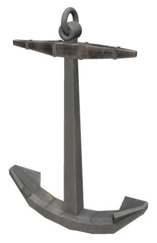

# ⛵ Ships

[← Back to the README](../README.MD)

## ⛵ SHIPS

The ship is indestructible, immune to all damage types, Ashlands-ready, and has permanent tailwind enabled.

| Item | Description | Requirements (Hammer) |
|------|-------------|----------------------|
| **White Hilt Ship** | The Indestructible Ship of Dyrnwyn | Fine Wood ×20, Iron Nails ×100, Bronze Nails ×100, Deer Hide ×15, Leather Scraps ×15 |

**Ship Features:**
- Immune to fire, blunt, slash, pierce, chop, pickaxe, spirit, frost, lightning, and poison damage
- Ashlands damage immune and resistant
- Always has tailwind (full sail speed regardless of wind direction) (`Ships` → `AlwaysTailwind`)
- Sails five times harder than the vanilla code default (`Ships` → `SailForce`, 0.5)
- Comfort bonus: +5
- Its own look: a carved dragon figurehead, a white sail with gold stripes along the edges and the White Hilt logo in the middle, a whitewashed hull with gold fittings, and shields with the logo along the rail

**Ship Upgrades** (crafted at the Workbench, used on the mast like an item on an item stand; use the mast to take the last one off):

| Upgrade | Effect | Requirements |
|---------|--------|--------------|
| **Ship Lantern** | A lantern on deck that lights up at night, 2.5 times as bright and twice as far as the vanilla lamp (`Ships` → `LanternBrightness`, `LanternRange`, each player's own) | Iron ×2, Resin ×10, Surtling Core ×1 |
| **Cargo Barrels** | Barrels and crates on deck; the cargo hold grows from 6 × 3 to 8 × 4 | Fine Wood ×10, Iron ×4 |
| **Ship Tent** | A tent on deck; under it you have Shelter and stay dry | Troll Hide ×6, Leather Scraps ×10, Wood ×6 |
| **Mast Wisp** | A wisp at the top of the mast that clears the Mistlands mist around the ship and thins ordinary fog for those within 15 m (`Ships` → `MastWispFogLeft`, 0.25 of the fog is left) | Guck ×5, Ancient Bark ×5, Surtling Core ×2 |
| **Fishing Net** | While the ship sails (at least 2 m/s), it catches a fish every 2 minutes (`Ships` → `FishingNetMinutes`) and puts it in the cargo hold. The Fishing skill of the sailor makes it catch up to twice as often and often two at a time, and raises the skill. Now and then it brings up seaweed, and on the ocean an amber pearl (`FishingNetBycatch`). The catch depends on the waters: perch and pike in the Meadows, trollfish in the Black Forest, giant herring in the Swamp, tuna, coral cod and pufferfish on the ocean, and so on | Fine Wood ×4, Leather Scraps ×10, Deer Hide ×4 |
| **Drift Anchor** | An anchor over the starboard rail. Lower or raise it at the mast (Shift + E). While it is down, the ship stays where it is and cannot set sail or row | Iron ×4, Chain ×2 |
| **Deck Brazier** | An iron brazier on the starboard deck under the tent that burns without fuel. It keeps those near it warm and counts as a fire for resting | Iron ×4, Stone ×10, Surtling Core ×2 |
| **Sea Chest** | A chest by the helm that holds 4 × 2 besides the cargo hold, e.g. for gear | Fine Wood ×10, Iron ×2 |
| **Ship Portal** | A small rune circle on the starboard deck between mast and helm. The ship shows in every White Hilt portal's travel list and travellers arrive on its deck wherever it has sailed; the circle itself opens the travel map (Shift + Use names it). The usual rules for ore and metal apply | Fine Wood ×10, Bronze ×2, Surtling Core ×2, Greydwarf Eye ×10 |

The barrels can only be taken off when the extra cargo slots are empty, and the sea chest when it is empty. Taking the anchor off also raises it. The drift anchor drops by itself when the last person leaves a still ship, and is weighed when someone takes the helm (`Ships` → `AutoAnchor`, on by default).

**Sailing help** (every ship, also vanilla ones):
- **Hold course**: press **H** at the helm. When you let go of the helm, the ship keeps the heading it has then, with the sail as it is, so you can walk about the deck. It stops before shallow water or land ahead and tells everyone aboard. Press H at the helm again to switch it off. The key is `Ships.Keys` → `HoldCourse`.
- **Speed and heading**: while steering, the speed in knots, the heading in degrees and compass point, where the wind comes from and the held course are shown under the wind indicator (`ShowSpeedAndHeading`).
- **Push the ship**: standing on shore or in the water next to a ship that lies still, look at it and press **E** (hold to keep pushing). It is pushed away from you, off a beach or a rock.

**Harbour Anchor:** a standing iron anchor built next to a map table. While one stands within 5 m of a map table, every ship in the world (rafts, Karves, Longships, Drakkars, the White Hilt Ship and ships from other mods) shows on everyone's map and minimap with its own build icon. Positions follow sailing ships every 2 seconds. Point at a ship on the large map to see its type and, if they are online, who built it.

| Item | Use | Crafting Station | Requirements |
|------|-----|------------------|--------------|
| **Harbour Anchor** | Shows every ship on the map | Hammer (Workbench) | Iron ×2, Chain ×2, Fine Wood ×4 |

## Config

Section `[Ships]` (admin only, synced from the server):

| Setting | Default | What it does |
|---|---|---|
| `HoldCourse` | true | Ships can hold their course with nobody at the helm |
| `PushShip` | true | A still ship can be pushed off the shore |
| `PushSpeed` | 2.5 | Speed in m/s one push gives |
| `PushMaxShipSpeed` | 1.5 | A ship can only be pushed below this speed, in m/s |
| `FishingNet` | true | The fishing net catches fish; off keeps the upgrade but catches nothing |
| `FishingNetMinSpeed` | 2 | Speed in m/s the ship needs to catch |
| `FishingNetSkillSpeedUp` | 0.5 | Share the time between catches is cut at Fishing 100 |
| `FishingNetDoubleChance` | 0.5 | Chance of two fish at Fishing 100 |
| `FishingNetSkillRaise` | 0.5 | Fishing experience per catch |
| `FishingNetSeaweedChance` | 0.1 | Chance of seaweed per catch |
| `FishingNetPearlChance` | 0.03 | Chance of an amber pearl per catch on the ocean |
| `AutoAnchorSeconds` | 2 | Seconds an empty, still ship waits before the anchor drops |
| `AutoAnchorMaxSpeed` | 2 | Below this speed, in m/s, the ship counts as still |
| `TentShelter` | true | The Ship Tent gives shelter and keeps the rain off |
| `MastWispReach` | 15 | Metres from the mast within which the Mast Wisp thins fog |
| `ShipPortal` | true | The deck portal can be used and is listed; off hides the rune circle |
| `ShipRoutes` | true | Route markers can be set at the Navigator's Table; saved markers stay when off |
| `RouteAutopilot` | true | "Take me there" can sail the route |
| `RouteMaxMarkers` | 5 | Most markers on a route |
| `RouteMaxSpeed` | 45 | Above this speed in knots, "Take me there" takes the sail down to half until the ship is well below it; 0 never |

`[Gear.ShipUpgrades] Weight` (5) sets the weight of each ship upgrade item.
