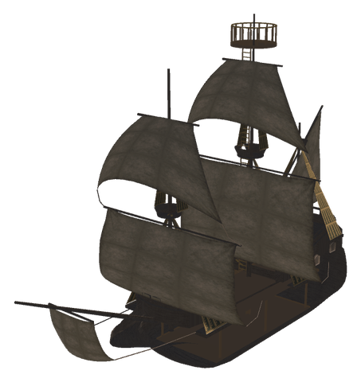
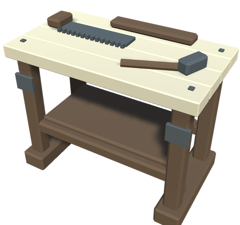
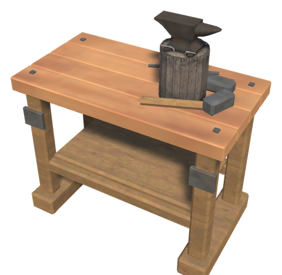
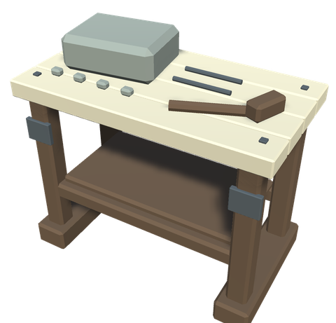
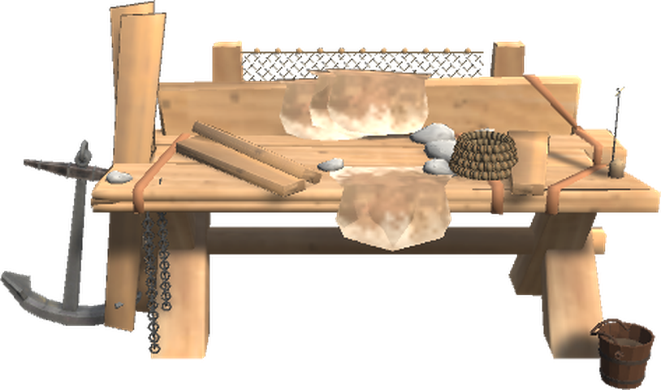

# ⛵ Ships

[← Back to the README](../README.MD)

## ⛵ SHIPS

Both White Hilt ships are indestructible, immune to all damage types and Ashlands-ready. Tailwind is enabled by default.

| Item | Description | Requirements (Hammer) |
|------|-------------|----------------------|
| **White Hilt Ship** | The Indestructible Ship of Dyrnwyn | Fine Wood ×20, Iron Nails ×100, Bronze Nails ×100, Deer Hide ×15, Leather Scraps ×15 |
| **Skidbladnir** | Freyr's sailing home: an empty lower deck, three masts and a high lookout | Fine Wood ×100, Iron Nails ×200, Ancient Bark ×50, Deer Hide ×40 |

### Skidbladnir

Named for Freyr's ship, Skidbladnir is a separate Hammer piece (`WhiteHiltSkidbladnir`), not a replacement for the White Hilt Ship. The central lower room is about 11 × 5.9 m with 2.6–2.9 m headroom. It ships empty: build workbenches, furniture and storage yourself with the ordinary Hammer. Normal materials, station, access and placement rules still apply. Terrain tools, plants and other vehicles cannot be attached.

Pieces you place on the ship line up with its deck and heading, even when it rocks or lies at an angle; rotation steps, the grid and nudging follow the ship. Build while the ship lies still. If the Drift Anchor upgrade is installed, lower it first. Furnishings retain their own inventories, damage and removal behavior, but use the ship as a foundation and move with it. A piece is fixed to the ship when you aim at the ship (or at furnishings on it) and it stands within the hull or on it, also on walls and up high; a piece beside the hull, on a jetty, is not, so the ship never catches on it. Their ship-local placement is saved for reloading; disabling new building does not detach existing furnishings. Remove the furnishings before dismantling the ship. Like the other ships, it strikes its sails and comes to rest when everyone has left it. Group moving/copying, beds and interactions supplied by other mods require separate in-game checks.

Below deck the camera comes in to 2 m behind you and stays inside the hull, so you see the lower room at once and the build ghost lands on its floor (`LowerDeckCameraDistance`, each player's own; 0 keeps the vanilla camera, which passes through the hull). Back on deck, your own zoom returns. The lower room stays dry in waves: the sea is not drawn inside it, whether you are below or looking down the stairs from the deck.

Storage aboard: the cargo hatch in the waist opens the cargo hold (6 × 3, 8 × 4 with the Cargo Barrels), and the Sea Chest upgrade adds a chest on the poop deck. Chests and wall drawers built below deck work as on land. The decks above count as a roof for furnishings below them, so they keep dry; furnishings out in the open weather like on land.

Use the port-side boarding ladder amidships, at the gap in the rail, to get aboard: Use climbs straight from the water to the deck, and alternate Use from the deck drops you into the water beside it. The deck has three levels, following the model:
- **Waist** (main deck): the stairs down to the lower deck start at the starboard opening just forward of the main mast and descend towards the bow. The cargo hatch, tent, brazier and cargo barrels are here; a short stair at the bow leads up to the forecastle. The tent is as wide and high as the longship's, but shorter: it spans the whole beam from the boarding ladder's gap to just before the forecastle stair, so you can walk under it and on up to the bow, and the cargo barrels stand along the port rail beneath it.
- **Quarterdeck**: three steps lead up on the starboard side of the main mast. The deck portal and the Navigator's Table are here, and a stair on the port side leads up to the poop deck.
- **Poop deck**: the helm, the sea chest and the mizzen mast.

Rails and walls follow the model's balustrades and new railings along the waist and the deck edges, so you cannot walk off. The stair opening has its own railing, open at the top of the stair and for a short stretch beside the main mast. The lower room is closed by bulkheads at both ends and lined with planking along both sides, so wall drawers hang on a visible wall. With the Ship Lantern upgrade, two stern lanterns on posts and three lamps under the lower deck's beams light together with the deck lantern; any of them switches all of them. The rudder on the sternpost turns with the helm, and the main course carries the White Hilt logo, readable from both sides.

Like the longship, Skidbladnir has places to sit or hold on, so you stay aboard in rough seas: two stools by the port rail of the quarterdeck, one beside the helm, two facing each other on the forecastle, a holdfast at the main mast and one at the forecastle's front rail. Use the mast ladder to reach the intermediate platform and top lookout. Ladder Use climbs to the next stop; alternate Use descends, like the White Hilt watchtowers. Skidbladnir supports all nine upgrades below, the Navigator's Table, routes and deck-portal arrival at their own positions.

Horizontal speed is capped at half the White Hilt Ship's calculated ideal full-sail terminal speed on flat water with tailwind, using its configured sail force and drag. The cap also applies to rowing and autopilot; vertical wave and Kraken movement is retained. It is not a comparison with another ship's instantaneous speed. Sail force is reduced as well, and the separate sails furl visibly. Geometry and sailing balance can be adjusted after testing.

Console testing: `spawn WhiteHiltSkidbladnir`. Validate waterline and stability, all deck and ladder clearances, station use and shelter, every upgrade, furnishing inventories after sailing/reloading, and multiplayer ownership and sector crossings. Offline builds and geometry checks do not establish that these work correctly in a live world. Test in a backup world first; server and clients must update together.

### Ship Workshops

Craft the **White Hilt Ship Hammer** at the [Shipwright's Bench](#shipwrights-bench) from Wood ×3, Iron ×2 and Resin ×2. Its separate build menu contains three compact stations plus repair/removal; they do not clutter the ordinary Hammer. The stations can only be placed aboard **Skidbladnir**, while it is still and its installed Drift Anchor is down. They always stand on the floor or deck beneath where you aim, even when you aim at a wall. Use the ordinary Hammer for other furnishings and [wall drawers](chests.md#wall-drawers).

  

| Piece | Footprint | Requirements (Ship Hammer) |
|---|---|---|
| **Ship Workbench** | 1.1 × 0.62 m | Wood ×10 |
| **Ship Forge** | 1.1 × 0.62 m | Wood ×10, Stone ×4, Coal ×4, Copper ×6 |
| **Ship Stonecutter** | 1.1 × 0.62 m | Wood ×10, Iron ×2, Stone ×4 |

These clone the original crafting stations: the same recipes, station levels, nearby extensions, repair capability, build range, shelter/fire requirements and material recovery apply. Ingredients gate them naturally; no extra progression-tier materials are added. No upgrades are pre-installed. For the stonecutter, the original nearby Workbench building requirement remains applicable.

Console prefab names: `WhiteHiltShipHammer`, `piece_whitehilt_shipworkbench`, `piece_whitehilt_shipforge`, `piece_whitehilt_shipstonecutter`. Their ordinary Recipes/Content/Tiers settings apply. Actual crafting, extension connections and shelter checks aboard a moving ship still need live-world validation.

**Ship Features:**
- Immune to fire, blunt, slash, pierce, chop, pickaxe, spirit, frost, lightning, and poison damage
- Ashlands damage immune and resistant
- Always has tailwind (full sail speed regardless of wind direction) (`Ships` → `AlwaysTailwind`)
- Sails five times harder than the vanilla code default (`Ships` → `SailForce`, 0.5)
- During manual sailing, the helmsman is preferred as network owner of the White Hilt Ship (`HelmOwnership`). Ownership stays with a player using the cargo hold or sea chest until both are closed and the open-request grace period has elapsed. Both inventories and current motion are saved before handing ownership back. Speed and sail force are unchanged; this does not remove network latency or passenger-side movement corrections.
- Comfort bonus: +5
- Its own look: a carved dragon figurehead, a white sail with gold stripes along the edges and the White Hilt logo in the middle, a whitewashed hull with gold fittings, and shields with the logo along the rail

Recolouring leaves materials without a main texture, including the vanilla water mask, unchanged.

### Shipwright's Bench

A sturdy workbench with a ship's anchor leaning on one end, an anchor chain, a coil of rope, a rushlight, a fishing net over the tool board and a bucket of tar. Build it with the Hammer under **Crafting**, near a Workbench. It is its own station: the ship upgrades and the Ship Hammer are made here, and the Harbour Anchor and the Mooring Post are built near it. It needs **no roof or walls** and does not wear in the rain, so it can stand out on the jetty.

| Item | Crafting Station | Requirements |
|------|------------------|--------------|
| **Shipwright's Bench** (`piece_whitehilt_skipsbyggerbenk`) | Hammer (Workbench) | Fine Wood ×10, Pine Tar ×2, Bronze ×2, Leather Scraps ×4 |

**Ship Upgrades** (crafted at the Shipwright's Bench, used on the mast like an item on an item stand; use the mast to take the last one off). They use what the Swamp and the forests give: bog iron for the ironwork, pine tar to seal, sphagnum moss to caulk, peat for the brazier, and cattail, reed and birch bark for the net:

| Upgrade | Effect | Requirements |
|---------|--------|--------------|
| **Ship Lantern** | A lantern on deck that lights up at night, with the vanilla lamp's intensity and three times its range for softer deck lighting and a wider reach around both sides of the ship (`Ships` → `LanternBrightness`, `LanternRange`, each player's own; needs a restart) | Bog Iron ×3, Resin ×6, Pine Tar ×1, Surtling Core ×1 |
| **Cargo Barrels** | Barrels and crates on deck; the cargo hold grows from 6 × 3 to 8 × 4 | Fine Wood ×10, Bog Iron ×4, Pine Tar ×2 |
| **Ship Tent** | A tent on deck; under it you have Shelter and stay dry, but a Kraken tentacle can periodically reach through the side opening and shove sheltered sailors out (see [Kraken](kraken.md#the-fight)) | Troll Hide ×4, Leather Scraps ×6, Wood ×6, Pine Tar ×2 |
| **Mast Wisp** | A wisp at the top of the mast that clears the Mistlands mist around the ship and thins ordinary fog for those within 15 m (`Ships` → `MastWispFogLeft`, 0.25 of the fog is left) | Guck ×5, Ancient Bark ×3, Sphagnum Moss ×5, Surtling Core ×2 |
| **Fishing Net** | While the ship sails (at least 2 m/s), it catches a fish every 2 minutes (`Ships` → `FishingNetMinutes`) and puts it in the cargo hold. The Fishing skill of the sailor makes it catch up to twice as often and often two at a time, and raises the skill. Now and then it brings up seaweed, and on the ocean an amber pearl (`FishingNetBycatch`). The catch depends on the waters: perch and pike in the Meadows, trollfish in the Black Forest, giant herring in the Swamp, tuna, coral cod and pufferfish on the ocean, and so on | Cattail ×8, Reed ×6, Birch Bark ×4, Fine Wood ×4 |
| **Drift Anchor** | An anchor over the starboard rail. Lower or raise it at the mast (Shift + E). While it is down, the ship stays where it is and cannot set sail or row | Bog Iron ×6, Chain ×2, Stone ×6 |
| **Deck Brazier** | An iron brazier on the starboard deck under the tent that burns without fuel. It keeps those near it warm and counts as a fire for resting | Bog Iron ×4, Stone ×10, Peat ×10, Surtling Core ×1 |
| **Sea Chest** | A chest by the helm that holds 4 × 2 besides the cargo hold, e.g. for gear | Fine Wood ×10, Bog Iron ×2, Pine Tar ×1, Sphagnum Moss ×3 |
| **Ship Portal** | A small rune circle on the starboard deck between mast and helm. The ship shows in every White Hilt portal's travel list and travellers arrive on its deck wherever it has sailed; the circle itself opens the travel map (Shift + Use names it). The usual rules for ore and metal apply | Fine Wood ×8, Pine Tar ×2, Bronze ×2, Surtling Core ×2, Greydwarf Eye ×10 |

The barrels can only be taken off when the extra cargo slots are empty, and the sea chest when it is empty. Taking the anchor off also raises it. The drift anchor drops by itself when the last person leaves a still ship, and is weighed when someone takes the helm (`Ships` → `AutoAnchor`, on by default).

**Lantern switch:** look at the installed lantern and press **Use** (E by default) to light it or put it out. The choice is saved on the ship and shared with everyone aboard, including after reloading or ownership changes. Until first used, the lantern retains automatic night lighting. Manual on also works during daytime. During a Kraken encounter, a lit lantern flickers before the tentacles appear and goes out before they can attack. It cannot be lit during the fight and stays off afterwards; use it again after Kraken dies or retreats. Only Kraken's target ship is affected, within `LanternKrakenRange`, independently of the ship-holding/lifting switches. An already extinguished lantern stays dark during the warning.

**Sailing help** (every ship, also vanilla ones):
- **Hold course**: press **H** at the helm. When you let go of the helm, the ship keeps the heading it has then, with the sail as it is, so you can walk about the deck. It stops before shallow water or land ahead and tells everyone aboard. Press H at the helm again to switch it off. The key is `Ships.Keys` → `HoldCourse`.
- **Speed and heading**: while steering, the speed in knots, the heading in degrees and compass point, where the wind comes from and the held course are shown under the wind indicator (`ShowSpeedAndHeading`).
- **Sounding line**: the read-out also shows the depth of the water under the ship, rocks under water included (`ShowDepth`). While you steer, or ride a ship that sails its route, the water ahead is sounded too: 5 seconds of sailing ahead, at least 15 m and at most 60 m past the bow. Depth and obstacle scans run once a second (`SoundingInterval`), rather than on each read-out refresh. If it gets shallower than 3.5 m or rocks lie in the way, the depth turns red, a message says *Shallow water ahead!* or *Rocks or something in the way ahead!* and the ship's bell rings. Not below 2 m/s, so it stays quiet while you lay to. Continuous danger, such as sailing beside a shallow shore, gives a reminder only every 60 seconds (`ShoalRepeatSeconds`). After 5 seconds of clear water at warning speed (`ShoalClearSeconds`), the next danger can warn again, still respecting the minimum 8-second pause (`ShoalCooldown`). Stopping or a brief gap in the shallows does not reset the reminder.
- **Camera zoom**: at the helm the camera zooms 2 m further out than in vanilla (`CameraExtraZoom`), and everyone aboard, standing on deck or sitting, can zoom out just as far (`CameraZoomAllAboard`).
- **Camera sweep**: when a ship sets off on its route ("Take me there" or explorer mode, see [Navigation](navigation.md)), the camera of everyone sitting aboard swings out around the ship, stops for a moment in front of the sail and comes round to behind you again, with the HUD hidden. Looking calmly around does not disturb it; a quick swing of the mouse, standing up or opening a menu brings the camera back at once.
- **Push the ship**: standing on shore or in the water next to a ship that lies still, look at it and press **E** (hold to keep pushing). It is pushed away from you, off a beach or a rock.
- **Man overboard**: fall into the water from a ship moving at 2 m/s or more, and everyone aboard gets *Man overboard: Kjell!*, the ship's bell, a pin on the map and an arrow on the minimap's edge pointing to you. You get a pin and an arrow toward the ship. A ship that sails its route or holds its course stops; a ship someone steers is left to them. It ends when you are out of the water, die, or after 5 minutes.
- **Lifeline**: standing on the deck of that ship within 25 m of the one in the water, press **E** (*Throw a lifeline to Kjell* under the crosshair). A moment later they are pulled aboard next to you.

**Harbour Anchor:** a standing iron anchor built next to a map table, within reach of a Shipwright's Bench. While one stands near a map table (`[Navigation] MapTableRange`, 5 m; see [Around the map table](navigation.md#around-the-map-table)), every ship in the world (rafts, Karves, Longships, Drakkars, the White Hilt Ship and ships from other mods) shows on everyone's map and minimap with its own build icon. Positions follow sailing ships every 2 seconds. Point at a ship on the large map to see its type and, if they are online, who built it.

| Item | Use | Crafting Station | Requirements |
|------|-----|------------------|--------------|
| **Harbour Anchor** | Shows every ship on the map | Hammer (Shipwright's Bench) | Iron ×2, Chain ×2, Fine Wood ×4 |

**Mooring Post:** a thick post with a coil of rope, for the dock, the shore or shallow water. Use it to moor the nearest ship within 20 m that is not moored yet (`MooringRange`): a rope runs from the post to the ship's nearest end, and the ship lies still where it is, rocking on the waves, also in a storm. It works on every ship: rafts, Karves, Longships, Drakkars, the White Hilt Ship and ships from other mods. While it is moored, the helm will not set sail or row; use the post again to cast off. One ship per post. The mooring is kept on the ship, so it holds after you log out, and a ship whose post is torn down is let go.

| Item | Use | Crafting Station | Requirements |
|------|-----|------------------|--------------|
| **Mooring Post** | Moors the nearest ship | Hammer (Shipwright's Bench) | Fine Wood ×4, Iron ×1, Leather Scraps ×4 |

## Config

Section `[Ships.Skidbladnir]` (admin only, synced from the server, except `LowerDeckCameraDistance`):

| Setting | Default | What it does |
|---|---|---|
| `WaterlineOffset` | 1.2 | Model height above the buoyancy plane in metres; restart required. Changing it requires repositioning existing furnishings |
| `SpeedShare` | 0.5 | Share of the existing ship's ideal full-sail reference speed; range 0.1 to 0.5 |
| `Building` | true | Allow new ordinary Hammer pieces aboard; saved furnishings remain attached when off |
| `BuildMaxSpeed` | 0.25 | Maximum horizontal speed in m/s for Hammer placement; an installed Drift Anchor must also be down |
| `FurnitureSyncSeconds` | 1 | Seconds between ownership-side saved world-position updates for furnishings; range 0.1 to 5 |
| `SailSeconds` | 2 | Seconds to deploy or furl the sails; range 0.5 to 10 |
| `LowerDeckCameraDistance` | 2 | Each player's own: below deck the camera comes in to this distance in metres and stays inside the hull; 0 keeps the vanilla camera; range 0 to 8 |

Section `[Ships]` (admin only, synced from the server):

| Setting | Default | What it does |
|---|---|---|
| `HoldCourse` | true | Ships can hold their course with nobody at the helm |
| `LanternWarningSeconds` | 3 | Seconds of lantern flicker before Kraken's tentacles appear, capped at their spawn delay (currently 2.5 seconds) |
| `LanternFlickerSeconds` | 0.18 | Seconds between synchronized light/dark warning beats |
| `LanternKrakenRange` | 60 | Metres from Kraken's target ship within which the lantern is suppressed |
| `HelmOwnership` | true | Prefer the White Hilt Ship's helmsman as network owner when both containers are idle; no change to vanilla ships or autopilot ownership |
| `HelmOwnershipInterval` | 0.5 | Seconds between ownership checks |
| `ContainerOwnershipGrace` | 2 | Seconds ownership is reserved after cargo open/stack or sea chest open requests; an open container remains protected after this timeout |
| `PushShip` | true | A still ship can be pushed off the shore |
| `PushSpeed` | 2.5 | Speed in m/s one push gives |
| `PushMaxShipSpeed` | 1.5 | A ship can only be pushed below this speed, in m/s |
| `FishingNet` | true | The fishing net catches fish; off keeps the upgrade but catches nothing |
| `FishingNetMinSpeed` | 2 | Speed in m/s the ship needs to catch |
| `FishingNetSkillSpeedUp` | 0.5 | Share the time between catches is cut at Fishing 100 |
| `FishingNetDoubleChance` | 0.5 | Chance of two fish at Fishing 100 |
| `FishingNetSkillRaise` | 0.5 | Fishing experience per catch |
| `FishingNetSeaweedChance` | 0.1 | Chance of seaweed per catch |
| `FishingNetPearlChance` | 0.03 | Chance of an amber pearl per catch on the ocean |
| `AutoAnchorSeconds` | 2 | Seconds an empty, still ship waits before the anchor drops |
| `AutoAnchorMaxSpeed` | 2 | Below this speed, in m/s, the ship counts as still |
| `TentShelter` | true | The Ship Tent gives shelter and keeps the rain off |
| `MastWispReach` | 15 | Metres from the mast within which the Mast Wisp thins fog |
| `ShipPortal` | true | The deck portal can be used and is listed; off hides the rune circle |
| `ShipRoutes` | true | Route markers can be set at the Navigator's Table; saved markers stay when off |
| `RouteAutopilot` | true | "Take me there" can sail the route |
| `RouteMaxMarkers` | 5 | Most markers on a route |
| `RouteMarkersLevel` | 30 | Exploration level needed to set route markers |
| `RouteSailLevel` | 50 | Exploration level needed for "Take me there" |
| `RouteMaxSpeed` | 45 | Above this speed in knots, "Take me there" takes the sail down to half until the ship is well below it; 0 never |
| `RouteSitSeconds` | 30 | Seconds the player who chose "Take me there" has to sit down before the route is called off |
| `RouteExploreLevel` | 50 | Exploration level needed for explorer mode |
| `RouteExploreCoastCells` | 1 | How close to land explorer mode keeps, in 32 m steps from shallow water; 1 is closest |
| `RouteExploreOpenWaterCost` | 3 | How many times longer open water counts in explorer mode; higher follows more of every bay, 1 is the fastest route |
| `RouteExploreNearLand` | 120 | Within this many metres of land, explorer mode never uses full sail |
| `CameraExtraZoom` | 2 | Metres the camera can zoom further out at the helm than in vanilla; 0 keeps the vanilla limit |
| `CameraZoomAllAboard` | true | Everyone aboard can zoom out as far as the one at the helm |
| `ManOverboard` | true | A fall from a moving ship is called out to those aboard |
| `OverboardMinSpeed` | 2 | Speed in m/s the ship must have for a fall to count |
| `OverboardStopShip` | true | A ship sailing its route or holding its course stops |
| `OverboardTimeout` | 300 | Seconds after which the alert ends by itself |
| `Lifeline` | true | A lifeline can be thrown from the deck |
| `LifelineRange` | 25 | Metres a lifeline reaches |
| `LifelineDelay` | 1.5 | Seconds until the one in the water is aboard |
| `MooringRange` | 20 | Metres from a Mooring Post within which a ship can be moored |

Each player's own settings in `[Ships]`:

| Setting | Default | What it does |
|---|---|---|
| `LanternBrightness` | 1 | Lantern intensity relative to the vanilla lamp; previously 2.5. Needs a restart |
| `LanternRange` | 3 | Lantern range relative to the vanilla lamp; previously 2. Reaches around both sides. Needs a restart |
| `RouteCameraSweep` | true | The camera swings around the ship when it sets off on a route |
| `RouteCameraSweepHideHud` | true | The HUD is hidden during the sweep |
| `RouteCameraSweepSeconds` | 10 | Seconds the whole sweep takes |
| `RouteCameraSweepHoldSeconds` | 1.5 | Seconds the camera stays still in front of the sail |
| `RouteCameraSweepDistance` | 1.3 | Distance from the sail, in ship lengths |
| `RouteCameraSweepHeight` | 0.3 | Height above the middle of the sail, in ship lengths |
| `RouteCameraSweepAngle` | 30 | Degrees to the side of the bow where the camera stops |
| `RouteCameraSweepCancelSeconds` | 0.5 | Seconds back to you when the sweep is interrupted |
| `RouteCameraSweepCancelLook` | 90 | Degrees the view must turn within about a second to interrupt; calm looking around and zooming do not |
| `ShowDepth` | true | Show the depth under the ship in the read-out |
| `SoundingInterval` | 1 | Seconds between depth and obstacle scans; results are cached between scans |
| `ShoalWarning` | true | Warn of shallow water and rocks ahead |
| `ShoalBell` | true | The warning rings the ship's bell |
| `ShoalDepth` | 3.5 | Water shallower than this, in metres, counts as shallow (ships need about 2 m) |
| `ShoalLookaheadSeconds` | 5 | Seconds of sailing ahead that are sounded |
| `ShoalMinLookahead` / `ShoalMaxLookahead` | 15 / 60 | Metres ahead of the bow sounded at least and at most |
| `ShoalMinSpeed` | 2 | No warning below this speed, in m/s |
| `ShoalCooldown` | 8 | Minimum seconds between warnings, including new danger encounters |
| `ShoalRepeatSeconds` | 60 | Seconds between reminders during continuous danger |
| `ShoalClearSeconds` | 5 | Seconds of clear water at warning speed before another danger counts as new |
| `ShipDiagnostics` | false | Log White Hilt Ship ownership and update timing locally while aboard |
| `ShipDiagnosticsInterval` | 5 | Seconds between diagnostic samples; ownership changes also trigger a sample |
| `PassengerSmoothing` | true | Aboard a White Hilt Ship or Skidbladnir someone else sails, the ship moves smoothly toward the helmsman's position instead of in small jumps |
| `PassengerSmoothSeconds` | 0.3 | Seconds your view of that ship takes to catch up with the helmsman's; longer is calmer but lags more |
| `PassengerSnapDistance` | 5 | Metres off at which the ship jumps to the helmsman's position at once |

Previous lantern defaults migrate once to the softer, wider lighting; other custom values are kept. The lantern remains a point light, not a directional searchlight. The brazier, mast wisp and portal lighting are unchanged. Check the final balance on the white hull and surrounding water, the lantern's interaction target and synchronized warning in game. Server and clients should update together.

### Multiplayer diagnostics

Only the ship's network owner (normally the helmsman) simulates it; everyone else follows the owner's updates. Vanilla moves the ship in small jumps toward each update, which passengers feel as shaking and sliding at speed. On White Hilt ships, passengers' clients instead steer the ship by velocity toward the owner's extrapolated position and heading (`PassengerSmoothing`), so it moves evenly and carries walking passengers along. Other ships keep vanilla behaviour.

Enable `[Ships] ShipDiagnostics` on the helmsman's client and on a passenger's client to compare `Ship diagnostics` entries in the BepInEx log. Samples include network owner, previous owner, helmsman player ID, passengers, container use, time since the last observed ZDO revision, largest observed revision gap and peak frame time. Owner peer IDs and helmsman player IDs are different identifiers. Revision timing includes inventory and control changes and is not a direct network-ping or movement-packet measurement.

For an in-game check, sail with multiple players at full sail and through turns, then have a passenger open, edit and close each container. Check that the ship returns to the helmsman's ownership and that both inventories retain their contents after reopening and reloading. Along a shallow shore, expect one initial warning and one reminder per minute, with a new warning after a sustained clear stretch. Compilation and isolated production-method checks passed; multiplayer smoothness and inventory handoff still require this in-game validation. Server and clients should update together.

`[Gear.ShipUpgrades] Weight` (5) sets the weight of each ship upgrade item.
