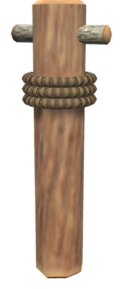

# ⛵ Ships

[← Back to the README](../README.MD)

## ⛵ SHIPS

The ship is indestructible, immune to all damage types, Ashlands-ready, and has permanent tailwind enabled.

| Item | Description | Requirements (Hammer) |
|------|-------------|----------------------|
| **White Hilt Ship** | The Indestructible Ship of Dyrnwyn | Fine Wood ×20, Iron Nails ×100, Bronze Nails ×100, Deer Hide ×15, Leather Scraps ×15 |

**Ship Features:**
- Immune to fire, blunt, slash, pierce, chop, pickaxe, spirit, frost, lightning, and poison damage
- Ashlands damage immune and resistant
- Always has tailwind (full sail speed regardless of wind direction) (`Ships` → `AlwaysTailwind`)
- Sails five times harder than the vanilla code default (`Ships` → `SailForce`, 0.5)
- Comfort bonus: +5
- Its own look: a carved dragon figurehead, a white sail with gold stripes along the edges and the White Hilt logo in the middle, a whitewashed hull with gold fittings, and shields with the logo along the rail

**Ship Upgrades** (crafted at the Workbench, used on the mast like an item on an item stand; use the mast to take the last one off):

| Upgrade | Effect | Requirements |
|---------|--------|--------------|
| **Ship Lantern** | A lantern on deck that lights up at night, 2.5 times as bright and twice as far as the vanilla lamp (`Ships` → `LanternBrightness`, `LanternRange`, each player's own) | Iron ×2, Resin ×10, Surtling Core ×1 |
| **Cargo Barrels** | Barrels and crates on deck; the cargo hold grows from 6 × 3 to 8 × 4 | Fine Wood ×10, Iron ×4 |
| **Ship Tent** | A tent on deck; under it you have Shelter and stay dry | Troll Hide ×6, Leather Scraps ×10, Wood ×6 |
| **Mast Wisp** | A wisp at the top of the mast that clears the Mistlands mist around the ship and thins ordinary fog for those within 15 m (`Ships` → `MastWispFogLeft`, 0.25 of the fog is left) | Guck ×5, Ancient Bark ×5, Surtling Core ×2 |
| **Fishing Net** | While the ship sails (at least 2 m/s), it catches a fish every 2 minutes (`Ships` → `FishingNetMinutes`) and puts it in the cargo hold. The Fishing skill of the sailor makes it catch up to twice as often and often two at a time, and raises the skill. Now and then it brings up seaweed, and on the ocean an amber pearl (`FishingNetBycatch`). The catch depends on the waters: perch and pike in the Meadows, trollfish in the Black Forest, giant herring in the Swamp, tuna, coral cod and pufferfish on the ocean, and so on | Fine Wood ×4, Leather Scraps ×10, Deer Hide ×4 |
| **Drift Anchor** | An anchor over the starboard rail. Lower or raise it at the mast (Shift + E). While it is down, the ship stays where it is and cannot set sail or row | Iron ×4, Chain ×2 |
| **Deck Brazier** | An iron brazier on the starboard deck under the tent that burns without fuel. It keeps those near it warm and counts as a fire for resting | Iron ×4, Stone ×10, Surtling Core ×2 |
| **Sea Chest** | A chest by the helm that holds 4 × 2 besides the cargo hold, e.g. for gear | Fine Wood ×10, Iron ×2 |
| **Ship Portal** | A small rune circle on the starboard deck between mast and helm. The ship shows in every White Hilt portal's travel list and travellers arrive on its deck wherever it has sailed; the circle itself opens the travel map (Shift + Use names it). The usual rules for ore and metal apply | Fine Wood ×10, Bronze ×2, Surtling Core ×2, Greydwarf Eye ×10 |

The barrels can only be taken off when the extra cargo slots are empty, and the sea chest when it is empty. Taking the anchor off also raises it. The drift anchor drops by itself when the last person leaves a still ship, and is weighed when someone takes the helm (`Ships` → `AutoAnchor`, on by default).

**Sailing help** (every ship, also vanilla ones):
- **Hold course**: press **H** at the helm. When you let go of the helm, the ship keeps the heading it has then, with the sail as it is, so you can walk about the deck. It stops before shallow water or land ahead and tells everyone aboard. Press H at the helm again to switch it off. The key is `Ships.Keys` → `HoldCourse`.
- **Speed and heading**: while steering, the speed in knots, the heading in degrees and compass point, where the wind comes from and the held course are shown under the wind indicator (`ShowSpeedAndHeading`).
- **Sounding line**: the read-out also shows the depth of the water under the ship, rocks under water included (`ShowDepth`). While you steer, or ride a ship that sails its route, the water ahead is sounded too: 5 seconds of sailing ahead, at least 15 m and at most 60 m past the bow. If it gets shallower than 3.5 m or rocks lie in the way, the depth turns red, a message says *Shallow water ahead!* or *Rocks or something in the way ahead!* and the ship's bell rings. Not below 2 m/s, so it stays quiet while you lay to, and not more than once every 8 seconds (`ShoalWarning`, `ShoalBell` and the other `Shoal*` settings below).
- **Camera zoom**: at the helm the camera zooms 2 m further out than in vanilla (`CameraExtraZoom`), and everyone aboard, standing on deck or sitting, can zoom out just as far (`CameraZoomAllAboard`).
- **Camera sweep**: when a ship sets off on its route ("Take me there" or explorer mode, see [Navigation](navigation.md)), the camera of everyone sitting aboard swings out around the ship, stops for a moment in front of the sail and comes round to behind you again, with the HUD hidden. Looking calmly around does not disturb it; a quick swing of the mouse, standing up or opening a menu brings the camera back at once.
- **Push the ship**: standing on shore or in the water next to a ship that lies still, look at it and press **E** (hold to keep pushing). It is pushed away from you, off a beach or a rock.
- **Man overboard**: fall into the water from a ship moving at 2 m/s or more, and everyone aboard gets *Man overboard: Kjell!*, the ship's bell, a pin on the map and an arrow on the minimap's edge pointing to you. You get a pin and an arrow toward the ship. A ship that sails its route or holds its course stops; a ship someone steers is left to them. It ends when you are out of the water, die, or after 5 minutes.
- **Lifeline**: standing on the deck of that ship within 25 m of the one in the water, press **E** (*Throw a lifeline to Kjell* under the crosshair). A moment later they are pulled aboard next to you.

**Harbour Anchor:** a standing iron anchor built next to a map table. While one stands within 5 m of a map table, every ship in the world (rafts, Karves, Longships, Drakkars, the White Hilt Ship and ships from other mods) shows on everyone's map and minimap with its own build icon. Positions follow sailing ships every 2 seconds. Point at a ship on the large map to see its type and, if they are online, who built it.

| Item | Use | Crafting Station | Requirements |
|------|-----|------------------|--------------|
| **Harbour Anchor** | Shows every ship on the map | Hammer (Workbench) | Iron ×2, Chain ×2, Fine Wood ×4 |

**Mooring Post:** a thick post with a coil of rope, for the dock, the shore or shallow water. Use it to moor the nearest ship within 20 m that is not moored yet (`MooringRange`): a rope runs from the post to the ship's nearest end, and the ship lies still where it is, rocking on the waves, also in a storm. It works on every ship: rafts, Karves, Longships, Drakkars, the White Hilt Ship and ships from other mods. While it is moored, the helm will not set sail or row; use the post again to cast off. One ship per post. The mooring is kept on the ship, so it holds after you log out, and a ship whose post is torn down is let go.

| Item | Use | Crafting Station | Requirements |
|------|-----|------------------|--------------|
| **Mooring Post** | Moors the nearest ship | Hammer (Workbench) | Fine Wood ×4, Iron ×1, Leather Scraps ×4 |

## Config

Section `[Ships]` (admin only, synced from the server):

| Setting | Default | What it does |
|---|---|---|
| `HoldCourse` | true | Ships can hold their course with nobody at the helm |
| `PushShip` | true | A still ship can be pushed off the shore |
| `PushSpeed` | 2.5 | Speed in m/s one push gives |
| `PushMaxShipSpeed` | 1.5 | A ship can only be pushed below this speed, in m/s |
| `FishingNet` | true | The fishing net catches fish; off keeps the upgrade but catches nothing |
| `FishingNetMinSpeed` | 2 | Speed in m/s the ship needs to catch |
| `FishingNetSkillSpeedUp` | 0.5 | Share the time between catches is cut at Fishing 100 |
| `FishingNetDoubleChance` | 0.5 | Chance of two fish at Fishing 100 |
| `FishingNetSkillRaise` | 0.5 | Fishing experience per catch |
| `FishingNetSeaweedChance` | 0.1 | Chance of seaweed per catch |
| `FishingNetPearlChance` | 0.03 | Chance of an amber pearl per catch on the ocean |
| `AutoAnchorSeconds` | 2 | Seconds an empty, still ship waits before the anchor drops |
| `AutoAnchorMaxSpeed` | 2 | Below this speed, in m/s, the ship counts as still |
| `TentShelter` | true | The Ship Tent gives shelter and keeps the rain off |
| `MastWispReach` | 15 | Metres from the mast within which the Mast Wisp thins fog |
| `ShipPortal` | true | The deck portal can be used and is listed; off hides the rune circle |
| `ShipRoutes` | true | Route markers can be set at the Navigator's Table; saved markers stay when off |
| `RouteAutopilot` | true | "Take me there" can sail the route |
| `RouteMaxMarkers` | 5 | Most markers on a route |
| `RouteMaxSpeed` | 45 | Above this speed in knots, "Take me there" takes the sail down to half until the ship is well below it; 0 never |
| `RouteSitSeconds` | 30 | Seconds the player who chose "Take me there" has to sit down before the route is called off |
| `RouteExploreLevel` | 50 | Exploration level needed for explorer mode |
| `RouteExploreCoastCells` | 1 | How close to land explorer mode keeps, in 32 m steps from shallow water; 1 is closest |
| `RouteExploreOpenWaterCost` | 3 | How many times longer open water counts in explorer mode; higher follows more of every bay, 1 is the fastest route |
| `RouteExploreNearLand` | 120 | Within this many metres of land, explorer mode never uses full sail |
| `CameraExtraZoom` | 2 | Metres the camera can zoom further out at the helm than in vanilla; 0 keeps the vanilla limit |
| `CameraZoomAllAboard` | true | Everyone aboard can zoom out as far as the one at the helm |
| `ManOverboard` | true | A fall from a moving ship is called out to those aboard |
| `OverboardMinSpeed` | 2 | Speed in m/s the ship must have for a fall to count |
| `OverboardStopShip` | true | A ship sailing its route or holding its course stops |
| `OverboardTimeout` | 300 | Seconds after which the alert ends by itself |
| `Lifeline` | true | A lifeline can be thrown from the deck |
| `LifelineRange` | 25 | Metres a lifeline reaches |
| `LifelineDelay` | 1.5 | Seconds until the one in the water is aboard |
| `MooringRange` | 20 | Metres from a Mooring Post within which a ship can be moored |

Each player's own settings in `[Ships]`:

| Setting | Default | What it does |
|---|---|---|
| `RouteCameraSweep` | true | The camera swings around the ship when it sets off on a route |
| `RouteCameraSweepHideHud` | true | The HUD is hidden during the sweep |
| `RouteCameraSweepSeconds` | 10 | Seconds the whole sweep takes |
| `RouteCameraSweepHoldSeconds` | 1.5 | Seconds the camera stays still in front of the sail |
| `RouteCameraSweepDistance` | 1.3 | Distance from the sail, in ship lengths |
| `RouteCameraSweepHeight` | 0.3 | Height above the middle of the sail, in ship lengths |
| `RouteCameraSweepAngle` | 30 | Degrees to the side of the bow where the camera stops |
| `RouteCameraSweepCancelSeconds` | 0.5 | Seconds back to you when the sweep is interrupted |
| `RouteCameraSweepCancelLook` | 90 | Degrees the view must turn within about a second to interrupt; calm looking around and zooming do not |
| `ShowDepth` | true | Show the depth under the ship in the read-out |
| `ShoalWarning` | true | Warn of shallow water and rocks ahead |
| `ShoalBell` | true | The warning rings the ship's bell |
| `ShoalDepth` | 3.5 | Water shallower than this, in metres, counts as shallow (ships need about 2 m) |
| `ShoalLookaheadSeconds` | 5 | Seconds of sailing ahead that are sounded |
| `ShoalMinLookahead` / `ShoalMaxLookahead` | 15 / 60 | Metres ahead of the bow sounded at least and at most |
| `ShoalMinSpeed` | 2 | No warning below this speed, in m/s |
| `ShoalCooldown` | 8 | Seconds before the warning can come again |

`[Gear.ShipUpgrades] Weight` (5) sets the weight of each ship upgrade item.
