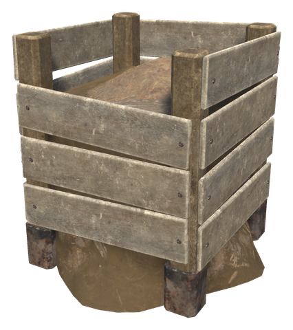

# 📖 Skills & milestones

[← Back to the README](../README.MD)

## 📖 SKILLS & MILESTONES

Gathering, cooking, farming, fishing, blocking, animal husbandry and exploration get **milestones** at levels 25, 50, 75 and 100, and some numbers that grow with every level. There is one new skill, **Foraging**. Open the skills dialog and hover over a skill: its tooltip shows what it gives at your level and all its milestones, the reached ones in green. Potions that raise your skills, such as the Gift of Brokkr, count too.

### ⭐ Stars

Food, wild picks, crops and seeds can get one to three stars. Items with different stars do not stack, and the stars show in the corner of the inventory slot, in the tooltip and on the ground. Recipes take ingredients with the most stars first.

- **Eating** something with stars gives 10% more health, stamina and eitr per star, and it lasts 10% longer per star (`StarFoodBonus`).
- **Dishes** from the Stone Pot, the cauldron and the cooking stations get stars from the cook's Cooking skill, and the stars of the ingredients carry over: three-star ingredients give at least a three-star dish.
- **Seeds** with stars grow crops that get stars more often.

| Skill | Chance of a star | Most stars |
|-------|------------------|------------|
| Foraging, Cooking, Farming | 0.6% per level, twice as likely at the best picking time | 1 from 25, 2 from 50, 3 from 100 |

### 🍄 Foraging (new skill)

Rises with every wild berry, mushroom and herb you pick. Each pick has a chance of one more item (up to 50% at level 100).

| Level | Milestone | What it does |
|-------|-----------|--------------|
| 25 | Keen Eye | Wild picks can get a star |
| 50 | Season Sense | Shows when a plant is at its best: mushrooms at dawn and in the rain, berries and herbs in the afternoon sun. Stars are twice as likely then |
| 75 | Sweep Picking | Picking a plant also picks the same plants within 4 m |
| 100 | Forager's Bounty | Up to three stars |

### 🍲 Cooking

Cooking stations (grill, oven, iron cooking station) work up to 50% faster while a skilled cook is within 10 m.

| Level | Milestone | What it does |
|-------|-----------|--------------|
| 25 | Fine Cooking | Dishes you cook can get a star |
| 50 | Watchful Cook | Food on cooking stations within 10 m of you does not burn |
| 75 | Chef's Touch | One more chance at a star on every dish |
| 100 | Master Chef | Up to three stars |

**Junk filter:** look at an item on the ground and press **Shift + E** to mark that kind of item as junk. Junk is no longer picked up by walking over it (you can still pick it up with E); press Shift + E on it again to undo. The list is kept per character.

### 🪓 Woodcutting

Each broken log has a chance of one more piece of wood (up to 50%), and a felled tree sometimes holds a bird's nest with feathers, resin or honey (2% to 8%).

| Level | Milestone | What it does |
|-------|-----------|--------------|
| 25 | Aimed Fall | Trees you fell come down the way you face |
| 50 | Replanting | A tree you fell is replanted 3 m from its stump, if you carry its seed (beech seeds, birch seeds, fir and pine cones, acorns, ancient seeds) |
| 75 | Domino Felling | A tree you fell knocks down the trees it falls on (one step, it does not chain on) |
| 100 | Old Growth | One tree in twenty is old growth and gives twice the wood |

### ⛏️ Pickaxes

Ore and scrap from broken rock have a chance of one more (up to 30%), and broken rock sometimes holds amber, flint, coins or an amber pearl (1.5% to 5%).

| Level | Milestone | What it does |
|-------|-----------|--------------|
| 25 | Clean Strike | One strike in five hits the seam and does double damage |
| 50 | Ore Echo | Striking rock makes ore deposits within 40 m show on the map for a minute (once every 30 s) |
| 75 | Rich Veins | One deposit in ten is rich and gives twice the ore |
| 100 | Prospector | The ore echo reaches 80 m and finds are twice as common |

### 🛡️ Blocking

Up to 20 more health, 10% less damage taken and 30% less stamina used for blocking.

| Level | Milestone | What it does |
|-------|-----------|--------------|
| 25 | Riposte | After a perfect parry, your next melee hit within 3 s does 50% more damage |
| 50 | Shield Wall | While you block with a tower shield, you and the players within 4 m take 20% less damage |
| 75 | Last Stand | Once every 10 minutes a deadly blow leaves you with 1 health, and nothing can hurt you for 3 seconds |
| 100 | Iron Guard | 25% more block power |

### 🌾 Farming

The White Hilt Cultivator already plants in rows and grids (see [Build camera & toolbar](build-tools.md)).

| Level | Milestone | What it does |
|-------|-----------|--------------|
| 25 | Starred Crops | Crops and seeds you harvest can get a star |
| 50 | Green Thumb | What you plant grows 25% faster |
| 75 | Giant Crops | One crop in twenty you plant grows into a giant, 60% bigger, that gives three times as much |
| 100 | Master Farmer | Up to three stars |

**Compost Bin** (Hammer, Workbench: Wood ×10, Stone ×2): a slatted wooden bin for kitchen and field waste. Every 2 minutes five pieces of waste turn into one Compost. Crops within 12 m of a bin with compost in it grow 30% faster, and the bin uses one compost a day. The waste list, time, range and speed are in `Farming.Compost`.

### 🎣 Fishing

**The fight on the line:** reeling in while the fish runs strains the line. Ease off (stop blocking) to let it slacken; if the strain reaches 100% the line snaps. The skill makes the line strain slower.

| Level | Milestone | What it does |
|-------|-----------|--------------|
| 25 | Snags | Now and then (5% to 20%) the hook also brings up coins, amber, an amber pearl, leather scraps or resin |
| 50 | Steady Hands | The line strains half as fast |
| 75 | Legendary Fish | Now and then (1% to 4%) a catch is legendary: level 5, marked in its tooltip |
| 100 | Double Catch | One catch in five brings two fish |

The **catch log** in the Fishing tooltip lists every kind of fish you have caught, how many, the largest and the legendary ones.

### 🐗 Animal Husbandry

The skill already speeds up taming and breeding ([Animal husbandry](husbandry.md)). New milestones:

| Level | Milestone | What it does |
|-------|-----------|--------------|
| 50 | Twins | Animals near you sometimes have twins (up to 25%) |
| 75 | Strong Young | Young born near you are sometimes one star stronger than their parents (up to 30%, at most 4 stars) |

### 🧭 Exploration

| Level | Milestone | What it does |
|-------|-----------|--------------|
| 25 | Lookout | Press **O**: the map opens up 200 m around you (400 m at level 100), and serpents, the Kraken and other ships within reach show on the map for a minute. Once every 5 minutes |

### 💀 Skill loss on death

`DeathLossMultiplier` scales the skill loss when you die: 0 keeps every skill, 1 is vanilla, 2 loses twice as much.

### ⚙️ Config

Section `Skills` (server-synced): `DeathLossMultiplier`, `Stars`, `StarFoodBonus`, and a switch for each group: `Foraging`, `Cooking`, `Woodcutting`, `Mining`, `Blocking`, `Farming`, `Fishing`, `Husbandry`, `Lookout`. The Lookout key is in `Skills.Keys` (each player sets it).

Star chances, in `Skills`: `FirstStarChance` (0.6), `SecondStarChance` (0.35, once the first is rolled), `ThirdStarChance` (0.25, once the second is rolled).

Each skill has its own section `Skills.<Skill>` (server-synced). It holds the level of every milestone, as `<Milestone>Level`, and the numbers behind it. A `Base` + `Skill` pair means base + skill × level / 100. Changes apply at once.

| Section | Milestone levels | Numbers (defaults) |
|---|---|---|
| `Skills.Foraging` | `KeenEyeLevel` 25, `SeasonSenseLevel` 50, `SweepPickingLevel` 75, `ForagersBountyLevel` 100 | `ExtraYieldChance` 0.5, `BestTimeStarMultiplier` 2, `SweepRange` 4 |
| `Skills.Cooking` | `FineCookingLevel` 25, `WatchfulCookLevel` 50, `ChefsTouchLevel` 75, `MasterChefLevel` 100 | `KitchenSpeedBonus` 0.5, `CookRange` 10 |
| `Skills.Woodcutting` | `AimedFallLevel` 25, `ReplantingLevel` 50, `DominoFellingLevel` 75, `OldGrowthLevel` 100 | `CleanSplitChance` 0.5, `BirdNestBaseChance` 0.02, `BirdNestSkillChance` 0.06, `OldGrowthChance` 0.05 |
| `Skills.Mining` | `CleanStrikeLevel` 25, `OreEchoLevel` 50, `RichVeinsLevel` 75, `ProspectorLevel` 100 | `ExtraOreChance` 0.3, `FindBaseChance` 0.015, `FindSkillChance` 0.035, `ProspectorFindMultiplier` 2, `CleanStrikeChance` 0.2, `CleanStrikeMultiplier` 2, `RichVeinChance` 0.1, `OreEchoRange` 40, `ProspectorRange` 80, `OreEchoCooldown` 30 |
| `Skills.Blocking` | `RiposteLevel` 25, `ShieldWallLevel` 50, `LastStandLevel` 75, `IronGuardLevel` 100 | `ExtraHealth` 20, `DamageReduction` 0.1, `BlockStaminaSaving` 0.3, `RiposteBonus` 0.5, `RiposteSeconds` 3, `ShieldWallReduction` 0.2, `ShieldWallRange` 4, `LastStandCooldownMinutes` 10, `LastStandGraceSeconds` 3, `IronGuardBonus` 0.25 |
| `Skills.Farming` | `StarredCropsLevel` 25, `GreenThumbLevel` 50, `GiantCropsLevel` 75, `MasterFarmerLevel` 100 | `GreenThumbBonus` 0.25, `GiantCropChance` 0.05, `GiantCropYield` 3, `SeedStarBonus` 0.15 |
| `Skills.Fishing` | `SnagsLevel` 25, `SteadyHandsLevel` 50, `LegendaryFishLevel` 75, `DoubleCatchLevel` 100 | `LineStrain` 0.35, `SteadyHandsReduction` 0.5, `SnagBaseChance` 0.05, `SnagSkillChance` 0.15, `LegendaryBaseChance` 0.01, `LegendarySkillChance` 0.03, `DoubleCatchChance` 0.2 |
| `Skills.Husbandry` | `TwinsLevel` 50, `StrongYoungLevel` 75 | `TwinChance` 0.25, `StrongYoungChance` 0.3 |
| `Skills.Exploration` | `LookoutLevel` 25 | `LookoutCooldownMinutes` 5, `LookoutRadius` 200 |

The Compost Bin, section `Farming.Compost` (server-synced): `WastePerCompost` (5) pieces of waste make one compost, and a bin uses `CompostPerDay` (1) compost a day while it feeds the soil (0 = never used up).
