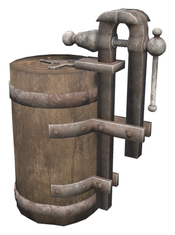
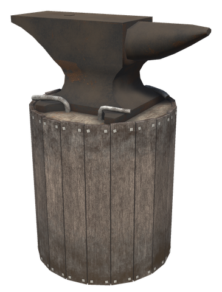

# ⚒️ Smithing

[← Back to the README](../README.MD)

## ⚒️ SMITHING

 

| Item | Description | Crafting Station | Requirements |
|------|-------------|------------------|--------------|
| **Chain Bench** | Forge extension with a smith's vise. While it stands next to the forge, the forge can make Chains | Hammer (next to the Forge) | Wood ×10, Iron ×4, Stone ×4 |
| **Chain** (vanilla item) | Made at the forge, only with a Chain Bench attached | Forge + Chain Bench | Iron ×2, Coal ×1 |
| **Repair Anvil** | An anvil on a stump. Use it to repair everything you wear at once (weapons, armor, cape, accessories and the shield in its slot), whatever station made it, with the forge's repair sound | Hammer (near a Forge) | Bronze ×5, Wood ×4 |

The Chain Bench also counts as a forge extension, so the forge can reach level 8.

The Repair Anvil is free to use by default. The server sets it in the `RepairAnvil` section: `CostPerItem` (e.g. `Resin:1,Iron:1` per repaired item; empty is free), `WholeInventory` (repair everything carried, off) and `RaiseCraftingSkill` (on).

The chains are set in the `ChainBench` section (server-synced): `NeedsBench` (on; off: any forge makes chains), `ChainsPerCraft` (1), `IronPerCraft` (2) and `CoalPerCraft` (1, 0 = none).

---

## 🔥 BINDING AND RUNE ETCHING

Dyrnwyn blazes only for the worthy. Fell a black beast of the dark hour ([Difficulty](difficulty.md)), bind its trophy to your White Hilt weapon, and the weapon strikes harder; then etch a rune into it for fire, frost, poison, lightning, a web or the grip of the deep. Both are done at extensions of the **Rune Forge** ([Portals & travel](portals.md)), and both stay with the item: in chests, on the ground and after upgrades.

| Piece | Description | Crafting Station | Requirements |
|-------|-------------|------------------|--------------|
| **Binding Stone** | A runestone with blood-red runes. Hold a White Hilt weapon (staffs too), or with no weapon in hand a White Hilt shield, and use a black beast trophy from the hotbar on the stone | Hammer (next to the Rune Forge) | Stone ×20, Chain ×2, Surtling Core ×1 |
| **Rune Etching Table** | The Galdr table's rune table. Hold a trophy-bound White Hilt weapon and use a rune from the hotbar on the table; the hover text lists every rune with what it costs | Hammer (next to the Rune Forge) | Fine Wood ×10, Iron ×4, Resin ×6 |

### Binding a trophy

One trophy per weapon or shield. The trophy is used up; binding another replaces the first, and the etched rune stays. The tooltip shows what is bound. A bound weapon deals more of every damage type it deals, a bound shield blocks more:

| Trophy | Bonus | Rune strength |
|--------|-------|---------------|
| Black Troll | +5% | 10% |
| Black Abomination, Black Serpent | +8% | 12% |
| Black Stone Golem | +10% | 15% |
| Black Fuling Berserker | +12% | 18% |
| Black Seeker Soldier | +15% | 21% |
| Black Morgen, Black Bonemaw | +20% | 25% |

At quality 8 a bound White Hilt Sword goes from 137 to 164 slash with the Black Morgen trophy, above the Nidhogg (153): the reward for felling the hardest beasts. Black trophies are never supplied by the restocking chests, carts or ship holds.

### Etching a rune

Only a weapon with a bound trophy can be etched, and it holds one rune; etching another replaces it. The rune and the materials are used up. The rune strength comes from the bound trophy and is a share of the weapon's base damage (quality 1): with the Black Morgen trophy, Dyrnwyn's Flame adds 15 fire to the White Hilt Sword.

| Rune | Materials | Infusion |
|------|-----------|----------|
| Flametal Rune | Surtling Core ×3 | **Dyrnwyn's Flame**: fire damage, which sets the target alight |
| Silver Rune | Crowberries ×10 | **Frost**: frost damage, which slows the target |
| Bronze Rune | Poison Gland ×3 | **Venom**: poison damage |
| Black Metal Rune | Kraken Ink ×3 | **Storm**: lightning damage |
| Iron Rune | Spider Silk ×5 | **Spider's Web**: every hit webs the target, as a giant spider's bite does |
| Gold Rune | Kraken Ink ×3, Kraken Tentacle ×1 | **Grip of the Deep**: half the rune strength comes back as health of the damage dealt (12.5% with the Black Morgen trophy) |

The server sets it in two sections. `[Gear.Binding]`: `<Beast>Bonus` and `<Beast>Infusion` for each beast (e.g. `BlackMorgenBonus` 0.2, `BlackMorgenInfusion` 0.25). `[Gear.Infusions]`: `<Rune>Cost` for each infusion (e.g. `FlameCost` = `SurtlingCore:3`) and `DeepLifeStealShare` (0.5).
