# 🪨 Stonework

What the Stonecutter makes besides the vanilla stone pieces: carved and raised stones, lamps, games and stone floors and walls for a Viking farm. Pieces marked *near a Stonecutter* are built with the ordinary Hammer within reach of one.

The Stonecutter also makes the [Whetstone](smithing.md#-whetstone-and-weapon-oils), and the Stone Pot's [Soapstone Cauldron](foraging.md) is carved near one.

## Memorial Stone

A tall raised stone, a *bauta*, about 2.5 m high, like the runestones raised for the dead and for great deeds. **Use** it to carve an inscription of your own (up to 100 characters) on its face, as on a sign; looking at it shows the inscription. The letters are cut into the stone and follow the curve of its face, growing smaller for a longer inscription. It is stone through and through: it stands on the ground, does not wear in the rain and sounds like stone when struck.

| Piece | Crafting Station | Requirements |
|-------|------------------|--------------|
| **Memorial Stone** (`piece_whitehilt_bautastein`) | Hammer, near a Stonecutter | Stone ×20 |

## Soapstone Lamp

A small bowl carved out of soapstone with a wick burning in resin, as the Norse lit their houses. It gives a soft, low light, smaller and cosier than a torch, and stands on tables, shelves and the floor. Feed it **Resin**; each lasts three times as long as in a torch. Surt's Brazier keeps it lit like any other torch.

| Piece | Crafting Station | Requirements |
|-------|------------------|--------------|
| **Soapstone Lamp** (`piece_whitehilt_soapstonelamp`) | Hammer (Furniture), near a Stonecutter | Soapstone ×2, Resin ×2 |

## Hnefatafl Board

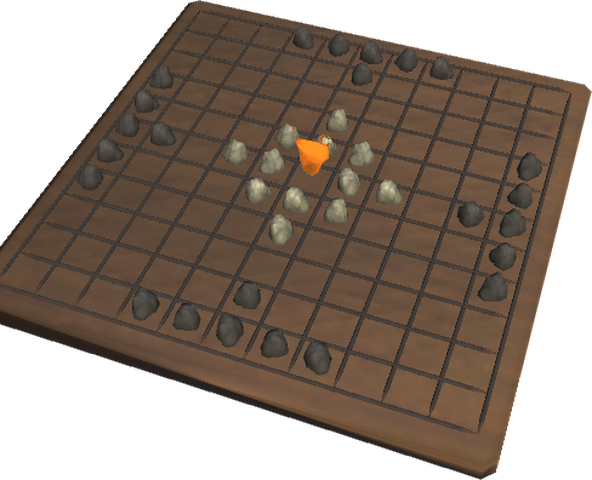

*Hnefatafl*, the king's table, the board game of the Norse, set up for a game on an 11 × 11 board: 24 dark stones besiege 12 light ones round an amber king. Put it on a table: it gives **+1 comfort**. It is for show; the pieces do not move.

| Piece | Crafting Station | Requirements |
|-------|------------------|--------------|
| **Hnefatafl Board** (`piece_whitehilt_hnefatafl`) | Hammer (Furniture), near a Stonecutter | Wood ×2, Stone ×6, Amber ×1 |

## Ship Setting and Stone Ring

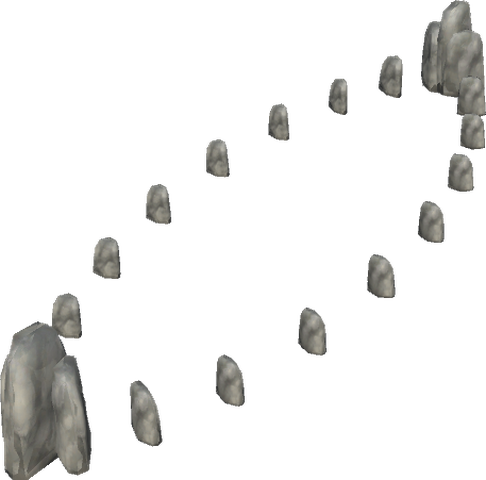 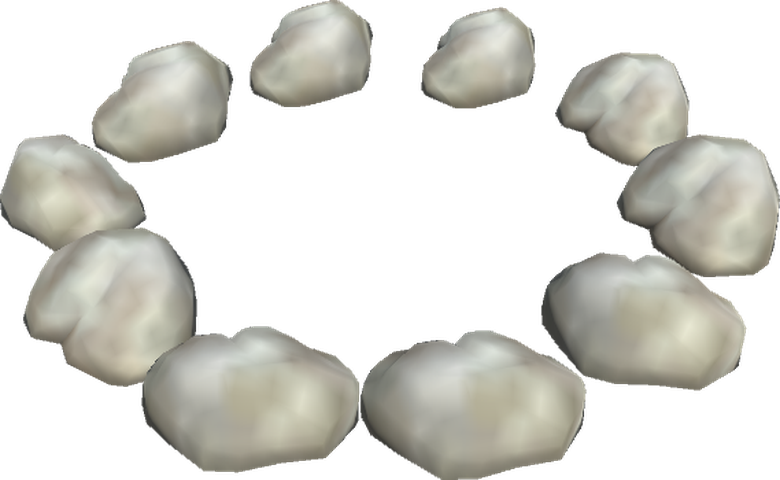

The **Ship Setting** is 22 raised stones in the outline of a ship, 12 m long and 4 m wide, rising to 1.75 m at the stems, as the Norse set them round their graves. The **Stone Ring** is ten low stones in a ring 3.6 m across, for a fire place or a thing site. Each is one piece, placed whole, and is stone like the Memorial Stone.

| Piece | Crafting Station | Requirements |
|-------|------------------|--------------|
| **Ship Setting** (`piece_whitehilt_skipssetning`) | Hammer, near a Stonecutter | Stone ×60 |
| **Stone Ring** (`piece_whitehilt_steinring`) | Hammer, near a Stonecutter | Stone ×20 |

## Slate floors, steps and paths

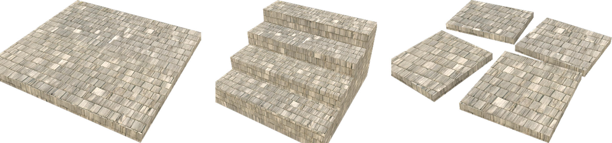

Thin slabs of slate in the same stone as the [slate roof](roofs.md), for floors, steps and garden paths. They snap and collide like the wooden floor and stair they are built on, but they are **stone**: they want the ground or other stone under them, as the vanilla stone pieces do, and do not wear in the rain. The slates keep their size on every slab.

| Piece | Use | Crafting Station | Requirements |
|-------|-----|------------------|--------------|
| **Slate Floor** (`piece_whitehilt_slatefloor`) | A 2 × 2 m floor of slate slabs | Hammer, near a Stonecutter | Slate ×4 |
| **Slate Floor 1 × 1** (`piece_whitehilt_slatefloor1x1`) | A 1 × 1 m slab to fill in | Hammer, near a Stonecutter | Slate ×1 |
| **Slate Steps** (`piece_whitehilt_slatesteps`) | Four broad steps rising 1 m over 2 m, like the wooden stair | Hammer, near a Stonecutter | Slate ×6 |
| **Slate Path** (`piece_whitehilt_slatepath`) | Four loose flagstones in 2 × 2 m, laid end to end for a path | Hammer, near a Stonecutter | Slate ×3 |

Slate comes from slate outcrops in the Mountains (see [Roofs](roofs.md)).

## Dry stone walls

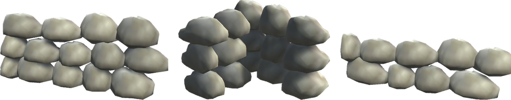

Field stones stacked without mortar, each course set off from the one below, as round Norwegian farms and fields. The walls snap end to end and on top of each other, and the corner joins two of them. They are stone: they want the ground or stone under them.

| Piece | Use | Crafting Station | Requirements |
|-------|-----|------------------|--------------|
| **Dry Stone Wall** (`piece_whitehilt_torrmur`) | 2 m long, 0.9 m high | Hammer, near a Stonecutter | Stone ×12 |
| **Dry Stone Wall 1 m** (`piece_whitehilt_torrmur_1m`) | 1 m long, 0.9 m high, to close a gap | Hammer, near a Stonecutter | Stone ×6 |
| **Dry Stone Wall Corner** (`piece_whitehilt_torrmur_hjorne`) | 1 m each way, 0.9 m high | Hammer, near a Stonecutter | Stone ×10 |
| **Field Wall** (`piece_whitehilt_steingard`) | A low wall round fields, 2 m long, 0.6 m high | Hammer, near a Stonecutter | Stone ×8 |

## Arches, columns and finishing stone

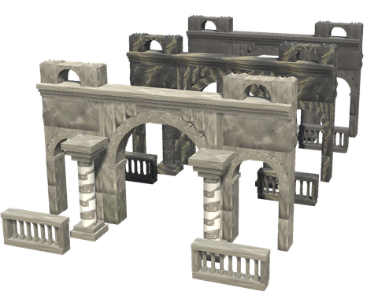

Valheim gives stone, black marble and grausten walls and floors, but not the pieces that make a building of them: arches, window frames, stairs and something to finish the top of a wall. These come in all three stones. The black marble and grausten pieces are the same shapes, cost half as much of their stone as the plain ones cost stone, are 1.5 and 2 times as strong, and come with the Mistlands and the Ashlands. Like the stone defences they are stone in the building rules, take little from blunt blows, arrows and blades, and nothing from fire, frost, poison or spirit.

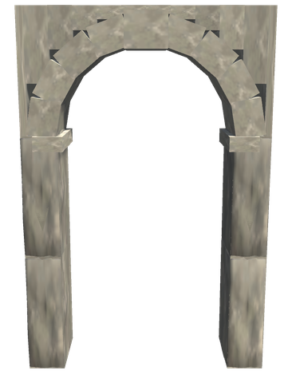 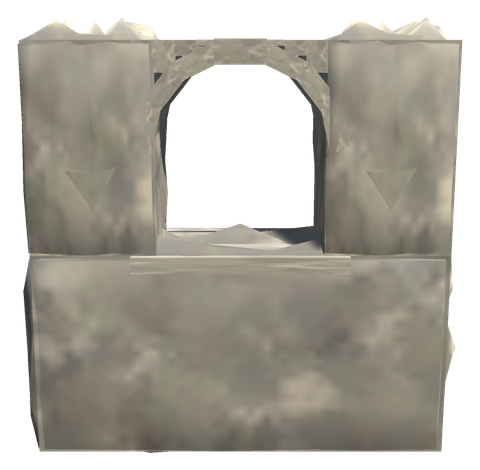 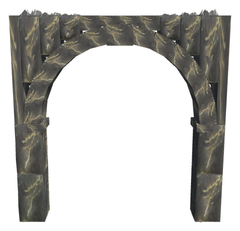 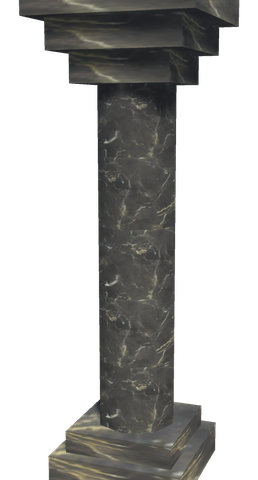

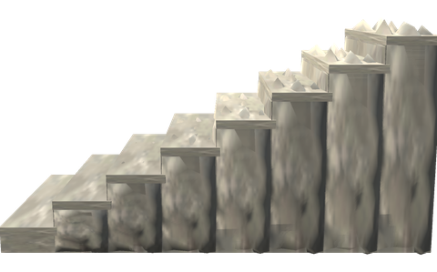 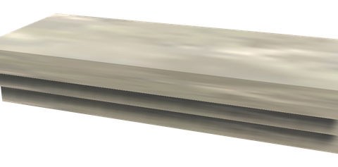 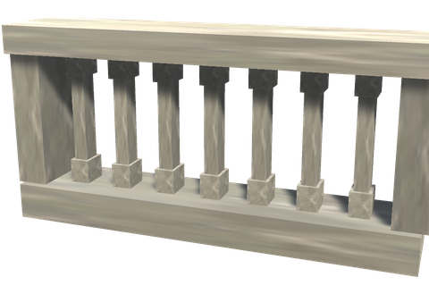 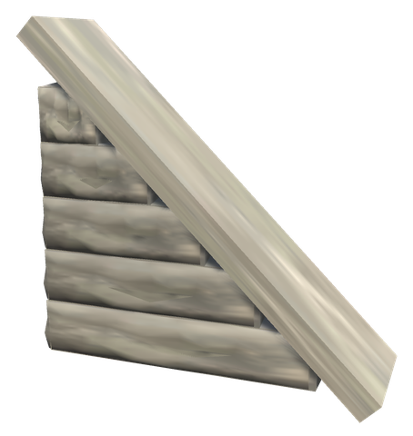 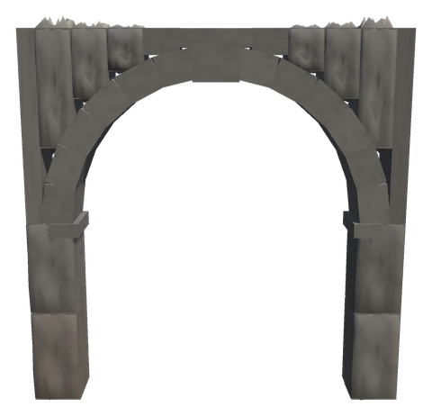

The arches are rings of wedge stones with a keystone, and the openings under them are round and free to walk through. The arched doorway leaves 2.7 m to its crown, a good metre over your head; the arched window sits at eye height, like the [log house's windows](log-house.md#-windows). The walls are 0.6 m thick, like the vanilla stone walls, and snap to them.

| Piece | Description | Crafting Station | Stone | Black marble | Grausten |
|-------|-------------|------------------|-------|--------------|----------|
| **Stone Arched Doorway** (`piece_whitehilt_buegang`) | A wall 2 × 3 m with a round-arched doorway 1.4 m wide | Hammer, near a Stonecutter | Stone ×24 | Black Marble ×12 | Grausten ×12 |
| **Stone Arched Window** (`piece_whitehilt_buevindu`) | A wall 2 × 2 m with a round-headed window 0.8 m wide at eye height | Hammer, near a Stonecutter | Stone ×16 | Black Marble ×8 | Grausten ×8 |
| **Stone Great Arch** (`piece_whitehilt_storbue`) | An arch 4 × 4 m over an opening 3 m wide | Hammer, near a Stonecutter | Stone ×40 | Black Marble ×20 | Grausten ×20 |
| **Wide Stone Stair** (`piece_whitehilt_steintrinn`) | 2 m wide, rising 2 m over 4 m | Hammer, near a Stonecutter | Stone ×24 | Black Marble ×12 | Grausten ×12 |
| **Stone Cornice** (`piece_whitehilt_gesims`) | Three courses stepping out over a wall's top, 2 m long | Hammer, near a Stonecutter | Stone ×6 | Black Marble ×3 | Grausten ×3 |
| **Stone Cornice Corner** (`piece_whitehilt_gesims_hjorne`) | The cornice round an outer corner | Hammer, near a Stonecutter | Stone ×6 | Black Marble ×3 | Grausten ×3 |
| **Stone Column** (`piece_whitehilt_steinsoyle`) | 3 m high, with a base and a capital | Hammer, near a Stonecutter | Stone ×10 | Black Marble ×5 | Grausten ×5 |
| **Stone Balustrade** (`piece_whitehilt_brystning`) | 2 m long and 1 m high | Hammer, near a Stonecutter | Stone ×8 | Black Marble ×4 | Grausten ×4 |
| **Stone Gable 26°** (`piece_whitehilt_steingavl_26`) | Half a gable, 2 m wide and 1 m high | Hammer, near a Stonecutter | Stone ×8 | Black Marble ×4 | Grausten ×4 |
| **Stone Gable 45°** (`piece_whitehilt_steingavl_45`) | Half a gable, 2 m wide and 2 m high | Hammer, near a Stonecutter | Stone ×14 | Black Marble ×7 | Grausten ×7 |

The black marble and grausten pieces are named after their stone, such as *Black Marble Great Arch* or *Grausten Column*, and their prefabs end in `_marmor` and `_grausten`.
