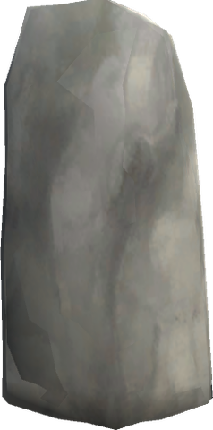
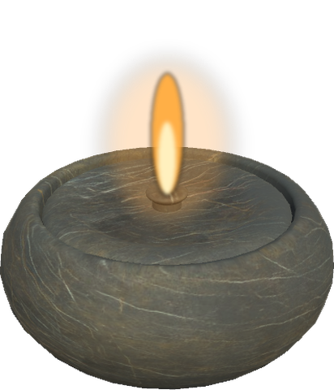

# 🪨 Stonework

What the Stonecutter makes besides the vanilla stone pieces: carved and raised stones, lamps, games and stone floors and walls for a Viking farm. Pieces marked *near a Stonecutter* are built with the ordinary Hammer within reach of one.

The Stonecutter also makes the [Whetstone](smithing.md#-whetstone-and-weapon-oils), and the Stone Pot's [Soapstone Cauldron](foraging.md) is carved near one.

## Memorial Stone

A tall raised stone, a *bauta*, about 2.5 m high, like the runestones raised for the dead and for great deeds. **Use** it to carve an inscription of your own (up to 100 characters) on its face, as on a sign; looking at it shows the inscription. It is stone through and through: it stands on the ground, does not wear in the rain and sounds like stone when struck.

| Piece | Crafting Station | Requirements |
|-------|------------------|--------------|
| **Memorial Stone** (`piece_whitehilt_bautastein`) | Hammer, near a Stonecutter | Stone ×20 |

## Soapstone Lamp

A small bowl carved out of soapstone with a wick burning in resin, as the Norse lit their houses. It gives a soft, low light, smaller and cosier than a torch, and stands on tables, shelves and the floor. Feed it **Resin**; each lasts three times as long as in a torch. Surt's Brazier keeps it lit like any other torch.

| Piece | Crafting Station | Requirements |
|-------|------------------|--------------|
| **Soapstone Lamp** (`piece_whitehilt_soapstonelamp`) | Hammer (Furniture), near a Stonecutter | Soapstone ×2, Resin ×2 |
