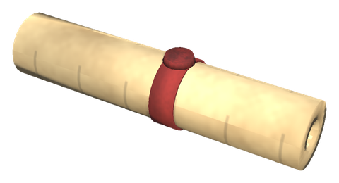
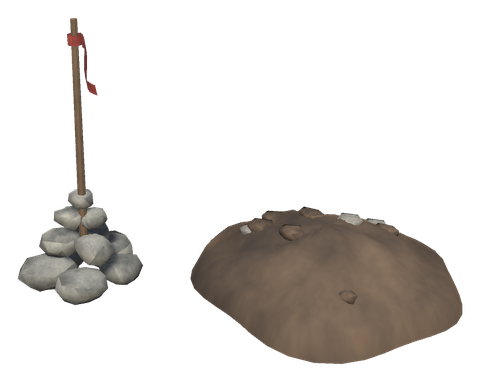
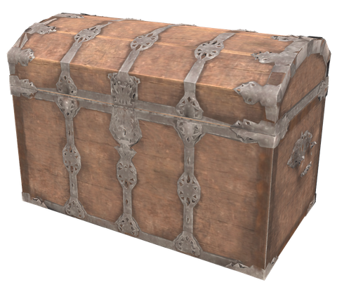

# 🗺️ Treasure maps

[← Back to the README](../README.MD)

  

Hildir sells **treasure maps**. Each map you buy has a treasure buried for it somewhere in land you have already explored. The map only shows a piece of land with a cross on it. Compare it with your own map to work out where it is, then go and dig the chest up.

## How it works

1. **Buy a map** from Hildir for 750 coins, once The Elder is slain. A new treasure is buried the moment you buy it, and the map is marked a moment later.
2. **Unroll it**: use the map from the hotbar or right-click it in the inventory. Esc or the button closes it again.
3. **Find the place**: the map has no coordinates and no names of biomes. Look for the coastline, lakes, hills and forests on it, and the landmarks drawn as symbols, and find the same shapes on your own map.
4. **Look for the cairn**: a small heap of stones with a stick and a red rag stands beside every treasure. It can be seen from a good distance.
5. **Dig**: hit the heap of dug earth by the cairn three times with any pickaxe. The chest comes up.
6. **Loot**: the chest holds a **black beast trophy** and a few things from the mod: meads, Stone Pot food, arrows and bolts, gift potions, runes, forageables or coins. It vanishes when it is empty.

Each map is a new treasure in a new place, with its own piece of land. Maps can be stored, traded and given away. Whoever finds a treasure first can dig it up. Once it is dug up, every map of it says **Plundered** and can be kept as a souvenir.

## Where treasures are buried

- On dry, gentle ground in an allowed biome (Meadows, Black Forest, Swamp, Mountains or Plains by default), 200 to 3000 m from where you bought the map.
- In land you have explored: at least 60% of the land on the map must be uncovered on your own map, so you can recognise it.
- Close to something the map shows: at most 80 m from water or from a landmark.
- Never within 60 m of anything a player has built, inside a location such as a crypt or village, or within 150 m of another treasure.

If no place suits, or you already have 3 treasures waiting in the ground, Hildir takes the map back and you get your coins back.

## What the map shows

The map is drawn from the land itself, like an old chart: water as an ink wash with thick shorelines, height lines and shading for hills, little trees where the forests are, a red cross on the treasure, a north arrow and a scale bar. It is **incomplete on purpose**: patches have faded away, the edges are torn, and the cross is never in the middle.

How much help it gives depends on the `HintLevel` setting:

| Level | The map shows |
|---|---|
| Easy | Landmarks with names, a note at the bottom, a dotted path from the nearest landmark to the cross |
| **Normal** (default) | Landmarks as symbols and a note at the bottom. The Exploration skill adds more (see below) |
| Hard | Only the land, the cross, the north arrow and the scale. No warnings when you are close |

The note says what the land is like at the cross, e.g. *Swamp, by the water. From Burial chamber: south-east.* The landmarks are the same kinds Munin's Perch knows: crypts, caves, villages, towers, runestones, boss altars, traders. Only those you have explored yourself go on the map.

On a Normal map the **Exploration** skill helps you read it:

- The faded patches shrink as the skill grows, up to 60% less at level 100.
- From level 40 the landmarks are named.
- From level 70 a dotted path leads from the nearest landmark to the cross.

When you carry the map of a treasure (Easy and Normal):

- within 25 m you are told the ground nearby looks dug up,
- within 10 m dust rises from the heap now and then.

## Config

Section `[Treasure]` (admin only, synced from the server):

| Setting | Default | What it does |
|---|---|---|
| `Enabled` | true | Hildir sells treasure maps; maps and chests already in the world stay either way |
| `Price` | 750 | Coins a map costs |
| `RequiredGlobalKey` | defeated_gdking | World key needed before Hildir sells maps; empty for always |
| `MaxActiveMaps` | 3 | Treasures a player may have waiting in the ground at once |
| `HintLevel` | Normal | Easy, Normal or Hard (see above) |
| `FragmentSize` | 480 | Width of the land a map shows, in metres |
| `MissingShare` | 0.25 | Share of a map that is faded away |
| `RotateFragment` | false | Maps may be drawn turned a quarter, half or three quarters round; the north arrow turns with them |
| `MinExploredShare` | 0.6 | Share of the land on a map the buyer must have explored |
| `MinDistance` / `MaxDistance` | 200 / 3000 | Nearest and farthest a treasure is buried from the buyer, in metres |
| `AllowedBiomes` | Meadows, BlackForest, Swamp, Mountain, Plains | Biomes a treasure may be buried in |
| `MinBaseDistance` | 60 | Metres from anything a player has built |
| `MinTreasureDistance` | 150 | Metres between two treasures |
| `FeatureDistance` | 80 | A treasure lies at most this far from water or a landmark |
| `DigHits` | 3 | Pickaxe blows to dig the chest up |
| `TrophyCount` | 1 | Black beast trophies in a chest, of beasts whose boss has been defeated |
| `LootRolls` | 3 | Draws from the loot list besides the trophies |
| `Loot` | (list) | `Prefab:min-max:weight`, comma separated; items that do not exist are skipped |
| `WarmDistance` | 25 | Metres at which a player carrying the map is told the ground looks dug up; 0 = never |
| `DustDistance` | 10 | Metres at which dust rises for a player carrying the map; 0 = never |
| `SkillNamesLevel` | 40 | Exploration level from which a Normal map names its landmarks |
| `SkillPathLevel` | 70 | Exploration level from which a Normal map shows the dotted path |
| `SkillFadeReduction` | 0.6 | Share of the faded patches that comes back at Exploration 100 |

The default loot list holds the five meads, smoked fish, wolf jerky and sweet gale sausages, White Hilt arrows and bolts, the gifts of Freya, Thor, Odin, Njord and Skadi, bronze and iron runes, lingonberries, crowberries, roseroot and coins.

## Testing with devcommands

`spawn WhiteHiltTreasureMap` gives an unmarked map. Use it to have a treasure buried for it, just like one bought from Hildir (no coins are given back if no place is found).
